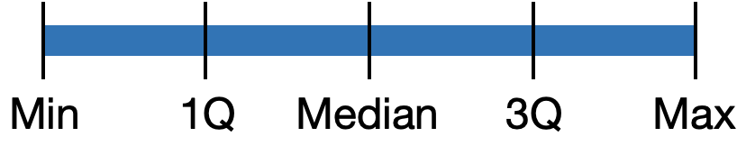
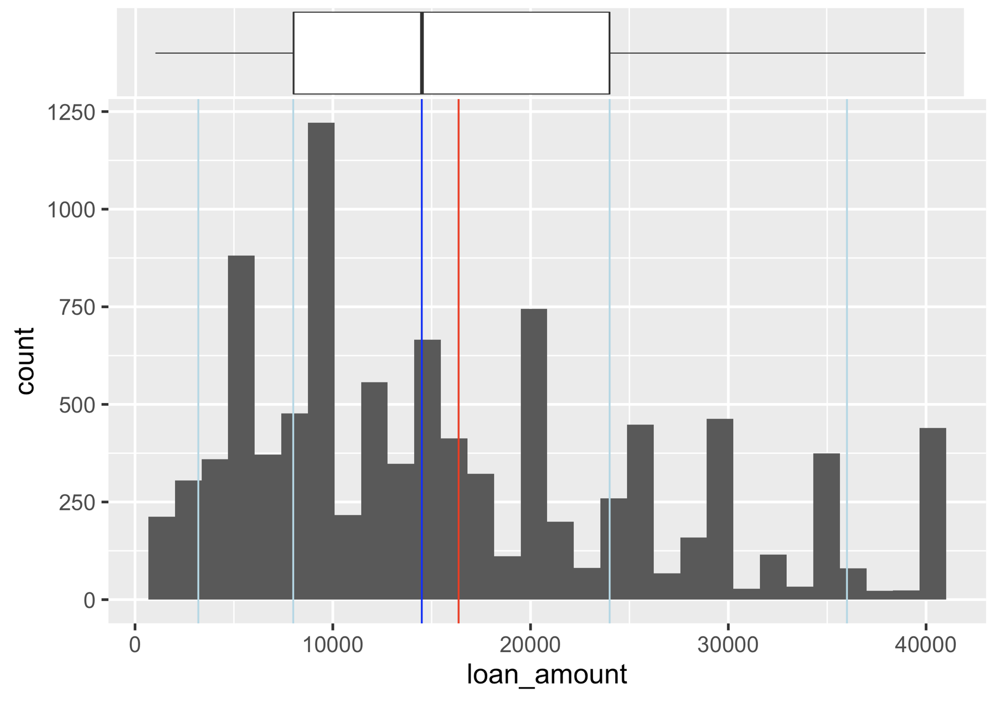

```{r child = "../setup.Rmd"}
```

```{css, echo = FALSE}
.tiny .remark-code { font-size: 60%; }
.small .remark-code { font-size: 80%; }
```


```{r packages, echo=FALSE, message=FALSE, warning=FALSE}
library(tidyverse)
library(openintro)
```

```{r include = FALSE}
loans <- loans_full_schema %>%
  select(loan_amount, interest_rate, term, grade, 
         state, annual_income, homeownership, debt_to_income,
         issue_month)
```


## Recap
--

- Descriptive statistics

  - Types of variables (numerical and categorical)

---
## Today

- Describing numerical distributions

  - Histograms
  
  - Measures of central tendency: mean, median, mode

  - Shape: skewness and modality
  
  - Spread: variance and standard deviation, range and interquartile range

  - Boxplots
    - Unusual observations
  
  - Density plot
  
  
---
## Data: Lending Club

- Lending Club is a platform that allows individuals to lend to other individuals

```{r}
loans <- loans_full_schema %>%
  select(loan_amount, interest_rate, term, grade, 
         state, annual_income, homeownership, debt_to_income,
         issue_month)
glimpse(loans)
```

---

## Selected variables

Variable        | Description
----------------|-------------
`loan_amount`   |	Amount of the loan received, in US dollars
`interest_rate` |	Interest rate on the loan, in an annual percentage
`term`	        | The length of the loan, which is always set as a whole number of months
`grade`	        | Loan grade, which takes a values A through G and represents the quality of the loan and its likelihood of being repaid
`state`         |	US state where the borrower resides
`annual_income` |	Borrower’s annual income, including any second income, in US dollars
`homeownership`	| Indicates whether the person owns, owns but has a mortgage, or rents
`debt_to_income` | Debt-to-income ratio
`issue_month` | Month the loan was issued

---

## Describing numerical distributions

- **Visual summaries**:
  - Histogram
  - Boxplot
  - Density plot
  - Line graph 
  
- Measures of **central tendency**: mean, median, mode 

- **Shape**:
    - Skewness: right-skewed, left-skewed, symmetric 
    - Modality: unimodal, bimodal, multimodal, uniform

- **Spread**: variance and standard deviation, range and interquartile range

- **Unusual observations**

- A **summary statistic** is a single number summarizing a large amount of data

---

## Histogram

- Shows **shape, center, and spread** of the data

- Contiguous (adjoining) boxes
  - Horizontal axis: what the data represents
  - Vertical axis: frequency or relative frequency 

.tiny[
.pull-left[
```{r message = TRUE, out.width = "100%"}
ggplot(loans, aes(x = loan_amount)) +
  geom_histogram()
```
]

.pull-right[
```{r out.width = "100%"}
hist(loans_full_schema$loan_amount)
```
]
]

---
## Histograms and binwidth

.panelset[
.panel[.panel-name[binwidth = 1000]
```{r out.width = "50%"}
ggplot(loans, aes(x = loan_amount)) +
  geom_histogram(binwidth = 1000)
```
]
.panel[.panel-name[binwidth = 5000]
```{r out.width = "50%"}
ggplot(loans, aes(x = loan_amount)) +
  geom_histogram(binwidth = 5000)
```
]
.panel[.panel-name[binwidth = 20000]
```{r out.width = "50%"}
ggplot(loans, aes(x = loan_amount)) +
  geom_histogram(binwidth = 20000)
```
]
]

---

## Adding labels 

.panelset[
.panel[.panel-name[Plot]
```{r ref.label = "hist-custom", echo = FALSE, warning = FALSE}
```
]
.panel[.panel-name[Code]
```{r hist-custom, fig.show = "hide", warning = FALSE}
ggplot(loans, aes(x = loan_amount)) +
  geom_histogram(binwidth = 5000) +
  labs( #<<
    x = "Loan amount ($)", #<<
    y = "Frequency", #<<
    title = "Amounts of Lending Club loans" #<<
  ) #<<
```
]
]

---
## Population vs. sample (briefly; more later)
- A **sample** is a portion or **subset** of the larger **population**

- E.g., population may be UC Davis students; randomly sample 300 students on the Quad this morning

- Population **parameter**, e.g., population mean
  - This is a fixed quantity

- Sample **statistic**, e.g., sample mean
  - Depends on the sample 

---
## Measures of central tendency

- **Mean**: "Average", sum the numbers and divide by the count (`mean()`)
  
  $\bar{x} = \frac{x_1 + x_2 + ... + x_n}{n}$, where $x$ is the variable of interest, the subscripts index the $n$ observations, and $\bar{x}$ denotes the sample mean. 
  
  The population mean is often denoted by $\mu$.
  
- **Median**: "Middle value", arrange in ascending order (`median()`)
  
- **Mode**: Most frequent value (`mode()` does not do what you might think)

- Note: you will sometimes need the `na.rm = TRUE` option

---
## Measures of central tendency

- `mean(loans$loan_amount)` = 16361.92

- `median(loans$loan_amount)` = 14500

- Mode is 10000 (Exercise: how to code this in R?)

.tiny[
.pull-left[
```{r , eval = FALSE}
ggplot(loans, aes(x = loan_amount)) +
  geom_histogram() +
  geom_vline(xintercept = median(loans$loan_amount),
             col = "blue") +
  geom_vline(xintercept = mean(loans$loan_amount),
             col = "red")
```

]
]

.pull-right[
```{r , echo = FALSE, out.width = "100%"}
ggplot(loans, aes(x = loan_amount)) +
  geom_histogram() +
  geom_vline(xintercept = median(loans$loan_amount),
             col = "blue") +
  geom_vline(xintercept = mean(loans$loan_amount),
             col = "red")
```
]


---
## Measures of shape: Skewness


```{r echo=FALSE, out.width="80%"}
knitr::include_graphics("img/skew.png")
```

- **Skewness** is to the side of the longer *tail*

  - **Positive skew/right skew**: mean > median
  
  - **Negative skew/left skew**: mean < median

---
## Measures of shape: Modality
- **Mode** is the most frequent value, but in real-world data sets, there might not be any observations with the same value. 

- A mode is represented by a **prominent peak in the distribution**

- **Unimodal** = one prominent peak, **bimodal** = two prominent peaks, **multimodal** = more than two prominent peaks, uniform

```{r echo=FALSE, out.width="80%"}

```

---
## Loans data

```{r, out.width = "70%"}
ggplot(loans, aes(x = loan_amount)) +
  geom_histogram(binwidth = 5000)
```

What is the skewness and modality? 

---
## Measures of spread: Variance and standard deviation


```{r echo=FALSE, out.width="70%"}
knitr::include_graphics("img/sd.svg")
```


- **Red distribution**: concentrated closely near the mean
- **Blue distribution**: more widely spread out from the mean
- They have the same mean, skewness, modality

---
## Measures of spread: Variance and standard deviation
- **Standard deviation** measures how far data values are from their mean

- **Deviation** is the distance of an observation from its mean, $x_i - \bar{x}$

- **Sample variance**: Take the square of deviations and find the mean
  - $s^2 = \frac{(x_1 - \bar{x})^2 + (x_2 - \bar{x})^2 + ... + (x_n - \bar{x})^2}{n - 1}$
  - For the denominator, use $n-1$ instead of $n$ to make it an *unbiased estimator of the population mean*

- **Sample standard deviation**, $s = \sqrt{s^2}$

- In R, `sd()` for sample standard deviation, `var()` for sample variance

- Population variance and standard deviation are often denoted by $\sigma^2$ and $\sigma$

---
## Measures of spread: Variance and standard deviation

- Standard deviation can roughly be interpreted as the mean distance from mean

- **Rules of thumb** for symmetric, bell-shaped distributions: 68%, 95%, and 99.7% of the values lie within one, two, and three standard deviations of the mean, respectively

```{r echo=FALSE, out.width="60%"}
knitr::include_graphics("img/sdRules.png")
```

---
## Measures of spread: Range and interquartile range

```{r echo=FALSE, out.width="30%"}

```

- **Percentile**: a number that divides ordered data into hundredths
  - Median = 50th percentile 

- **Quartile**: a number that divides ordered data into quarters 
  - First quartile = 25th percentile
  - Second quartile = Median = 50th percentile
  - Third quartile = 75th percentile

- **Interquartile range** (IQR) = 3rd - 1st quartile
  - `IQR()` in R

- **Range** = Max - min

- **Five-number summary**: Min, 1Q, Median, 3Q, Max
  - `summary()` in R (also gives mean)

---
## Loans data
.tiny[
```{r}
sd(loans$loan_amount)
var(loans$loan_amount)
sqrt(var(loans$loan_amount))
summary(loans$loan_amount)
IQR(loans$loan_amount)
```
]

`homeownership` is a factor variable with three levels, `MORTGAGE`, `OWN` and `RENT`. How do we calculate the variance for each type of home ownership status? 

---

## Percentiles
Vertical lines for 5th, 25th percentile, median, mean, 75th and 95th percentiles

.panelset[
.panel[.panel-name[Plot]
```{r ref.label = "hist-percentiles", echo = FALSE, warning = FALSE}
```
]
.panel[.panel-name[Code]
```{r hist-percentiles, fig.show = "hide", warning = FALSE}
ggplot(loans, aes(x = loan_amount)) +
  geom_histogram() +
  geom_vline(xintercept = median(loans$loan_amount),
             col = "blue") +
  geom_vline(xintercept = quantile(loans$loan_amount, .05),
             col = "lightblue") +
  geom_vline(xintercept = quantile(loans$loan_amount, .25),
           col = "lightblue") + 
  geom_vline(xintercept = quantile(loans$loan_amount, .75),
           col = "lightblue") +
  geom_vline(xintercept = quantile(loans$loan_amount, .95),
           col = "lightblue") +
  geom_vline(xintercept = mean(loans$loan_amount),
             col = "red")
```
]
]

---

## Boxplots 
```{r echo=FALSE, out.width="80%"}

```

---
## Boxplots
```{r fig.dim = c(7, 2)}
ggplot(loans, aes(x = loan_amount)) +
  geom_boxplot() +
  labs(x = "Loan amount") +
  scale_y_continuous(breaks = NULL)
```

- Lower whisker, box (1Q, median, 3Q), upper whisker
- Total length of the box is IQR
- The length of each whisker is up to 1.5*IQR
- Any points beyond that are **outliers**, observations that are unusually far from the rest of the data
- Outliers appear as points

---

## Box plot and outliers

Income data are often skewed (right or left?)

```{r fig.dim = c(7, 2)}
ggplot(loans, aes(x = annual_income)) +
  geom_boxplot()+
  scale_y_continuous(breaks = NULL)
```

---
## Boxplots in base R
.tiny[
.pull-left[
```{r message = TRUE, out.width = "100%"}
ggplot(loans, aes(x = loan_amount)) +
  geom_boxplot()
```
]

.pull-right[
```{r out.width = "100%"}
boxplot(loans$loan_amount)
```
]
]

---

## Another way to remove y-axis labels

We saw `scale_y_continuous(breaks = NULL)` earlier

.panelset[
.panel[.panel-name[Plot]
```{r ref.label = "box-custom", echo = FALSE, warning = FALSE}
```
]
.panel[.panel-name[Code]
```{r box-custom, fig.show = "hide", warning = FALSE}
ggplot(loans, aes(x = loan_amount)) +
  geom_boxplot() +
  labs(
    x = "Loan amount ($)",
    y = NULL,
    title = "Loan amounts of Lending Club loans"
  ) +
  theme( #<<
    axis.ticks.y = element_blank(), #<<
    axis.text.y = element_blank() #<<
  ) #<<
```
]
]

---

## Density plot

Density plots are an alternative to histograms 

.tiny[
.pull-left[
```{r message = TRUE, out.width = "100%"}
ggplot(loans, aes(x = loan_amount)) +
  geom_density()
```
]

.pull-right[
```{r out.width = "100%"}
plot(density(loans$loan_amount))
```
]
]
---

## Density plots and adjusting bandwidth

.panelset[
.panel[.panel-name[adjust = 0.5]
```{r out.width = "50%"}
ggplot(loans, aes(x = loan_amount)) +
  geom_density(adjust = 0.5)
```
]
.panel[.panel-name[adjust = 1]
```{r out.width = "50%"}
ggplot(loans, aes(x = loan_amount)) +
  geom_density(adjust = 1) # default bandwidth
```
]
.panel[.panel-name[adjust = 2]
```{r out.width = "50%"}
ggplot(loans, aes(x = loan_amount)) +
  geom_density(adjust = 2)
```
]
]

---

## Title and labels 

.panelset[
.panel[.panel-name[Plot]
```{r ref.label = "density-custom", echo = FALSE, warning = FALSE}
```
]
.panel[.panel-name[Code]
```{r density-custom, fig.show = "hide", warning = FALSE}
ggplot(loans, aes(x = loan_amount)) +
  geom_density(adjust = 2) +
  labs( #<<
    x = "Loan amount ($)", #<<
    y = "Density", #<<
    title = "Amounts of Lending Club loans" #<<
  ) #<<
```
]
]


---
## Relationships between numerical variables

- Paired or bivariate data

  - Scatterplot 

  - Hexplot

  - Correlation
  
  - Line graph 

---
## Summary

--

- Describing numerical distributions

  - Histograms
  
  - Measures of central tendency: mean, median, mode

  - Shape: skewness and modality
  
  - Spread: variance and standard deviation, range and interquartile range

  - Boxplots
    - Unusual observations
  
  - Density plot
 