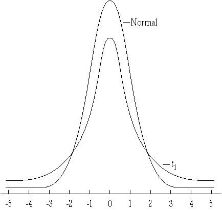

```{r child = "../setup.Rmd"}
```


```{css, echo = FALSE}
.tiny .remark-code { font-size: 70%; }
.small .remark-code { font-size: 80%; }
.tiny { font-size: 60%; }
.small { font-size: 80%; }
```

```{r packages, echo=FALSE, message=FALSE, warning=FALSE}
library(dplyr)
library(ggplot2)
```

## Reminders/announcements 

- Homework 6 due today at 9PM  

- Participation survey for last week and the previous week closes at 9PM

- This week's schedule: 
  - Tuesday 10-11am OH (JH, MSB 1117)
  - Thanksgiving
  
- Last homework (Homework 7) will be released next Monday 11/28 and due Friday 12/2 9PM

- Final exam on 12/7 at 3:30pm (cumulative)

---
## Recap
- Confidence intervals: 

  - Introduction and interpretation 
  
  - Construction using Central Limit Theorem: $\left(\overline{x}-z_{\frac{\alpha}{2}}\frac{\sigma}{\sqrt{n}}, \overline{x}+z_{\frac{\alpha}{2}}\frac{\sigma}{\sqrt{n}} \right)$

---
## Today

- More on confidence intervals: 

  - Changing n and alpha

  - Simulation example 

  - $\sigma^2$ unknown 

  - Confidence interval for population proportion 

---
## Confidence Interval for Population Mean
- **Set up**: $X_i$ are independent and identically distributed with population mean $\mu$ and variance, $\sigma^2$. We are interested in a $100(1-\alpha)$% confidence interval for the unknown population parameter $\mu$. We use the sample mean, $\overline{X}$, constructed from a sample of size $n$, as an estimator for the population mean. Assume $n$ is large.

We showed that 
$P(\overline{X}-z_{\frac{\alpha}{2}}\frac{\sigma}{\sqrt{n}} \leq \mu \leq \overline{X}+z_{\frac{\alpha}{2}}\frac{\sigma}{\sqrt{n}})  = 1 - \alpha$

And hence after collecting data and computing the sample mean, $\bar{x}$, an $\alpha$-level confidence interval for $\mu$ is

$$\left(\overline{x}-z_{\frac{\alpha}{2}}\frac{\sigma}{\sqrt{n}}, \overline{x}+z_{\frac{\alpha}{2}}\frac{\sigma}{\sqrt{n}} \right)$$

This relied on the Central Limit Theorem: when $n$ large, $Z = \frac{\overline{X} - \mu}{\sigma / \sqrt{n}} \approx N(0, 1)$, in other words $\overline{X} \approx N(\mu, \frac{\sigma^2}{n})$ 

---
## Example
Let $X_1, X_2, ..., X_{200}$ be independent $N(\mu, 4)$ random variables. We collect the sample of size 200, and the resulting sample mean, $\overline{x}$, is $\overline{x} = 24$. What is a 95% confidence interval for $\mu$?

Since $n = 200$ is large, by CLT, a 95% confidence interval for $\mu$ is given by 
$$\left(\overline{x}-z_{\frac{\alpha}{2}}\frac{\sigma}{\sqrt{n}}, \overline{x}+z_{\frac{\alpha}{2}}\frac{\sigma}{\sqrt{n}} \right)$$

Substitute $\overline{x} = 24$, $z_{\frac{\alpha}{2}} = 1.96$, $\sigma = 2$, $n = 200$, giving $\left(24-1.96*2/ \sqrt{200}, 24 + 1.96*2/ \sqrt{200} \right)$ or (23.72, 24.28)

We are 95% confident that $\mu$ falls within the interval (23.72, 24.28).

---

## Confidence Interval Width: changing n

$$\left(\overline{x}-z_{\frac{\alpha}{2}}\frac{\sigma}{\sqrt{n}}, \overline{x}+z_{\frac{\alpha}{2}}\frac{\sigma}{\sqrt{n}} \right)$$

For a given $z_{\frac{\alpha}{2}}$, confidence intervals that are narrower indicate greater certainty in estimated values. We can get narrower intervals by increasing $n$, the sample size.

---

## Earlier example
We had $n = 200$, $\overline{x} = 24$, $\sigma = 2$, and our 95% confidence interval for $\mu$ was (23.72, 24.28).

What about when $n = 2000$?

$$\left(\overline{x}-z_{\frac{\alpha}{2}}\frac{\sigma}{\sqrt{n}}, \overline{x}+z_{\frac{\alpha}{2}}\frac{\sigma}{\sqrt{n}} \right)$$

Substitute $\overline{x} = 24$, $z_{\frac{\alpha}{2}} = 1.96$, $\sigma = 2$, $n = 2000$, giving $\left(24-1.96*2/ \sqrt{2000}, 24 + 1.96*2/ \sqrt{2000} \right)$ or (23.91, 24.09)

---

## Confidence Interval Width: changing alpha

While 95% confidence intervals are the most common, it is simple to generate other intervals, for example 99% intervals, by replacing the critical value. E.g., for a 99% interval, we need the z-score that cuts off the upper 0.005 of the distribution, which is 2.58.

```{r}
qnorm(.995)
```

In our earlier example, we had $n = 200$, $\overline{x} = 24$, $\sigma = 2$, and our 95% confidence interval for $\mu$ was (23.72, 24.28). When $\alpha = .01$, a 99% confidence interval is $\left(24-2.58*2/ \sqrt{200}, 24 + 2.58*2/ \sqrt{200} \right)$ or (23.64, 24.36).

---
## Confidence Interval Width: changing alpha

In a recent study of 50 randomly selected statistics students, they
were asked the number of hours per week they spend studying for
their statistics classes. The results were used to estimate the mean
time for all statistics students with 90%, 95% and 99% confidence
intervals. These were (not necessarily in the same order):
$$(7.5, 8.5) ~~~ (7.6, 8.4) ~~~(7.7, 8.3).$$

Which interval is which?


---
## Simulation example
Let $X$ be normally distributed with mean $\mu = 3$ and variance $\sigma^2 = 25$, i.e., $X \sim N(3, 5^2)$


```{r}
myDraws <- rnorm(1000, mean = 3, sd = 5)
xBar <- mean(myDraws)
n <- length(myDraws)
halfWidth <- qnorm(.975)*5/sqrt(n)
(lower <- xBar - halfWidth)
(upper <- xBar + halfWidth)
```

Hence a 95% confidence interval for $\mu$ is (`r lower`, `r upper`).

---
## Simulation example: 5000 confidence intervals

```{r}
set.seed(0)
CIsDF <- data.frame(lower = rep(NA, 5000), upper = rep(NA, 5000))
for (i in 1:nrow(CIsDF)) {
  myDraws <- rnorm(1000, mean = 3, sd = 5)
  xBar <- mean(myDraws)
  n <- length(myDraws)
  halfWidth <- qnorm(.975)*5/sqrt(n)
  CIsDF[i, "lower"] <- xBar - halfWidth
  CIsDF[i, "upper"] <- xBar + halfWidth
}
```


---
## Simulation example: 5000 confidence intervals

How many of the 5000 CIs do we expect include the true population mean, $\mu = 3$?

--
- Recall interpretation of confidence intervals: If we were to **repeat this procedure** a large number of times, sampling and constructing confidence intervals in the same way, **95% of constructed intervals would contain the true population parameter**.

- If we repeat the experiment 5,000 times, i.e., draw samples and construct 5,000 confidence intervals, we would expect 4,750 of these to contain the true population parameter 

.small[
.pull-left[
```{r eval = FALSE}
CIsDF %>%
  mutate(index = 1:nrow(CIsDF),
         estimate = (lower + upper)/2) %>%
  slice(1:20) %>%
  ggplot(aes(estimate, index)) +
  geom_pointrange(aes(xmin = lower, xmax = upper)) + 
  geom_vline(xintercept = 3, colour = "grey60", linetype = 2) + 
  labs(title = "First 20 CIs for population mean",
    x = "Estimate",
    y = "Index")
```
]
]

.pull-right[
```{r echo = FALSE, out.width = "100%"}
CIsDF %>%
  mutate(index = 1:nrow(CIsDF),
         estimate = (lower + upper)/2) %>%
  slice(1:20) %>%
  ggplot(aes(estimate, index)) +
  geom_pointrange(aes(xmin = lower, xmax = upper)) + 
  geom_vline(xintercept = 3, colour = "grey60", linetype = 2) + 
  labs(title = "First 20 CIs for population mean",
    x = "Estimate",
    y = "Index")
```
]

---
## Simulation example: 5000 confidence intervals

```{r}
sum(CIsDF$lower <= 3 & CIsDF$upper >= 3)
sum(CIsDF$lower <= 3 & CIsDF$upper >= 3) / nrow(CIsDF)
```

---
## Simulation example: 5000 confidence intervals, 90% level of confidence

```{r}
set.seed(0)
CIsDF <- data.frame(lower = rep(NA, 5000), upper = rep(NA, 5000))
for (i in 1:nrow(CIsDF)) {
  myDraws <- rnorm(1000, mean = 3, sd = 5)
  xBar <- mean(myDraws)
  n <- length(myDraws)
  halfWidth <- qnorm(.95)*5/sqrt(n)
  CIsDF[i, "lower"] <- xBar - halfWidth
  CIsDF[i, "upper"] <- xBar + halfWidth
}
sum(CIsDF$lower <= 3 & CIsDF$upper >= 3)
sum(CIsDF$lower <= 3 & CIsDF$upper >= 3) / nrow(CIsDF)
```

---
## What happens if the population variance is unknown?

- The confidence interval involves $\sigma^2$; most of the time, this is unknown 

- Recall that we can **use the sample variance**, $s^2=\frac{1}{n-1}\sum_{i=1}^n(x_i-\bar{x})^2$, to estimate $\sigma^2$

- Before collecting the data: $S^2=\frac{1}{n-1}\sum_{i=1}^n(X_i-\overline{X})^2$

- If we estimate $\sigma^2$ using $S^2$, then we can't use the Central Limit Theorem in the same way

- Two ways we can make progress:
  1. When $n$ is large
  2. When $n$ is small 

---
## First case (n large)

- If $n$ is large, CLT still holds (for the $\sigma^2$ version), and using another theorem (out of scope for this class), we can prove that 
$\frac{\overline{X} - \mu}{S / \sqrt{n}} \approx N(0, 1)$ 

- Notice that the only difference is that we have replaced $\sigma$ by $S$.

- An $\alpha$-level confidence interval for $\mu$ is $\left(\overline{x}-z_{\frac{\alpha}{2}}\frac{s}{\sqrt{n}}, \overline{x}+z_{\frac{\alpha}{2}}\frac{s}{\sqrt{n}} \right)$

- Just like before, it doesn't matter what the distribution of $X_i$ is

---
## Previous example: $\sigma$ known
Let $X_1, X_2, ..., X_{200}$ be independent $N(\mu, 4)$ random variables. We collect the sample of size 200, and the resulting sample mean, $\overline{x}$, is $\overline{x} = 24$. What is a 95% confidence interval for $\mu$?

Since $n = 200$ is large, by CLT, a 95% confidence interval for $\mu$ is given by 
$$\left(\overline{x}-z_{\frac{\alpha}{2}}\frac{\sigma}{\sqrt{n}}, \overline{x}+z_{\frac{\alpha}{2}}\frac{\sigma}{\sqrt{n}} \right)$$

Substitute $\overline{x} = 24$, $z_{\frac{\alpha}{2}} = 1.96$, $\sigma = 2$, $n = 200$, giving $\left(24-1.96*2/ \sqrt{200}, 24 + 1.96*2/ \sqrt{200} \right)$ or (23.72, 24.28)

We are 95% confident that $\mu$ falls within the interval (23.72, 24.28).

---
## Previous example: $\sigma$ unknown
Let $X_1, X_2, ..., X_{200}$ be independent $N(\mu, \sigma^2)$ random variables. We collect the sample of size 200, and the resulting sample mean, $\overline{x}$, is $\overline{x} = 24$. $\sigma^2$ is unknown, but using our sample, we calculate the sample variance, $s^2$ to be 4.1. What is a 95% confidence interval for $\mu$?

Since $n = 200$ is large, a 95% confidence interval for $\mu$ is given by 
$$\left(\overline{x}-z_{\frac{\alpha}{2}}\frac{s}{\sqrt{n}}, \overline{x}+z_{\frac{\alpha}{2}}\frac{s}{\sqrt{n}} \right)$$

Substitute $\overline{x} = 24$, $z_{\frac{\alpha}{2}} = 1.96$, $s = \sqrt{4.1}$, $n = 200$, giving $\left(24-1.96*\sqrt{4.1}/ \sqrt{200}, 24 + 1.96*\sqrt{4.1}/ \sqrt{200} \right)$ or (23.72, 24.28)

We are 95% confident that $\mu$ falls within the interval (23.72, 24.28).

---

## Second case (n small)

- If $n$ is small, we cannot use CLT, so  
$\frac{\overline{X} - \mu}{S / \sqrt{n}}$ is not approximately $N(0, 1)$

- Instead, $\frac{\overline{X} - \mu}{S / \sqrt{n}} \sim t_{n-1}$ when $X_i$ are independent and $\sim N(\mu, \sigma^2)$

- In other words, the underlying distribution of $X_i$ is now restricted to normal

- An $\alpha$-level confidence interval for $\mu$ is $\left(\overline{x}-t_{n-1,\frac{\alpha}{2}}\frac{s}{\sqrt{n}}, \overline{x}+t_{n-1,\frac{\alpha}{2}}\frac{s}{\sqrt{n}} \right)$

- The notation $t_{n-1,\frac{\alpha}{2}}$ means the quantile corresponding to a probability of $\alpha/2$ in the right tail, for a $t_{n-1}$ distribution. We can use `qt(alpha/2, df = n-1, lower.tail = FALSE)`, e.g., 

.small[
```{r}
qt(.025, df = 19, lower.tail = FALSE)
```
]

---
## Student's t distribution

.pull-left[
- While working for Guinness Brewery in Dublin, William Sealy Gosset published a paper on the $t$ distribution, which became known as Student's $t$ distribution

- He used the new distribution to determine how large a sample of persons to use in taste-testing beer

]

.pull-right[
- Guinness worried competitors would steal their secret if he published under his own name, so Gosset published under the pseudonym "Student"

```{r echo=FALSE,out.width="50%"}

```
]

---
## Student's t distribution

- The $t$ distribution looks like the normal distribution, except that it has **fatter tails**

```{r echo=FALSE, out.width = "30%"}

```

- The $t$ distribution has a parameter called **degrees of freedom**, abbreviated *df*. For each possible df, there is a different $t$ distribution, with the $t$ distribution looking more like the normal as df gets large.

- As the sample size gets bigger, the $t$ distribution approximates the normal distribution

---

## Student's t distribution

- The random variable $T = \frac{\overline{X}-\mu}{S/\sqrt{n}}$ has a Student's t distribution with $n-1$ degrees of freedom, represented using the notation $t_{n-1}$. 

  - Recall that here $S^2 = \frac{1}{n - 1}\sum_{i = 1}^n (X_i - \overline{X})^2$, where $\overline{X} = \frac{\sum_{i = 1}^n X_i}{n}$ is the sample mean

- In other words, when we replace $\sigma$ by $S$, the distribution is now $t$ and not standard normal

- An $\alpha$-level confidence interval for $\mu$ is $\left(\overline{x}-t_{n-1,\frac{\alpha}{2}}\frac{s}{\sqrt{n}}, \overline{x}+t_{n-1,\frac{\alpha}{2}}\frac{s}{\sqrt{n}} \right)$

---

## Some intuition 
- An $\alpha$-level confidence interval for $\mu$ is $\left(\overline{x}-t_{n-1,\frac{\alpha}{2}}\frac{s}{\sqrt{n}}, \overline{x}+t_{n-1,\frac{\alpha}{2}}\frac{s}{\sqrt{n}} \right)$

.small[
```{r}
qnorm(.975)
qt(.975, df = 19)
```
]

- The $t$ distribution is used to construct confidence intervals for the mean when we need to account for the **additional variability** due to estimating $\sigma$ in addition to $\mu$

- The fatter tails lead to wider confidence intervals; makes sense since there is extra uncertainty due to the estimation of $\sigma^2$ 

- Very roughly speaking, the degrees of freedom measure the amount of information available in the data to estimate $\sigma^2$ and thus gives us information about how reliable our estimate $s^2$ is. 

---

## Confidence Intervals with $\sigma$ Unknown

**Case 1: When $n$ is large**

- Doesn't matter what the distribution of $X_i$ is; mean $\mu$ and variance $\sigma^2$
- $\frac{\overline{X}-\mu}{S/\sqrt{n}} \approx N(0, 1)$ 
- We can use the interval $\left(\overline{x}-z_{\frac{\alpha}{2}}\frac{s}{\sqrt{n}}, \overline{x}+z_{\frac{\alpha}{2}}\frac{s}{\sqrt{n}} \right)$

**Case 2: When $n$ is small**

- When $X_i$ is normally distributed with mean $\mu$ and variance $\sigma^2$, $T = \frac{\overline{X}-\mu}{S/\sqrt{n}} \sim t_{n-1}$
- We can use the interval $\left(\bar{x}-t_{n-1,\frac{\alpha}{2}}\frac{s}{\sqrt{n}}, \bar{x}+t_{n-1,\frac{\alpha}{2}}\frac{s}{\sqrt{n}} \right)$ 


---

## Example: Lead in Flint, MI

From April 25, 2014 to October 15, 2015, the water supply source for Flint, MI was switched to the Flint River from the Detroit water system. Without corrosion inhibitors, the Flint River water, which is high in chloride, caused lead from aging pipes to leach into the water supply. We have data from Flint collected as part of a citizen-science project involving Virginia Tech researchers.

```{r echo=FALSE}
knitr::include_graphics("img/flintdetroit.jpg")
```

---

## Example: Lead in Flint, MI

.small[
```{r}
flint <- readxl::read_excel("./data/Flint-Samples.xlsx", sheet = 1) %>%
  rename("Pb_initial"="Pb Bottle 1 (ppb) - First Draw")
str(flint)
```
]

- Each row is a sample and the lead level in the sample is in the `Pb_initial` column. The units are parts per billion (ppb)

- We want to construct a confidence interval for the unknown population mean lead level in Flint water

- What is the sample size $n$? What confidence interval should we use? 

---

## Calculating a Confidence Interval for Flint Lead

- Here there are 271 samples, so $n$ qualifies as large 

- For a 95% confidence interval: 
$$\left(\overline{x}-z_{\frac{\alpha}{2}}\frac{s}{\sqrt{n}}, \overline{x}+z_{\frac{\alpha}{2}}\frac{s}{\sqrt{n}} \right)$$
.small[
```{r flintmeanci}
xBar <- mean(flint$Pb_initial)
sigma2 <- var(flint$Pb_initial)
n <- length(flint$Pb_initial)
halfWidth <- qnorm(.975)*sqrt(sigma2/n)
(lower <- xBar - halfWidth)
(upper <- xBar + halfWidth)
```
]
Hence a 95% confidence interval for the mean lead level in water in Flint is (`r lower`, `r upper`)

---

## Using the t-distribution

```{r tttest}
t.test(flint$Pb_initial)
```


---

## Confidence interval for population proportion 

- Recall that when $X$ is a Bernoulli random variable, the sample mean $\overline{X} = \frac{\sum_{i = 1}^n{X_i}}{n}$ is the same as the sample proportion $\hat{P}$.

- We have $\overline{X} = \hat{P} \approx N(p, \frac{p(1-p)}{n})$ by the Central Limit Theorem, when $n$ is large

- $p$ is unknown, but we can replace it by $\hat{p}$, calculated from the sample, in the same way we replaced $\sigma$ by $s$ for the population mean (case 1, when $n$ large), so an $\alpha$-level confidence interval for $p$ is

$$\left(\hat{p}-z_{\frac{\alpha}{2}}\frac{\sqrt{\hat{p}(1-\hat{p})}}{\sqrt{n}}, \hat{p}+z_{\frac{\alpha}{2}}\frac{\sqrt{\hat{p}(1-\hat{p})}}{\sqrt{n}} \right)$$


---
## Example: Approval ratings

```{r echo = FALSE, out.width = "70%"}
knitr::include_graphics("img/approval.png")
```

.tiny[
Source: https://www.rasmussenreports.com/public_content/politics/biden_administration/prez_track_sep23
]

--

- Margin of error = $z_{\frac{\alpha}{2}}\frac{\sqrt{\hat{p}(1-\hat{p})}}{\sqrt{n}}$

```{r}
qnorm(.975)*sqrt(.5^2/1500)
```

---

## Example: Flint 

The EPA action level for lead in public water supplies is 15 ppb. Let's calculate the estimated proportion of samples (homes) in Flint with lead levels over 15 ppb along with a 95% confidence interval for the proportion.

```{r}
flint <- flint %>%
  mutate(Pbover15 = Pb_initial > 15)

pHat <- mean(flint$Pbover15)
var <- pHat*(1 - pHat)/length(flint$Pbover15)
halfWidth <- qnorm(.975)*sqrt(var)
(lower <- pHat - halfWidth)
(upper <- pHat + halfWidth)
```

Hence a 95% confidence interval for the proportion of homes in Flint with lead level above 15 ppb is (`r lower`, `r upper`).


---

## Summary
- More on confidence intervals: 

  - Changing n and alpha
  
  - Simulation example 

  - $\sigma^2$ unknown:
      - $n$ large: $\left(\overline{x}-z_{\frac{\alpha}{2}}\frac{s}{\sqrt{n}}, \overline{x}+z_{\frac{\alpha}{2}}\frac{s}{\sqrt{n}} \right)$
      - $n$ small and $X_i$ normal: $\left(\overline{x}-t_{n-1,\frac{\alpha}{2}}\frac{s}{\sqrt{n}}, \overline{x}+t_{n-1,\frac{\alpha}{2}}\frac{s}{\sqrt{n}} \right)$
    
  - Confidence interval for population proportion: $\left(\hat{p}-z_{\frac{\alpha}{2}}\frac{\sqrt{\hat{p}(1-\hat{p})}}{\sqrt{n}}, \hat{p}+z_{\frac{\alpha}{2}}\frac{\sqrt{\hat{p}(1-\hat{p})}}{\sqrt{n}} \right)$


