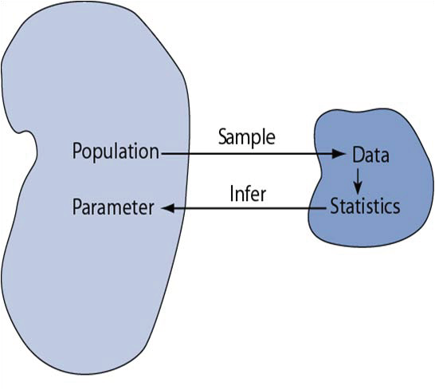
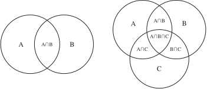
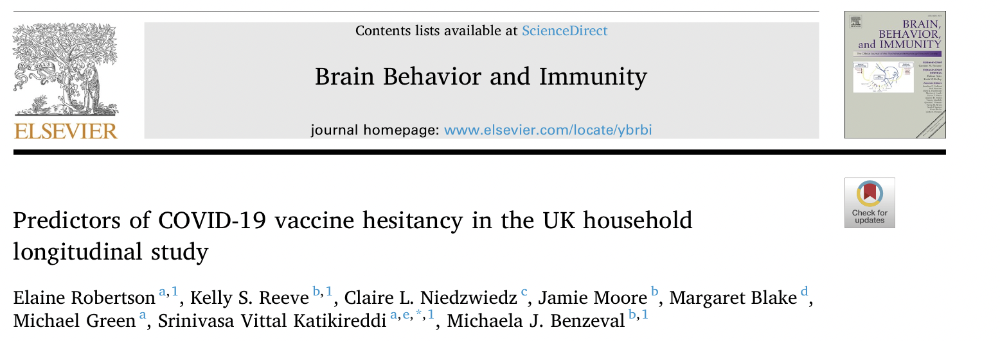

```{r child = "../setup.Rmd"}
```

```{css, echo = FALSE}
.tiny .remark-code { font-size: 60%; }
.small .remark-code { font-size: 80%; }
.tiny { font-size: 60%; }
.small { font-size: 80%; }
```


```{r packages, echo=FALSE, message=FALSE, warning=FALSE}
library(tidyverse)
```

## Course content 

1. Fundamentals of R
  - Overview of data types and structures
  - Data manipulation and data visualization tools  

2. Descriptive statistics for numerical and categorical data

3. **Probability**
  - **Rules of probability computation; conditional probability**
  - Basic probability models: Binomial, Normal and Poisson 

4. Statistical inference
  - Sampling distributions of sample mean and sample proportion 
  - Hypothesis testing and confidence intervals for population mean and population proportion

---
## Today

- Statistical inference and probability theory

- Introduction to probability 

---

## Descriptive statistics
- **Summarize** and **describe** data

- Do not necessarily **generalize** beyond the data 

- **Example**: An instructor wants to know how students in the class did on the last test
  - The instructor asks the 10 students sitting in the front row
  - Does this generalize to the entire class?

---

## Descriptive statistics vs. inferential statistics
- Suppose the instructor **randomly samples** 10 people from the class and computes the sample mean

    - Would we expect this sample mean to be exactly equal to the mean of all the students in the class, even if the sample was random?

--

- Say the instructor takes **another sample** of 10 people from the class

    - Would we expect the mean of this second sample to be equal to the mean of the first sample?

--

- **Inferential statistics** or **statistical inference** gives us an idea about how each of these sample means are likely to vary from each other and from the mean of all the students in the class


---
## Recall: Population vs. sample 
- A **sample** is a portion or **subset** of the larger **population**

- E.g., population may be UC Davis students; randomly sample 300 students on the Quad this morning

- **Population**: the entire group we would like to make conclusions about 

- **Sample**: specific group we have collected data from 

- Population **parameter**, e.g., population mean
  - This is a fixed quantity

- Sample **statistic**, e.g., sample mean
  - Depends on the sample 

---

## Population parameters vs. sample statistics

```{r echo=FALSE, out.width = "30%"}

```

|   | **Parameters** | **Statistics** |
|:----|:------:|:------:|
| Source | Population | Sample |
| Calculated? | No | Yes |
| Example notation | $\mu, \sigma, p$ | $\overline{x}, s, \hat{p}, \hat{\mu}, \hat{\sigma}$ |


---
## Statistical Inference

- **Statistical inference** 

    - Draw conclusions about the larger population
    
.pull-left[
```{r echo=FALSE, out.width="70%"}
knitr::include_graphics("img/soup.png")
```
]

.pull-right[
Similar to tasting a spoonful of soup while cooking to make an inference about the entire pot.
]

- This is one goal of statistics: to answer a question, by making **inferences** about a **population** based on data in one or more **samples**.

- The validity of our inferences depends on a variety of factors, including the **representativeness** of the sample

---

## Statistical inference

When a **sample statistic** is used to estimate a **population parameter**, it will be accompanied by a **margin of error**

```{r echo = FALSE, out.width = "85%"}
knitr::include_graphics("img/approval.png")
```

.tiny[
Source: https://www.rasmussenreports.com/public_content/politics/biden_administration/prez_track_sep23
]
---
## Statistical inference

- In order to draw principled conclusions from our data, we rely on a formal probabilistic framework that allows us to **quantify uncertainty**.

- **Statistical inference** is built upon the foundation of **probability theory**.

- Many topics in statistical inference

  - Fundamentals: probability, distributions, random variables, ...
  
  - Sampling 
  
  - Hypothesis testing
  
  - Point estimates and confidence intervals
  
  - Modeling: Linear regression, analysis of variance, nonparametric models, machine learning, ... 


---
## Probability

- The **probability** of an event tells us how likely an event is to occur, and it can take values from 0 to 1, inclusive. 

--

- Coin flipping: What is the chance of getting heads? 

--

- Die rolling: What is the chance of rolling a 1?

--

- Y chromosomes in the US population: 51.2% of births are to babies with Y chromosomes, and 48.8% of babies do not have Y chromosomes. Thus the probability of having a baby with a Y chromosome is 0.512.

---


## Formalizing Probability

- **Random process** gives rise to an **outcome** with an associated probability

  - Flip coin: heads or tails
  - Roll die: 1, 2, 3, 4, 5 or 6
  
- The **probability** of an outcome is the proportion of times the outcome would occur if we observed the random process an infinite number of times.

- An outcome or set of outcomes are called **events**

- E.g., $A$ is the event that a die roll results in 1 or 2
  - In set notation: $A = \{1, 2\}$


---

## Formalizing Probability

- A **sample space** is the set of all possible outcomes, often denoted by $\mathcal{S}$
  - Flipping a coin: {H, T}
  - Rolling a die: {1, 2, 3, 4, 5, 6}
  
- **Probability** is usually denoted by $p$, $P$, or $\mathbb{P}$, e.g., $\mathbb{P}(A) = 1$, where $A$ is the event

- Always takes values between 0 and 1 (inclusive); sometimes represented as a percentage, e.g., 50%

- So we have $\mathbb{P}(\text{flipping H})= .5$

---


## Operations on Events

- The **union** of A and B, denoted $A \cup B$, is the event that A, or B, or both A and B, occur. E.g.,:
  - $A$ is the event that a person smokes
  
  - $B$ is the event that a person identifies as female
  
  - $A \cup B$ is the event that a person is either a smoker, or identifies as female, or both.
  
  - "or" is inclusive, i.e., "and/or" in everyday language

--

- The **intersection** of A and B, denoted $A \cap B$, is the event that both A and B occur. Using the same example, 
  - $A \cap B$ is the event that a person both smokes and identifies as female

---
## Venn Diagram

```{r echo = FALSE, out.width = "75%"}

```

- $A \cup B$ includes both circles

- Will sometimes see a rectangle encapsulating the Venn diagram; this denotes the sample space

---

## Disjoint or mutually exclusive events 

- A and B are **disjoint** or **mutually exclusive** if $A \cap B = \emptyset$ 
  
  - A and B cannot occur simultaneously
  
  - Flipping heads and flipping tails are disjoint events 
  
  - Smoking and identifying as female are *not* disjoint; they can happen at the same time 

--

- The **complement** of A, denoted $A^c$ or $\overline{A}$, is the event A does not occur. 

- In other words, $A^c$ represents all outcomes in the sample space that are not in A

- $A$ and $A^c$ are **disjoint**. 

---

## Probability Rules

- The probability of any event in the sample space is between 0 and 1, inclusive.

- What is the probability of the entire sample space? 

- If we know the probability of $A$, often denoted $P(A)$, it is easy to calculate the probability of $A^c$ as $P(A^c) = 1 - P(A)$. 

- This is called the **complement rule**:  $P(A) + P(A^c) = 1$.

---

## Additive Rule of Probability

- When events are mutually exclusive (cannot occur together), $P(A \cup B) = P(A) + P(B)$. In a Venn diagram, the circles representing A and B do not intersect.

- When two events can occur simultaneously (think about the overlapping sections in the Venn diagrams), then we need to avoid double-counting when calculating the probability either of two events will occur.


--

- The general **additive rule of probability** is therefore $P(A \cup B) = P(A) + P(B) - P(A \cap B)$ 

- $A \cap B$ is part of the event A and part of the event B, we need to avoid double-counting it.

  - Note that if two events A and B are mutually exclusive, then $P(A \cap B) = 0$.

---

## Computing Probabilities

- **Probability of an outcome** = proportion of times the outcome would occur if we observed the random process **infinitely many times**

- If all the outcomes **equally likely**, then for some event $E$, $$P(E)=\frac{\text{# of outcomes in } E}{\text{# of total outcomes in } \mathcal{S}}.$$

- Rolling die: 
  - Let $A$ be the event that we roll a 1 or a 6
  
  - $P(A) = \frac{2}{6}$

---

## Vaccine Hesitancy in the UK

```{r echo = FALSE, out.width = "75%", fig.align = "center"}

```


- Information on 10,000 people. 

(Sample in the original study, but for our purposes (to illustrate probability concepts) we are going to treat this as a population.) 

---

## Vaccine Hesitancy


|Ethnicity|Vaccine Hesitant | Not Hesitant |
|:------|------:|-------:|
| White British or Irish | 1362 | 7368 |
| Other white background | 71 | 199 |
| Mixed | 55 | 115 |
| Asian or Asian British - Indian | 37 | 143 |
| Asian or Asian British - Pakistani/Bangladeshi | 85 | 115 |
| Asian or Asian British - other | 15 | 95 |
| Black or Black British | 136 | 54 |
| Other Ethnic Group or Not Specified | 31 | 119 |

---

## Practicing with Probabilities

Define events A = vaccine hesitant and B = Asian or Asian British-Indian. Calculate the following probabilities for a randomly-selected person from the 10,000 people

- $P(A)$

- $P(B)$

- $P(A \cap B)$

- $P(A \cup B)$

- $P(A \cup B^c)$

---

## Vaccine Hesitancy

.small[
|Ethnicity|Vaccine Hesitant | Not Hesitant |
|:------|------:|-------:|
| White British or Irish | 1362 | 7368 |
| Other white background | 71 | 199 |
| Mixed | 55 | 115 |
| Asian or Asian British - Indian | 37 | 143 |
| Asian or Asian British - Pakistani/Bangladeshi | 85 | 115 |
| Asian or Asian British - other | 15 | 95 |
| Black or Black British | 136 | 54 |
| Other Ethnic Group or Not Specified | 31 | 119 |
]

- A = vaccine hesitant; B = Asian or Asian British-Indian
- Want $P(A)$, $P(B)$, $P(A \cap B)$, $P(A \cup B)$, $P(A \cup {B^c})$

---

## Vaccine Hesitancy

.tiny[
|Ethnicity|Vaccine Hesitant | Not Hesitant |
|:------|------:|-------:|
| White British or Irish | 1362 | 7368 |
| Other white background | 71 | 199 |
| Mixed | 55 | 115 |
| Asian or Asian British - Indian | 37 | 143 |
| Asian or Asian British - Pakistani/Bangladeshi | 85 | 115 |
| Asian or Asian British - other | 15 | 95 |
| Black or Black British | 136 | 54 |
| Other Ethnic Group or Not Specified | 31 | 119 |
]

- A = vaccine hesitant; B = Asian or Asian British-Indian
- $P(A) = \frac{1362 + 71 + 55 + 37 + 85 + 15 + 136 + 31}{10000} = \frac{1792}{10000} = .1792$
- $P(B) = \frac{37 + 143}{10000} = .018$
- $P(A \cap B) = \frac{37}{10000} = .0037$
- $P(A \cup B) = \frac{1362 + 71 + 55 + 37 + 85 + 15 + 136 + 31 + 143}{10000} = .1935$
- $P(A \cup {B^c}) = \frac{1935 - 143 + 7368 + 199 + 115 + 115+ 95+ 54 + 119}{10000} = .9875$
  - Or, $1 - \frac{143}{10000}$


---

## Probability distribution 

- A **probability distribution** is a table of all **disjoint** outcomes and their associated probabilities.

.tiny[
|Ethnicity|Vaccine Hesitant | Not Hesitant |
|:------|------:|-------:|
| White British or Irish | $\frac{1362}{10000}$ | $\frac{7368}{10000}$ |
| Other white background | $\frac{71}{10000}$ | $\frac{199}{10000}$ |
| Mixed | $\frac{55}{10000}$ | $\frac{115}{10000}$ |
| Asian or Asian British - Indian | $\frac{37}{10000}$ | $\frac{143}{10000}$ |
| Asian or Asian British - Pakistani/Bangladeshi | $\frac{85}{10000}$ | $\frac{115}{10000}$ |
| Asian or Asian British - other | $\frac{15}{10000}$ | $\frac{95}{10000}$ |
| Black or Black British | $\frac{136}{10000}$ | $\frac{54}{10000}$ |
| Other Ethnic Group or Not Specified | $\frac{31}{10000}$ | $\frac{119}{10000}$ |
]

---

## Rules for Probability Distributions

A probability distribution is a **list of the possible outcomes** with **corresponding probabilities** 

- Needs to satisfy three rules:

1. The outcomes listed must be disjoint.

2. Each probability must be between 0 and 1.

3. The probabilities must total 1.

---

## Independence

- Events $A$ and $B$ are **independent** if knowing the outcome of one provides no useful information about the outcome of the other

- E.g.: Flipping a coin and rolling a die are two independent processes
  - Knowing the coin was heads does not help determine the outcome of a die roll

- Seeing someone with an umbrella and the day being rainy are not independent
  - If we see someone with an umbrella, it is more likely to be a rainy day 

---

## Independence

- What is the probability of flipping heads and rolling a 1 on a die? 

- Probability distribution

| 1 | 2 | 3 | 4 | 5 | 6 
--|--|-- |-- |-- |-- |--
Heads | $\frac{1}{12}$ | $\frac{1}{12}$ | $\frac{1}{12}$ | $\frac{1}{12}$ | $\frac{1}{12}$ | $\frac{1}{12}$ 
Tails | $\frac{1}{12}$ | $\frac{1}{12}$ | $\frac{1}{12}$ | $\frac{1}{12}$ | $\frac{1}{12}$ | $\frac{1}{12}$ 

- Intuition: 1/2 of the time we get heads, and 1/6 of those times we roll a 1

- Probabilities can therefore be multiplied

---

## Independence

- Multiplication rule for **independent processes**:

  - If A and B represent events from two different and independent processes, then the probability that both A and B occur can be calculated as the product of their separate probabilities: $P(A \cap B) = P(A) \times P(B)$.
  
  - If there are $k$ events $A_1, ..., A_k$ from $k$ independent processes, then the probability they all occur is $P(A_1) \times P(A_2) \times ... \times P(A_k)$.


---
## Summary

--

- Descriptive statistics vs. inferential statistics

- Statistical inference and probability theory

- Introduction to probability 
  - Events, sample space
  - Probability rules  
      - Complement rule: $P(A) + P(A^c) = 1$  
      - Additive rule: $P(A \cup B) = P(A) + P(B) - P(A \cap B)$  
  - Probability distributions
  - Independence:
      - Multiplication rule: $P(A \cap B) = P(A) \times P(B)$
  

