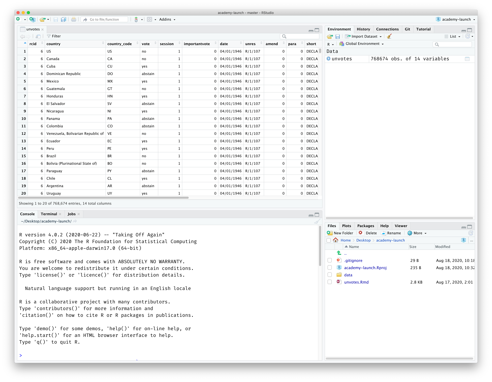

```{r child = "../setup.Rmd"}
```

```{css, echo = FALSE}
.small .remark-code { font-size: 80%; }
```

```{r packages, echo=FALSE, message=FALSE, warning=FALSE}
library(dplyr)
library(ggplot2)
library(unvotes)
```


## Agenda
- Course overview 

- Course logistics

- Fundamentals of R

---

## Statistical data science
--

- Statistics is the study of how to collect, analyze, and draw conclusions from **data**.

- Data science is typically thought of as an **interdisciplinary field**, combining statistical thinking with elements more traditionally thought of as coming from other fields, such as programming, database management and optimization.

- There is a stronger focus on the **practical aspects** of working with data, in particular **computing**, as well as **applications** in different domains, such as the sciences, business, sports, and government.

- This is a course on **introduction to data science**, with an emphasis on statistical thinking.

- **Intro statistics** course, with a focus on computing. 

---
## Examples of data science in practice

```{r echo=FALSE, out.width="50%", fig.align="center"}
knitr::include_graphics("img/target.png")
```

---
```{r echo=FALSE, out.width="60%", fig.align="center"}

```
---

```{r echo=FALSE, out.width="85%", fig.align="center"}

```
---

```{r echo=FALSE, out.width="60%", fig.align="center"}

```

---
## Data science life cycle

<!-- https://sta199-fa21-003.netlify.app/slides/01-intro.html#11 -->
<!-- https://sta199-fa21-003.netlify.app/appex/appex01-unvotes.html -->

```{r echo=FALSE, out.width="90%", fig.align="center"}
knitr::include_graphics("img/data-science-cycle.006.png")
```

---

## Course content 

1. **Fundamentals of R**  
  - Overview of data types and structures 
  - Data manipulation and data visualization tools 

2. **Descriptive statistics** for numerical and categorical data 

3. **Probability**
  - Rules of probability computation; conditional probability
  - Basic probability models: Binomial, Normal and Poisson 

4. **Statistical inference**
  - Sampling distributions of sample mean and sample proportion 
  - Hypothesis testing and confidence intervals for population mean and population proportion

- No statistics, data science or programming knowledge presumed

---

## Course logistics 
- **Lectures** Monday, Wednesday and Friday 

- Thursday **lab** (run by Jedidiah Harwood)

- **Office hours**
  - Jedidiah Harwood: Tuesdays and Thursdays 10-11 AM at MSB 1117
  - Xiao Hui Tai: Mondays 2:30-3:30 PM at MSB 4242

- **Course website**: https://xhtai.github.io/statdatasci/
  - Lecture notes, homework, supplementary materials, etc.
  
- **Canvas** for lab materials, turning in labs and homework (through Gradescope), solutions and grade-book

- **Piazza** for announcements and discussion

---

## Course logistics 

- **Waitlist**:

  - If you are no longer interested in taking the course, please drop sooner rather than later; there are many students on the waitlist
  - I have no control of the waitlist 

---

## Grading  

- 15% labs
  - Due at 9pm, Monday after lab
  
- 25% homework (roughly weekly)
  - Assigned on Friday afternoon, due Thursday 9pm
  - Except last two weeks 
  
- 30% midterms (two midterms, one dropped)

- 30% final

- See syllabus on course webpage for full details

---
## Software
```{r echo=FALSE, out.width="80%"}
knitr::include_graphics("img/excel.png")
```

---
.pull-left[
```{r echo=FALSE, out.width="25%", fig.align="left"}

```

```{r echo=FALSE, out.width="100%"}
knitr::include_graphics("img/r.png")
```
]

.pull-right[
<br> 
<br> 

- R is a free, open-source **statistical programming language** for statistical computing

- It is also an **interactive environment** for doing data science

- Data science teams often use a **mix of languages**, including R, Python, Julia, ... 

]
---
.pull-left[
```{r echo=FALSE, out.width="25%", fig.align="left"}

```

```{r echo=FALSE, out.width="100%"}
knitr::include_graphics("img/r.png")
```
]

.pull-right[

<br> 
<br> 

- R **Console**: Basic interaction with R is by typing in the console, a.k.a. terminal or command-line

- You type in commands, R gives back answers (or errors)

- It is easily **extensible** with packages

- **Menus and other graphical interfaces** are extras built on top of the console

]

---

## Quick R demonstration
- Arithmetic 
```{r comment=NA}
1 + 2
```

- Comparisons
```{r comment=NA}
1 == 2
```


---

.pull-left[
```{r echo=FALSE, out.width="55%", fig.align="left"}
knitr::include_graphics("img/RStudio-Logo-Flat.png")
```

```{r echo=FALSE, out.width="100%"}

```
]

.pull-right[
<br> 
<br> 

- **RStudio** is a free, open-source R **programming environment**

- It is called an **integrated development environment**, or IDE, for R programming  

- It contains a built-in code editor, many features to make working with R easier, and works the same way across different operating systems.

]

---

## Example of a data visualization 

```{r echo = FALSE, out.width = '100%'}
un_votes %>%
  filter(country %in% c("United States", "United Kingdom", "China", "Singapore")) %>%
  inner_join(un_roll_calls, by = "rcid") %>%
  inner_join(un_roll_call_issues, by = "rcid") %>%
  mutate(year = lubridate::year(date)) %>%
  group_by(country, year, issue) %>%
  summarize(votes = n(),
            percent_yes = mean(vote == "yes")) %>%
  filter(votes > 5) %>%  # Only use records where there are more than 5 votes
  ggplot(mapping = aes(x = year, y = percent_yes, color = country)) +
  geom_point(alpha = 0.4) +
  geom_smooth(method = "loess", se = FALSE) +
  facet_wrap(~issue) +
  scale_y_continuous(labels = scales::percent) +
  labs(
    title = "Percentage of 'Yes' votes in the UN General Assembly",
    subtitle = "1946 to 2019",
    y = "% Yes",
    x = "Year",
    color = "Country"
  ) +
  scale_color_viridis_d() +
  theme(text = element_text(size = 9))   
```

---
<br><br>
.small[
```{r eval = FALSE}
un_votes %>%
  filter(country %in% c("United States", "United Kingdom", "China", "Singapore")) %>%
  inner_join(un_roll_calls, by = "rcid") %>%
  inner_join(un_roll_call_issues, by = "rcid") %>%
  mutate(year = lubridate::year(date)) %>%
  group_by(country, year, issue) %>%
  summarize(votes = n(),
            percent_yes = mean(vote == "yes")) %>%
  filter(votes > 5) %>%  # Only use records where there are more than 5 votes
  ggplot(mapping = aes(x = year, y = percent_yes, color = country)) +
  geom_point(alpha = 0.4) +
  geom_smooth(method = "loess", se = FALSE) +
  facet_wrap(~issue) +
  scale_y_continuous(labels = scales::percent) +
  labs(
    title = "Percentage of 'Yes' votes in the UN General Assembly",
    subtitle = "1946 to 2019",
    y = "% Yes",
    x = "Year",
    color = "Country"
  ) +
  scale_color_viridis_d() +
  theme(text = element_text(size = 9))   
```
]
---

## Computing set up

- UC Davis **JupyterHub** (https://jupyterhub.ucdavis.edu/) has RStudio set up 

- Alternatively, you can install R and RStudio on **your own computers** 

- You will need **regular, reliable access to a computer** either with a working browser, or running an up-to-date version of R and RStudio

- If this is a problem, please let us know right away. There are resources available to support you.

- Labs will be at TLC 2212; either use computers available in the lab, or your own laptops (make sure your laptop is charged before class)

- For lectures, I will sometimes do additional exercises at the end of class, so laptops are encouraged but not required. 

---

## JupyterHub

```{r echo=FALSE, out.width="70%"}

```

Clicking the "Sign in with Google" button will take you to a login page. Log in using your UC Davis credentials. 

---

## JupyterHub

```{r echo=FALSE, out.width="80%"}

```


---

## JupyterHub

```{r echo=FALSE, out.width="100%"}

```


---
## Tour: RStudio

```{r echo=FALSE, out.width="80%"}
knitr::include_graphics("img/jupyter3annotated.png")
```

To upload `Rmd` files or data files, download them to your computer (from the course webpage or from Canvas), and then upload them to the server using the Upload button in the Files pane. 

---

## A short list of R essentials

- **Functions** are (most often) verbs, followed by what they will be applied to in parentheses:

```{r eval=FALSE}
do_this(to_this)
do_that(to_this, to_that, with_those)
```

- **Packages** are extensions to R
  - They include functions, documentation, and sample data
  - They are hosted on **CRAN** (the Comprehensive R Archive Network)
  - They are installed using `install.packages()` and loaded using `library()`, once per session:

```{r eval=FALSE}
install.packages("package_name")
library(package_name)
```

Alternatively, you can call a function from a package without loading it, using `package_name::do_this()`.

---
## A short list of R essentials
- Object **documentation** can be accessed with `?` or `help()`

```{r eval=FALSE}
?mean
```

- The **environment** is where R finds the value associated with a name

- **Comments** are lines or text that start with the hash #
  - These will not be executed 

---

## R Markdown
```{r echo=FALSE, out.width="10%"}
knitr::include_graphics("img/rmarkdown.png")
```

- R Markdown is a tool to **integrate code and written prose** in reproducible computational documents

- R Markdown files have the `Rmd` extension. Each time you "knit," the analysis is run from the beginning.

- To learn more, go to [rmarkdown.rstudio.com](https://rmarkdown.rstudio.com/)

- Labs will be completed in R Markdown

- Code goes in **chunks**, defined by three backticks, narrative goes outside of chunks

---

## Tour: R Markdown

```{r echo=FALSE, out.width="90%"}
knitr::include_graphics("img/tour-rmarkdown.png")
```

