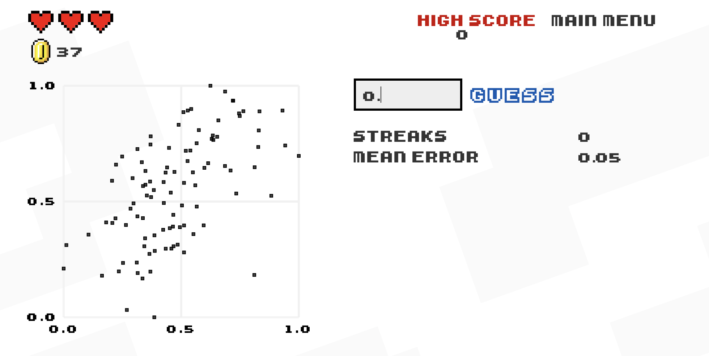

```{r child = "../setup.Rmd"}
```

```{css, echo = FALSE}
.tiny .remark-code { font-size: 60%; }
.small .remark-code { font-size: 80%; }
```


```{r packages, echo=FALSE, message=FALSE, warning=FALSE}
library(dplyr); library(ggplot2)
library(openintro)
loans <- loans_full_schema %>%
  select(loan_amount, interest_rate, term, grade, 
         state, annual_income, homeownership, debt_to_income,
         issue_month)
# glimpse(loans)

```


## Today
- Relationships between numerical variables 

- Describing categorical distributions

  - Bar plot

- Relationships between categorical data

  - Contingency tables


---
## Relationships between numerical variables

- Paired or bivariate data

  - Scatterplot 

  - Hexplot

  - Correlation
  
  - Line graph 

---

## Scatterplot
We have seen many examples of scatterplots 

--
- UN Votes

- Star Wars

- Anscombe's quartet

- Palmer Penguins

---

## Scatterplot
Each point is a single observation with **two characteristics**, or variables, plotted on the x- and y-axis respectively 

```{r warning = FALSE}
ggplot(loans, aes(x = debt_to_income, y = interest_rate)) +
  geom_point()
```

---

## Scatterplot in base R


.tiny[
.pull-left[
```{r message = TRUE, out.width = "100%"}
ggplot(loans, aes(x = debt_to_income, y = interest_rate)) +
  geom_point()
```
]

.pull-right[
```{r out.width = "100%"}
plot(loans$debt_to_income, loans$interest_rate)
```
]
]

---

## Overplotting and hex plots

- **Overplotting** is when points are plotted on top of each other

- Common in **large data sets** 

- A few ways to deal with this include using `alpha`, or `jitter()`

- Alternatively, **hex plots** or hexbin plots

.tiny[
.pull-left[
```{r warning = FALSE, out.width = "100%"}
ggplot(loans, aes(x = debt_to_income, y = interest_rate)) +
  geom_point()
```
]

.pull-right[
```{r warning = FALSE, out.width = "100%"}
ggplot(loans, aes(x = debt_to_income, y = interest_rate)) +
  geom_hex()
```
]
]

---

## Hex plot

- Hex plots **divide the graphing surface into hexagons** 

  - All points are grouped into their respective hexagonal regions 
  
  - **Color gradient** indicates the number of observations (count) in each hexagonal area.

```{r echo = FALSE, warning = FALSE}
ggplot(loans, 
       aes(x = debt_to_income, y = interest_rate)) +
  geom_hex()
```


---
## Correlation

- Correlation is the **association between two variables** 

- **(Pearson) Correlation coefficient** is a measure of **linear** correlation between two sets of data

- Ranges from -1 to 1

```{r echo=FALSE, out.width="70%"}
knitr::include_graphics("img/corr.svg")
```


---
## Correlation

Recall:
- Sample mean: $\bar{x} = \frac{x_1 + x_2 + ... + x_n}{n} = \frac{\sum_{i = 1}^{n} x_i}{n}$
- Sample variance: $s^2 = \frac{(x_1 - \bar{x})^2 + (x_2 - \bar{x})^2 + ... + (x_n - \bar{x})^2}{n - 1} = \frac{\sum_{i=1}^{n} (x_i-\bar{x})^2}{n-1}$

- Population mean: $\mu$
- Population variance: $\sigma^2$

- When talking about a population parameter for a variable $x$, might use subscript $x$, e.g., $\mu_x$, $\sigma^2_x$; similarly for a sample statistic, e.g., $s_x^2$

---
## Correlation
- Sample correlation: $r_{xy} = \frac{\sum_{i=1}^n (x_i-\bar{x})(y_i-\bar{y})}{\sqrt{\sum_{i=1}^n (x_i-\bar{x})^2 \sum_{i=1}^n(y_i-\bar{y})^2}}$

- Population correlation: $\rho$

- `cor()` in R

---
## Correlation
- Sample correlation: $r_{xy} = \frac{\sum_{i=1}^n (x_i-\bar{x})(y_i-\bar{y})}{\sqrt{\sum_{i=1}^n (x_i-\bar{x})^2 \sum_{i=1}^n(y_i-\bar{y})^2}}$

```{r echo=FALSE, out.width="80%"}

```

---
## Correlation
- Sample correlation: $r_{xy} = \frac{\sum_{i=1}^n (x_i-\bar{x})(y_i-\bar{y})}{\sqrt{\sum_{i=1}^n (x_i-\bar{x})^2 \sum_{i=1}^n(y_i-\bar{y})^2}}$

```{r echo=FALSE, out.width="80%"}
knitr::include_graphics("img/corr2.png")
```


---
## Correlation
- Sample correlation: $r_{xy} = \frac{\sum_{i=1}^n (x_i-\bar{x})(y_i-\bar{y})}{\sqrt{\sum_{i=1}^n (x_i-\bar{x})^2 \sum_{i=1}^n(y_i-\bar{y})^2}}$

```{r echo=FALSE, out.width="80%"}
knitr::include_graphics("img/corr3.png")
```

---
## Correlation
- Sample correlation: $r_{xy} = \frac{\sum_{i=1}^n (x_i-\bar{x})(y_i-\bar{y})}{\sqrt{\sum_{i=1}^n (x_i-\bar{x})^2 \sum_{i=1}^n(y_i-\bar{y})^2}}$

- What does the **denominator** look like? 

--
  - Recall: Sample variance $s^2 = \frac{(x_1 - \bar{x})^2 + (x_2 - \bar{x})^2 + ... + (x_n - \bar{x})^2}{n - 1} = \frac{\sum_{i=1}^{n} (x_i-\bar{x})^2}{n-1}$
  
  - Denominator: $\sqrt{\sum_{i=1}^n (x_i-\bar{x})^2 \sum_{i=1}^n(y_i-\bar{y})^2} = \sqrt{(n-1)s_x^2 (n - 1)s_y^2} = (n-1)s_xs_y$

- Pearson correlation coefficient is **scale and location-invariant**
  
  - **Subtract sample means**, $\bar{x}$ and $\bar{y}$

  - You can think of the denominator as a **scaling factor** 
  

---
## Guess the correlation
http://guessthecorrelation.com/

```{r echo=FALSE, out.width="80%"}

```

---
## Line graphs

Line graphs are most commonly used for data over time, **time series data**

.tiny[
.panelset[
.panel[.panel-name[Plot]
```{r ref.label = "line", echo = FALSE, warning = FALSE}
```
]
.panel[.panel-name[Code]
```{r line, fig.show = "hide", warning = FALSE}
loans %>%
  group_by(issue_month) %>%
  summarize(count = n()) %>%
  ggplot(aes(x = as.Date(paste0("01-", issue_month), format = "%d-%b-%Y"), y = count)) +
  geom_point() + 
  geom_line() +
  scale_x_date(labels = scales::date_format(format = "%m/%Y"), 
               breaks = scales::date_breaks(width = "1 month"), 
               expand = c(.02, .02)) +
  labs(title = "Number of monthly loans", 
    y = "Number of loans",
    x = "Month")
```
]
]
]

---
## Line graphs
- Be careful of `geom_path()` vs. `geom_line()`: 

  - `geom_path()` connects the observations in the order in which they appear in the data
  
  - `geom_line()` connects them in order of the variable on the x axis.

- In base R: `plot(x, y, type = "l")`. Also see `lines()`

---
## Line graphs in base R
.tiny[
.panelset[
.panel[.panel-name[Plot]
```{r ref.label = "line-base", echo = FALSE, warning = FALSE}
```
]
.panel[.panel-name[Code]
```{r line-base, fig.show = "hide", warning = FALSE}
tmpDF <- loans %>%
  group_by(issue_month) %>%
  summarize(count = n()) %>%
  mutate(issue_month = as.Date(paste0("01-", issue_month), format = "%d-%b-%Y")) %>%
  arrange(issue_month)
plot(tmpDF$issue_month, tmpDF$count, type = "l",
     main = "Number of monthly loans",
     xlab = "Month",
     ylab = "Number of loans")
```
]
]
]

---
## Exercises

- Two employees at a grocery store are weighing produce. One records weights in pounds (lb) and one in kilograms. What should we expect the correlation coefficient between their measurements to be?


$r_{xy} = \frac{\sum_{i=1}^n (x_i-\bar{x})(y_i-\bar{y})}{\sqrt{\sum_{i=1}^n (x_i-\bar{x})^2 \sum_{i=1}^n(y_i-\bar{y})^2}}$

- Write R code to calculate the sample correlation coefficient using just basic arithmetic operations (+ or sum(), -, . . . ) and the length() function. (Do not use functions like cor(), mean() or sd().)

---
## Summary

--
- Relationships between numerical variables 

  - Scatterplot
  
  - Hex plot

  - Correlation coefficient
  
  - Line graph


