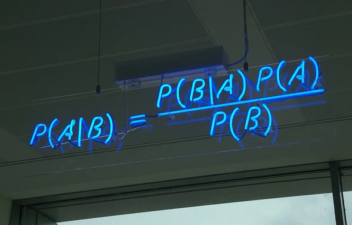

```{r child = "../setup.Rmd"}
```

```{css, echo = FALSE}
.tiny .remark-code { font-size: 60%; }
.small .remark-code { font-size: 80%; }
.tiny { font-size: 60%; }
.small { font-size: 80%; }
```


```{r packages, echo=FALSE, message=FALSE, warning=FALSE}
library(dplyr); library(ggplot2)
```


## Today

- Conditional probability

- Marginal and joint probability 

- Revisiting independence

- Bayes' Theorem


---
## Conditional Probability

- Probabilty an event will occur **given that** another event has occured  

- E.g., instead of the **marginal** probability of contracting COVID:

  - The probability that someone will contract COVID **given that** they have been vaccinated
  
  - The probability someone will contract COVID **given that** they have not been vaccinated. 

--

- Earlier example: $A$ = person smokes; $B$ = identifies as female

  - Conditional probability that someone is a smoker (event $A$) given that they identify as female (event $B$) is denoted $P(A|B)$
  
      - "Probability of A given B"


---

## Simple Example

- Population = 3 female non-smokers, 1 female smoker, 4 non-female non-smokers, 4 non-female smokers.

.pull-left[
- Each individual's characteristics:
.small[
``` 
   Female    Smoker
1       1         1
2       0         1
3       0         1
4       0         1
5       0         1
6       1         0
7       1         0
8       1         0
9       0         0
10      0         0
11      0         0
12      0         0
```
]
]

.pull-right[

.small[
| Female | Non-female 
--|-- | -- 
Smoke |  1 | 4
Does not smoke |3 | 4
]
]
---

## Conditional probability

.pull-left[
- Each individual's characteristics:
.small[
``` 
   Female    Smoker
1       1         1
2       0         1
3       0         1
4       0         1
5       0         1
6       1         0
7       1         0
8       1         0
9       0         0
10      0         0
11      0         0
12      0         0
```
]
]

.pull-right[

.small[
| Female | Non-female 
--|-- | -- 
Smoke |  1 | 4
Does not smoke |3 | 4
]
]

- Conditional probability someone is a smoker given that they identify as female, $P(\texttt{smoker}|\texttt{female})$
    
--
$= \frac{1}{3+1}$

- Change denominator to correspond to smaller population of interest

- How to read this off table / data? 


---
## Conditional probability: How to do this in R?

--

- Condition on `female` column, find proportion of smokers and non-smokers. 

- Recall: **column proportions**

```{r}
outTable <- matrix(c(1, 3, 4, 4), nrow = 2)
rownames(outTable) <- c("Smoker", "Non-smoker")
colnames(outTable) <- c("Female", "Non-female")
prop.table(outTable, margin = 2)
```


---
## Marginal probability 

- Each individual's characteristics:
.small[
``` 
   Female    Smoker
1       1         1
2       0         1
3       0         1
4       0         1
5       0         1
6       1         0
7       1         0
8       1         0
9       0         0
10      0         0
11      0         0
12      0         0
```
]

- **Marginal probability**: "unconditional" probability; based on a single variable
  
- One way to think about marginal probability: "throwing away/ignoring the other variable"

- $P(\texttt{female}) = \frac{4}{12}$ (just look at female column)
  
- $P(\texttt{smoker}) = \frac{5}{12}$ (just look at smoker column)


---
## Marginal probability

- Another way to think about marginal probability: **sum over the other variables** 
  - Might hear people say "marginalize over the other variable"

- Recall: row and column totals in R

.small[
```{r}
outTableTotals <- outTable %>%
  cbind(rowTotal = rowSums(outTable)) 
outTableTotals <- outTableTotals %>%
  rbind(columnTotal = colSums(outTableTotals))
outTableTotals
```
]

- What do column totals sum over? How about row totals? 

--

- $P(\texttt{female}) =$ 

- $P(\texttt{smoker}) =$ 

---
## Joint probability

- For outcomes for **two or more** variables or processes

- E.g.:
  - Flipping a coin *and* rolling a die
  
  - Identifying as female *and* smoking

- $P(\texttt{smoker}$ and $\texttt{female})$, $P(\texttt{smoker}, \texttt{female})$, $P(A \cap B)$


---
## Joint probability

- Divide frequencies by total count

```{r}
outTable / sum(outTable)
```

- This is a **probability distribution**; should sum to 1

- The probabilities we saw in the previous class were joint and marginal probabilities 

---

## Recall Our Vaccine Hesitancy Example

|Ethnicity|Vaccine Hesitant | Not Hesitant |
|:------|------:|-------:|
| White British or Irish | 1362 | 7368 |
| Other white background | 71 | 199 |
| Mixed | 55 | 115 |
| Asian or Asian British - Indian | 37 | 143 |
| Asian or Asian British - Pakistani/Bangladeshi | 85 | 115 |
| Asian or Asian British - other | 15 | 95 |
| Black or Black British | 136 | 54 |
| Other Ethnic Group or Not Specified | 31 | 119 |


---

## Three Probabilities

Define events A=vaccine hesitant and B=Asian or Asian British-Indian. Calculate the following probabilities for a randomly-selected person drawn from the population of 10,000. 

- **Marginal probability** of vaccine hesitancy, $P(A) = \frac{1362 + 71 + 55 + 37 + 85 + 15 + 136 + 31}{10000} = \frac{1792}{10000}$

- **Joint probability** of vaccine hesitancy and Indian ethnicity, $P(A \cap B) = \frac{37}{10000}$

- **Conditional probability** of vaccine hesitancy given a person is of Indian ethnicity, $P(A \mid B)$

--
$= \frac{37}{37+143}$

--

- Exercise: Given that someone is vaccine hesitant, what is the conditional probability that the person is of Indian ethnicity? 

---

## Rules for Conditional Probability

- **Conditional probability** $P(A|B)=\frac{P(A \cap B)}{P(B)}$

- Recall: Conditional probability someone is a smoker given that they identify as female = $P(\texttt{smoker}|\texttt{female}) = \frac{1}{3+1}$

  - Calculated by changing the denominator to correspond to our smaller population of interest 
  
  - $= \frac{\# (\texttt{smoker and female})}{\# \texttt{female}}$ 

- According to new formula: $P(\texttt{smoker}|\texttt{female}) = \frac{P(\texttt{smoker} \cap \texttt{female})}{P(\texttt{female})} = \frac{\# \texttt{smoker and female}/\texttt{total}}{\# \texttt{female}/\texttt{total}}$

- Works because total cancels out

---

## Rules for Conditional Probability

- $P(A|B)=\frac{P(A \cap B)}{P(B)}$

- **General multiplication rule**: $P(A \cap B) = P(B)P(A|B)$.


.small[
| Female | Non-female 
--|-- | -- 
Smoke |  1 | 4
Does not smoke |3 | 4
]


- $P(\texttt{smoker and female}) = P(\texttt{female})P(\texttt{smoker}|\texttt{female})$

---

## Rules for Conditional Probability

- **Sum of conditional probabilities**: 

Let $A_1, ..., A_k$ be disjoint outcomes. Then $P(A_1|B) + ... + P(A_k| B) = 1$

  - Same idea as complement rule: $P(A) + P(A^c) = 1$.


- Two events, $A$ and $A^c$

  - $P(A|B) + P(A^c| B) = 1$

  - Conditional version of complement rule 
  
  - $P(A|B) = 1 - P(A^c| B)$

---

## Rules for Conditional Probability

- **Law of total probability**:

- $P(B)=P(B \mid A)P(A) + P(B \mid {A}^c)P({A}^c) = P(B \cap A)+P(B \cap {A}^c)$

  - What is this in words? 

  <!-- - Translates to the statement that the probability that B occurs is equal to the sum of the probabilities that B occurs with A and that B occurs without A -->

- Extending this to $A_1, ..., A_k$, where $A_1, ..., A_k$ are disjoint outcomes: $P(B) = P(B \cap A_1)+ ... + P(B \cap {A_k})$


---

## Revisiting Independence

- Recall: If events A and B are independent, then $P(A \cap B)=P(A)\times P(B).$

  - Knowing the outcome of one does not provide information about the other

  - Rolling die and coin toss example 

- Another way to check this is using conditional probability

---

## Revisiting Independence

- Recall this probability distribution:

| 1 | 2 | 3 | 4 | 5 | 6 
--|--|-- |-- |-- |-- |--
Heads | $\frac{1}{12}$ | $\frac{1}{12}$ | $\frac{1}{12}$ | $\frac{1}{12}$ | $\frac{1}{12}$ | $\frac{1}{12}$ 
Tails | $\frac{1}{12}$ | $\frac{1}{12}$ | $\frac{1}{12}$ | $\frac{1}{12}$ | $\frac{1}{12}$ | $\frac{1}{12}$ 

- $P(\texttt{roll 1} | \texttt{heads}) = \frac{P(\texttt{1 and heads})}{P(\texttt{heads})} = \frac{1/12}{1/2} = 1/6$

- $P(\texttt{roll 1}) = 1/6$

- Events $A$ and $B$ are **independent** if and only if $P(A \mid B)=P(A)$ and $P(B \mid A)=P(B)$.

---

## Revisiting Independence

- Events $A$ and $B$ are **independent** if and only if $P(A \mid B)=P(A)$ and $P(B \mid A)=P(B)$.

  - This comes from the multiplication rule $P(A \cap B)=P(A)\times P(B)$ and the definition of conditional probability, $P(A|B)=\frac{P(A \cap B)}{P(B)}$
  
  - $P(A|B)=\frac{P(A \cap B)}{P(B)} = \frac{P(A) P(B)}{P(B)} = P(A)$

  - $P(B|A)=\frac{P(A \cap B)}{P(A)} = \frac{P(A) P(B)}{P(A)} = P(B)$
  
---

## Checking Independence

Are vaccine hesitancy and Indian ethnicity independent in our population?

- **Marginal probability** of vaccine hesitancy, $P(A) = \frac{1362 + 71 + 55 + 37 + 85 + 15 + 136 + 31}{10000} = \frac{1792}{10000} = .1792$

- **Conditional probability** of vaccine hesitancy given a person is of Indian ethnicity, $P(A \mid B) = \frac{37}{37+143} = .206$

- $P(A) = P(A \mid B)$? Independent?  

---

## Independent vs Disjoint Events

- For **independent events** $A$ and $B$, $P(A \mid B)=P(A)$ and $P(B \mid A)=P(B)$, so knowing one event occurred tells us *nothing* about the chances the other event will occur.

- For two **disjoint** or **mutually exclusive** events, knowing that one event has occurred tells us that the other event definitely has not    occurred, i.e., $P(A \cap B)=0$.

- Disjoint events are therefore *not* independent!

---
## Exercises


Given $P(A) = 0.3, P(B) = 0.7$  

(a) Can you compute $P(A \cap B)$ if you only know $P(A)$ and $P(B)$?  

(b) Assuming that events A and B arise from independent random processes,  
    i. what is $P(A \cap B)$?  
    ii. what is $P(A \cup B)$?  
    iii. what is $P(A \mid B)$?  
    
(c) If we are given that $P(A \cap B) = 0.1$, are the random variables giving rise to events A and B independent?  

(d) If we are given that $P(A \cap B) = 0.1$, what is $P(A \mid B)$?  

---
## Exercises

Suppose 80% of people like peanut butter, 89% like jelly, and 78% like both. Given that a randomly sampled person likes peanut butter, what's the probability that he also likes jelly?

---

## Bayes' Theorem

- Often we know $P(B|A)$ when we really want $P(A|B)$

- For example, a 40-year-old woman has a positive screening mammogram. Let the event $A$ be having cancer and $B$ be the positive mammogram screening result. 

--

- Using Bayes' Theorem is sometimes described as "updating our beliefs"
    - Without any information on the test result: the probability of cancer is $P(A)$. With test result we can calculate $P(A|B)$

- Want $P(A|B)$

<!-- , which is the probability of having cancer given a positive screening result.  -->

--

- Need $P(A)$, the prevalance of breast cancer among 40-year-old women.

- Properties of screening tool: 
  - $P(B | A)$
  - $P(B | A^c)$
  - $P(B)$

<!-- (called **sensitivity**, the probability of a positive result given that a person has cancer) -->


---

## Bayes' Theorem

**Bayes' theorem** says that $P(A \mid B) =\frac{P(A \cap B)}{P(B)} =\frac{P(B \mid A)P(A)}{P(B)} =\frac{P(B \mid A)P(A)}{P(B \mid A)P(A) + P(B \mid A^c)P(A^c)}$. 

- The last equality is by the law of total probability 

```{r echo = FALSE, out.width = "50%"}

```
Credit: Matt Buck, Flickr, CC BY-SA 2.0

---

## Bayes' Theorem

$P(A \mid B) =\frac{P(A \cap B)}{P(B)} =\frac{P(B \mid A)P(A)}{P(B)} =\frac{P(B \mid A)P(A)}{P(B \mid A)P(A) + P(B \mid A^c)P(A^c)}$
 
- $A$ = cancer, $B$ = positive screening result.  

- Say $P(A) = .01$

- $P(B | A)= .85$

- $P(B|A^c) = .1$ (probability of a positive screening result given that a person does not have cancer)

What is $P(A \mid B)$?

---

## Bayes' Theorem in Action

$P(A \mid B) =\frac{P(A \cap B)}{P(B)} =\frac{P(B \mid A)P(A)}{P(B)} =\frac{P(B \mid A)P(A)}{P(B \mid A)P(A) + P(B \mid A^c)P(A^c)}$

- $P(A) = .01$

- $P(B | A) = .85$

- $P(B|A^c) = .1$

- Then $P(A \mid B) =\frac{.85*.01}{.85*.01 + .1*(1 - .01)} = 0.079$

---
## Summary
--

- Conditional probability
  - General multiplication rule: $P(A \cap B) = P(B)P(A|B)$
  - Sum of conditional probabilities: $P(A_1|B) + ... + P(A_k| B) = 1$
  - Law of total probability: $P(B) = P(B \cap A_1)+ ... + P(B \cap {A_k}) = P(B \mid A_1)P(A_1) + ... + P(B \mid {A_k})P({A_k})$

- Marginal and joint probability 

- Revisiting independence
  - $P(A \mid B)=P(A)$ and $P(B \mid A)=P(B)$

- Bayes' Theorem
  - $P(A \mid B) =\frac{P(A \cap B)}{P(B)} =\frac{P(B \mid A)P(A)}{P(B)} =\frac{P(B \mid A)P(A)}{P(B \mid A)P(A) + P(B \mid A^c)P(A^c)}$


