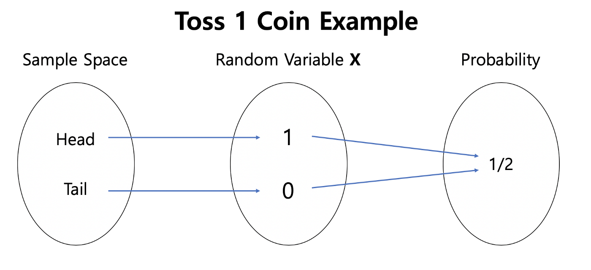
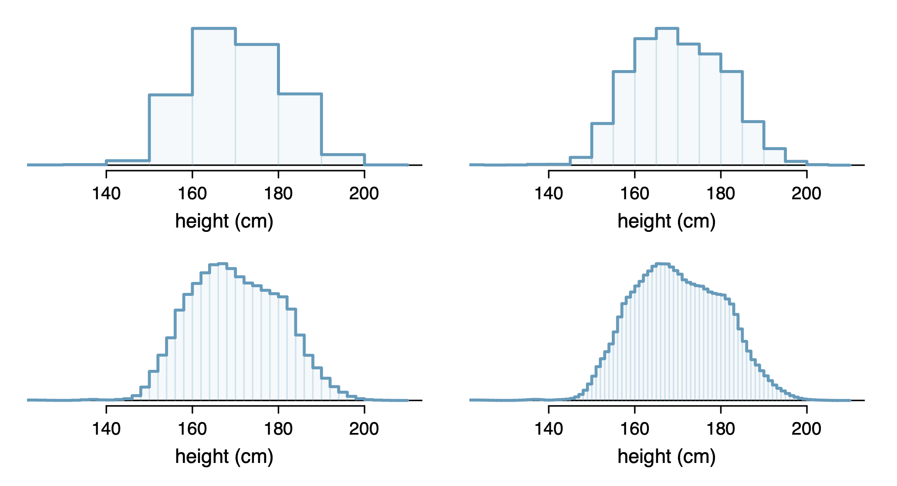
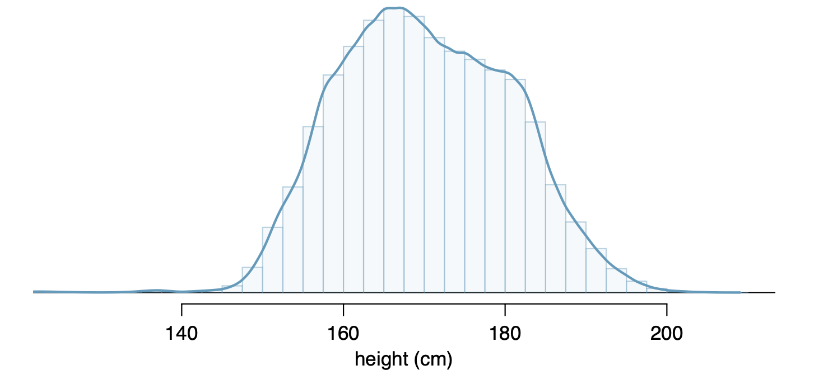

```{r child = "../setup.Rmd"}
```

```{css, echo = FALSE}
.tiny .remark-code { font-size: 60%; }
.small .remark-code { font-size: 80%; }
.tiny { font-size: 60%; }
.small { font-size: 80%; }
```


```{r packages, echo=FALSE, message=FALSE, warning=FALSE}
library(tidyverse)
```


## Reminders

- Lab 5 is due Monday at 9pm

- I will post HW 4 after class, due Thursday at 9pm
  - PDF files only; you may handwrite and scan, or type up your answers

- Participation survey opens after class, closes Monday at 9pm

---
## Recap

--

- Conditional probability
  - General multiplication rule: $P(A \cap B) = P(B)P(A|B)$
  - Sum of conditional probabilities: $P(A_1|B) + ... + P(A_k| B) = 1$
  - Law of total probability: $P(B) = P(B \cap A_1)+ ... + P(B \cap {A_k}) = P(B \mid A_1)P(A_1) + ... + P(B \mid {A_k})P({A_k})$

- Marginal and joint probability 

- Revisiting independence
  - $P(A \mid B)=P(A)$ and $P(B \mid A)=P(B)$

- Bayes' Theorem
  - $P(A \mid B) =\frac{P(A \cap B)}{P(B)} =\frac{P(B \mid A)P(A)}{P(B)} =\frac{P(B \mid A)P(A)}{P(B \mid A)P(A) + P(B \mid A^c)P(A^c)}$


---
## Today

- Random variables

  - Expectation and variance
  
  - Discrete and continuous random variables

- Common probability distributions

---
## Random variables

- A random variable is a mapping or a function from possible outcomes in a sample space to a probability space. 

- Recall: **sample space** is the set of all possible outcomes from a **random process**

```{r echo = FALSE, out.width = "60%"}

```
.small[
Source: https://medium.com/jun94-devpblog/prob-stats-1-random-variable-483c45242b3c
]

---
## Random variables

```{r echo = FALSE, out.width = "60%"}

```
.small[
Source: https://medium.com/jun94-devpblog/prob-stats-1-random-variable-483c45242b3c
]

- Let $X$ be the random variable indicating whether a coin flip results in heads.

- Instead of saying $P(\texttt{heads})$, we say $P(X = 1)$

- This representation allows us to apply mathematical frameworks and get a better understanding of real-world phenomenon

---
## Random variables

- Random variables are usually denoted by capital letters, most commonly $X$, $Y$, $Z$

- A realization or draw of the random variable is denoted by a lowercase letter, $x$, $y$, $z$

- Other examples of random variables:

  - Mass of classroom chairs
  
  - Ages of students at UC Davis

- For discrete random variables:
  
  - Each outcome has an associated probability $P(X = x_i)$ where $i = 1, ..., k$ ( $k$ outcomes are denoted by lower-case, $x_1, ..., x_k$)
  - Sometimes also written as $p_1, ..., p_k$ 

---

## Expectation 
Two books are assigned for a statistics class: a textbook and its corresponding study guide. The university bookstore determined 20% of enrolled students do not buy either book, 55% buy the textbook only, and 25% buy both books, and these percentages are relatively constant from one quarter to another. How many books should the bookstore expect to sell per student?

- Intuitively: $.2*0 + .55*1 + .25*2 = 1.05$ 

- Another way to think about it: say the class has 100 students. How many books should the bookstore expect to sell to the class? 

---
## Expectation 

- Formally: Let $X=$ number of books sold per student 

- The three possible outcomes are $x_1$ = 0 books, $x_2$ = 1 book (1 textbook for each student), $x_3$ = 2 books (1 textbook and 1 study guide for each student)

i | 1 | 2 | 3
--|--|--|--
$x_i$ | 0 | 1 | 2
$P(X = x_i)$ | .2 | .55 | .25

$$
\begin{aligned}
E(X) &= x_1 \times P(X = x_1) + x_2 \times P(X = x_2) + ... + x_k \times P(X = x_k)\\
&= \sum_{i=1}^k x_i P(X = x_i)
\end{aligned}
$$

- Using this definition: $E(X) = 0*.2 + 1* .55 + 2 * .25 = 1.05$.


---
## Expectation 

- Say we are interested in the amount of revenue that the bookstore can expect to earn per student. Say the textbook costs $ 137 and the study guide costs $ 33.

- What modifications do we need? 

  - Formally: Let $X=$ number of books sold per student

  - The three possible outcomes are $x_1$ = 0 books, $x_2$ = 1 books (1 textbook for each student), $x_3$ = 2 books (1 textbook and 1 study guide for each student)

i | 1 | 2 | 3
--|--|--|--
$x_i$ | 0 | 1 | 2
$P(X = x_i)$ | .2 | .55 | .25

  - Using this definition: $E(X) = 0*.2 + 1* .55 + 2 * .25 = 1.05$.
  
---
## Expectation 

- Say we are interested in the amount of revenue that the bookstore can expect to earn per student. Say the textbook costs $ 137 and the study guide costs $ 33.

- What modifications do we need? 

  - Formally: Let $X=$ revenue from books sold per student

  - The three possible outcomes are $x_1$ = $ 0, $x_2$ = $ 137 (1 textbook for each student), $x_3$ = $ 170 (1 textbook and 1 study guide for each student)

i | 1 | 2 | 3
--|--|--|--
$x_i$ | 0 | 137 | 170
$P(X = x_i)$ | .2 | .55 | .25


  - Using this definition: $E(X) = 0*.2 + 137* .55 + 170 * .25 = 117.85$.
 
---
## Expectation 

- The expectation is denoted by $E(X)$, $\mu$ or $\mu_x$

- This is the expected or average outcome of $X$, where $X$ is a random variable 

- Given a probability distribution for a discrete random variable, we can calculate it using

$$
\begin{aligned}
E(X) &= x_1 \times P(X = x_1) + x_2 \times P(X = x_2) + ... + x_k \times P(X = x_k)\\
&= \sum_{i=1}^k x_i P(X = x_i)
\end{aligned}
$$

- Recall: this is a **population parameter**, a fixed quantity
  - The sample version, the **sample statistic**, is the sample mean $\bar{x}$

---
## Properties of the expectation 

- $E[c] = c$, where c is a constant

- $E[aX] = aE[X]$

- $E[aX + c] = aE[X] + c$

- To calculate $E(X^2)$ (will be useful later), simply replace $x_i$ in the sum by $x_i^2$, i.e., 

$$
\begin{aligned}
E(X^2) &= x_1^2 \times P(X = x_1) + x_2^2 \times P(X = x_2) + ... + x_k^2 \times P(X = x_k)\\
&= \sum_{i=1}^k x_i^2 P(X = x_i)
\end{aligned}
$$

- More generally, $E[g(X)] = \sum_{i=1}^k g(x_i) P(X = x_i)$ (Law of the unconscious statistician)

---
## Variance

- Recall: we saw the **sample variance**, calculated for a data set

  - Take the square of deviations and find the mean
  
  - $s^2 = \frac{(x_1 - \bar{x})^2 + (x_2 - \bar{x})^2 + ... + (x_n - \bar{x})^2}{n - 1}$

- **Population variance** is often denoted by $\sigma^2$, $\sigma_x^2$, or $Var(X)$

- Given a probability distribution for a discrete random variable, we can calculate it using

.small[
$$
\begin{aligned}
Var(X) &= E[(X-\mu)^2] \\
&= (x_1 - \mu)^2 \times P(X = x_1) + (x_2 - \mu)^2 \times P(X = x_2) + ... + (x_k - \mu)^2 \times P(X = x_k)\\
&= \sum_{i=1}^k (x_i - \mu)^2 P(X = x_i)
\end{aligned}
$$
]

- Note: rather than summing over observations, these are over possible outcomes, weighted by their probabilities

---
## Variance

Another common way to write the variance is 
$$
\begin{aligned}
Var(X) &= E[(X-E(X))^2] \\
&= E[ (X^2 - 2XE(X) + [E(X)]^2) ] \\
&= E(X^2) - 2E(X)E(X) + [E(X)]^2 \\
&= E(X^2) - [E(X)]^2
\end{aligned}
$$

- Recall: $E(X) = \sum_{i=1}^k x_i P(X = x_i)$

- To calculate $E(X^2)$, simply replace $x_i$ in the sum above by $x_i^2$, i.e., 

$$
\begin{aligned}
E(X^2) &= x_1^2 \times P(X = x_1) + x_2^2 \times P(X = x_2) + ... + x_k^2 \times P(X = x_k)\\
&= \sum_{i=1}^k x_i^2 P(X = x_i)
\end{aligned}
$$

---
## Properties of the variance 

- $Var[c] = 0$, where c is a constant

- $Var[aX] = a^2Var[X]$

- $Var[aX + c] = a^2Var[X]$

---
## Linear combinations of random variables

- Often we care not just about a single random variable, but a combination of them

- E.g., 

  - The total revenue of our bookstore is a combination of books from different classes, not just our one statistics class
  
  - The total gain or loss in a stock portfolio is the sum of the gains and losses in its components
  
  - Total weekly commute time is a combination of daily commute
  
  
- Let $W$ be the weekly commute time per student at UC Davis

  - $X_1$ = commute time per student on Monday
  - $X_2$ = commute time per student on Tuesday
  - ...
  - $X_5$ =  commute time per student on Friday
  - $W = X_1 + X_2 + ... + X_5$ is also a random variable
  

---
## Linear combinations of random variables
- A **linear combination** of two random variables, $X$ and $Y$, is of the form 
$$
aX + bY,
$$

where $a$ and $b$ are constants.

- $a$ and $b$ are also called coefficients

- In our example, $W = X_1 + X_2 + ... + X_5$ is a linear combination with coefficients 1. 

---
## Expectation of linear combinations of random variables

- The expectation for a linear combination of random variables is given by 
$$
E(aX + bY) = aE(X) + bE(Y)
$$

- In our example, say $E(X_1) = ... = E(X_5) = 21$ minutes.

- Then, $E(W) = 1*21 + 1*21 + 1*21 + 1*21 + 1*21 = 105$ minutes.  

---
## Variance of linear combinations of random variables

- The variance for a linear combination of **independent** random variables
$$
Var(aX + bY) = a^2 Var(X) + b^2 Var(Y)
$$

- Note: this is only true if $X$ and $Y$ are independent. 

- In our example, say $Var(X_1) = ... = Var(X_5) = 5$ minutes. 

- Commute times on each day of the week are independent. 

- Then, $Var(W) = 1^2*5 + 1^2*5 + 1^2*5 + 1^2*5 + 1^2*5 = 25$ minutes.  

---
## Continuous random variables

- So far we have talked about discrete random variables

- One way to think about the difference between a discrete and a continuous random variable is to think about the sample versions

- Start with a histogram and decrease the bin size

```{r echo = FALSE, out.width = "60%"}

```


---
## Continuous random variables

- As the bin size goes to zero, we end up with a density plot

```{r echo = FALSE, out.width = "80%"}

```


---
## Continuous random variables

- The population versions are **probability mass functions** and **probability density functions**

- Recall: A **probability distribution** is a table of all **disjoint** outcomes and their associated probabilities.

  - In the case of discrete random variables, the probability distribution can be represented by a **probability mass function**, with "mass" on discrete values
  
  - In the case of continuous random variables, we have a **probability density function**

- We saw that in a probability distribution, the probabilities must total 1. In the continuous version, the total area under the density's curve needs to be 1.


---
## Continuous random variables

- For a continuous random variable, the probability that the random variable takes on any exact value is zero

- E.g., if $X$ is a random variable representing the height of an individual, $P(X = 180) = 0$

- This is because there are an infinite number of values the variable can take on, and the total probability needs to sum to 1.

- Instead, we think about probabilities in ranges. 

- $P(a \leq X \leq b)$ is the area under the density function between $a$ and $b$.

---
## Course content 

1. Fundamentals of R
  - Overview of data types and structures
  - Data manipulation and data visualization tools  

2. Descriptive statistics for numerical and categorical data

3. Probability
  - Rules of probability computation; conditional probability
  - **Basic probability models: Binomial, Normal and Poisson**

4. Statistical inference
  - Sampling distributions of sample mean and sample proportion 
  - Hypothesis testing and confidence intervals for population mean and population proportion

---
## Common probability distributions

- Discrete 

  - **Bernoulli**
  
  - **Binomial**

  - **Poisson**
  
  - Geometric

- Continuous

  - **Normal or Gaussian**
  
  - **Student's $t$**
  
  - Uniform
  
  - Exponential

---
## Why do we care about probability distributions?

- Recall: **Statistical inference** is built upon the foundation of **probability theory**.

- A more specific example: Suppose we are interested in comparing two groups of pancreatic cancer patients, with one group on the standard treatment and one group on an experimental new treatment. 

- Comparing the sample means of some outcome is insufficient because it does not take into account sampling variability
  
- Instead, we can perform a statistical test to compare the two groups 

- The statistical test depends on the variable of interest $X$ and its probability distribution.
  
- E.g.: define $X$ to be a 0/1 variable indicating whether each patient survives 1 year, or define X as the number of months a patient survives.

- Each definition is associated with the assumption of a different probability distribution, which would require a different type of test.

---
## Bernoulli random variable

- Note on terminology: when we say we have a Bernoulli random variable, we mean that the random variable follows a Bernoulli distribution

- Same with normal (or Gaussian) random variable, ... 

- Consider a binary random variable $Y$. By definition, $Y$ must assume one of two possible values, e.g.

  - failure or success
  - dead or alive
  - UC Davis student or not
  - current smoker or not
  - heads or tails (coin flip)
  - Y chromosome or not 

- A random variable of this type is known as a **Bernoulli** random variable, and we describe the probability of response using the parameter $\pi$ or $p$. 

---
## Bernoulli random variable

- $Y=1$ is often called a "success," $Y=0$ is called a "failure", and $\pi$ or $p$ is defined as the probability of a success, i.e., $P(Y = 1)$.

- The probability of a "failure," $P(Y = 0)$ is then $1 - p$

- Examples:

  - Coin flip: let $Y=1$ if heads and $Y=0$ if tails, then $P(Y=1) = p=0.5$

  - Vegetarian in US: $Y=1$ if vegetarian and $Y=0$ if not, then $P(Y=1) = p=0.05$ and $P(Y=0)=1-p=1-0.05=0.95$

  - Vegetarian in India: $Y=1$ if vegetarian and $Y=0$ if not, then $P(Y=1)=p=0.31$ and $P(Y=0)=1-p=1-0.31=0.69$

---
## Bernoulli random variable
- Probability mass function for a Bernoulli distributed random variable is $P(Y=y)=p^y(1-p)^{1-y}$

  - $P(Y=1)=p^1(1-p)^0=p$ (remember $x^0=1$ for any $x$)
  
  - $P(Y=0)=p^0(1-p)^1=1-p$
  
- For the Bernoulli random variable, we don't really need this formality

- However, we want to extend this to more complex settings

- $E(Y) = \sum_{i=1}^k y_i P(Y = y_i) = p$ and $Var(Y) = p(1-p)$

---
## Sampling from a Bernoulli distribution in R

- When $p = .5$, we can use the `sample()` function

```{r}
set.seed(0) # so results are reproducible 
bernoulliDraws <- sample(0:1, size = 100, replace = TRUE)
bernoulliDraws
```

---
## Sampling from a Bernoulli distribution in R

```{r}
data.frame(outcome = bernoulliDraws) %>%
  ggplot(aes(x = outcome)) +
    geom_bar()
```

---
## Sampling from a Bernoulli distribution in R

What happens when we increase the sample size? 

.small[
.pull-left[
$n = 100$
```{r out.width = "100%"}
set.seed(0) # so results are reproducible 
bernoulliDraws <- sample(0:1, size = 100, 
                         replace = TRUE)
data.frame(outcome = bernoulliDraws) %>%
  ggplot(aes(x = outcome)) +
    geom_bar()
```
]


.pull-right[
$n = 1000$
```{r out.width = "100%"}
set.seed(0) # so results are reproducible 
bernoulliDraws <- sample(0:1, size = 1000, 
                         replace = TRUE)
data.frame(outcome = bernoulliDraws) %>%
  ggplot(aes(x = outcome)) +
    geom_bar()
```
]
]

---
## Sampling from a Bernoulli distribution in R

What happens when we increase the sample size? 

.small[
.pull-left[
$n = 1000$
```{r out.width = "100%"}
set.seed(0) # so results are reproducible 
bernoulliDraws <- sample(0:1, size = 1000, 
                         replace = TRUE)
data.frame(outcome = bernoulliDraws) %>%
  ggplot(aes(x = outcome)) +
    geom_bar()
```
]

.pull-right[
$n = 10000$
```{r out.width = "100%"}
set.seed(0) # so results are reproducible 
bernoulliDraws <- sample(0:1, size = 10000, 
                         replace = TRUE)
data.frame(outcome = bernoulliDraws) %>%
  ggplot(aes(x = outcome)) +
    geom_bar()
```
]
]

---
## Law of large numbers

The law of large numbers states that as a sample size grows, the sample mean gets closer to the expected value, or population mean

.small[
```{r}
myMeans <- data.frame(sampleSize = 1:10000, myMean = NA)
meanFun <- function(inputSampSize, outcomes) {
  return(mean(outcomes[1:inputSampSize]))
}
myMeans$myMean <- sapply(myMeans$sampleSize, meanFun, bernoulliDraws)
head(myMeans)
tail(myMeans)
```
]
---
## Law of large numbers
```{r}
myMeans %>%
  ggplot(aes(x = sampleSize, y = myMean)) +
  geom_line() +
  labs(x = "Sample size",
       y = "Sample mean",
       title = "Illustration of law of large numbers")
```

---
## Summary
--

- Random variables

  - Expectation and variance
  
  - Discrete and continuous random variables

- Common probability distributions

  - Bernoulli 

- Law of large numbers


