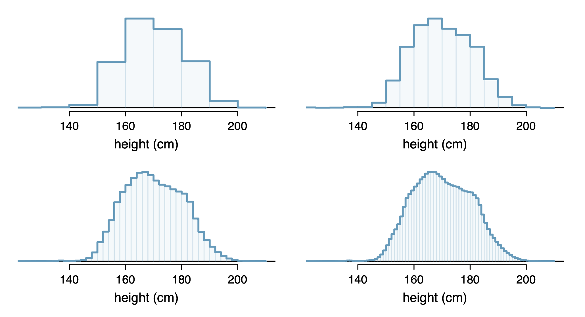

```{r child = "../setup.Rmd"}
```

```{css, echo = FALSE}
.tiny .remark-code { font-size: 60%; }
.small .remark-code { font-size: 80%; }
.tiny { font-size: 60%; }
.small { font-size: 80%; }
```


```{r packages, echo=FALSE, message=FALSE, warning=FALSE}
library(dplyr); library(ggplot2)
```


## Today
- Continuous random variables 

- Common probability distributions

  - Bernoulli 
  
  - Binomial 

- Law of large numbers 

---
## Continuous random variables

- Sample version: start with a histogram and decrease the bin size

```{r echo = FALSE, out.width = "60%"}

```


---
## Continuous random variables

- As the bin size goes to zero, we end up with a density plot

```{r echo = FALSE, out.width = "80%"}
knitr::include_graphics("img/density.png")
```


---

## Continuous random variables

- The population versions are **probability mass functions** and **probability density functions**

- Recall: A **probability distribution** is a table of all **disjoint** outcomes and their associated probabilities.

  - Discrete random variables: probability distribution = **probability mass function**
  
  - Continuous random variables: probability distribution = **probability density function**

- Total probability needs to be 1

<!-- - We saw that in a probability distribution, the probabilities must total 1. In the continuous version, the total area under the density's curve needs to be 1. -->


---

## Continuous random variables

- Probability that the random variable takes on any exact value is **zero**

- E.g., if $X$ is a random variable representing the height of an individual, $P(X = 180) = 0$

- Why? 
<!-- - This is because there are an infinite number of values the variable can take on, and the total probability needs to sum to 1. -->

- Instead: $P(a \leq X \leq b)$ is the **area under the density function** between $a$ and $b$.

---
## Course content 

1. Fundamentals of R
  - Overview of data types and structures
  - Data manipulation and data visualization tools  

2. Descriptive statistics for numerical and categorical data

3. Probability
  - Rules of probability computation; conditional probability
  - **Basic probability models: Binomial, Normal and Poisson**

4. Statistical inference
  - Sampling distributions of sample mean and sample proportion 
  - Hypothesis testing and confidence intervals for population mean and population proportion

---
## Common probability distributions

- Discrete 

  - **Bernoulli**
  
  - **Binomial**

  - **Poisson**
  
  - Geometric

- Continuous

  - **Normal or Gaussian**
  
  - Student's $t$
  
  - Uniform
  
  - Exponential

---

## Bernoulli random variable

<!-- - Note on terminology: when we say we have a Bernoulli random variable, we mean that the random variable follows a Bernoulli distribution -->

<!-- - Same with normal (or Gaussian) random variable, ...  -->

- Consider a **binary random variable** $Y$. Two possible values, e.g.

  - failure or success
  - dead or alive
  - UC Davis student or not
  - current smoker or not
  - heads or tails (coin flip)
  - Y chromosome or not 

- A random variable of this type is known as a **Bernoulli** random variable

- Probability of response has parameter $\pi$ or $p$. 

---
## Bernoulli random variable

- $Y=1$ is often called a **success**, $Y=0$ is called a **failure** and $\pi$ or $p$ is defined as the probability of a success, i.e., $P(Y = 1)$.

- The probability of a "failure," $P(Y = 0)$ is then $1 - p$

--

- Examples:

  - Coin flip: let $Y=1$ if heads and $Y=0$ if tails, then $P(Y=1) = p=0.5$

  - Vegetarian in US: $Y=1$ if vegetarian and $Y=0$ if not, then $P(Y=1) = p=0.05$ and $P(Y=0)=1-p=1-0.05=0.95$

  - Vegetarian in India: $Y=1$ if vegetarian and $Y=0$ if not, then $P(Y=1)=p=0.31$ and $P(Y=0)=1-p=1-0.31=0.69$

---
## Bernoulli random variable
- **Probability mass function** for a Bernoulli distributed random variable is $P(Y=y)=p^y(1-p)^{1-y}$

  - $P(Y=1)=p^1(1-p)^0=p$ (remember $x^0=1$ for any $x$)
  
  - $P(Y=0)=p^0(1-p)^1=1-p$
  
- $E(Y) = \sum_{i=1}^k y_i P(Y = y_i) = p$ and $Var(Y) = p(1-p)$

---
## Sampling from a Bernoulli distribution in R

- When $p = .5$, we can use the `sample()` function

```{r}
set.seed(0) # so results are reproducible 
bernoulliDraws <- sample(0:1, size = 100, replace = TRUE)
bernoulliDraws
```

---
## Sampling from a Bernoulli distribution in R

```{r}
data.frame(outcome = bernoulliDraws) %>%
  ggplot(aes(x = outcome)) +
    geom_bar()
```

---
## Sampling from a Bernoulli distribution in R

What happens when we increase the sample size? 

.small[
.pull-left[
$n = 100$
```{r out.width = "100%"}
set.seed(0) # so results are reproducible 
bernoulliDraws <- sample(0:1, size = 100, 
                         replace = TRUE)
data.frame(outcome = bernoulliDraws) %>%
  ggplot(aes(x = outcome)) +
    geom_bar()
```
]


.pull-right[
$n = 1000$
```{r out.width = "100%"}
set.seed(0) # so results are reproducible 
bernoulliDraws <- sample(0:1, size = 1000, 
                         replace = TRUE)
data.frame(outcome = bernoulliDraws) %>%
  ggplot(aes(x = outcome)) +
    geom_bar()
```
]
]

---
## Sampling from a Bernoulli distribution in R

What happens when we increase the sample size? 

.small[
.pull-left[
$n = 1000$
```{r out.width = "100%"}
set.seed(0) # so results are reproducible 
bernoulliDraws <- sample(0:1, size = 1000, 
                         replace = TRUE)
data.frame(outcome = bernoulliDraws) %>%
  ggplot(aes(x = outcome)) +
    geom_bar()
```
]

.pull-right[
$n = 10000$
```{r out.width = "100%"}
set.seed(0) # so results are reproducible 
bernoulliDraws <- sample(0:1, size = 10000, 
                         replace = TRUE)
data.frame(outcome = bernoulliDraws) %>%
  ggplot(aes(x = outcome)) +
    geom_bar()
```
]
]

---
## Law of Large Numbers

The Law of Large Numbers states that as a sample size grows, the sample mean gets closer to the expected value, or population mean

.small[
```{r}
myMeans <- data.frame(sampleSize = 1:10000, myMean = NA)
meanFun <- function(inputSampSize, outcomes) {
  return(mean(outcomes[1:inputSampSize]))
}
myMeans$myMean <- sapply(myMeans$sampleSize, meanFun, bernoulliDraws)
head(myMeans)
tail(myMeans)
```
]
---
## Law of Large Numbers
```{r}
myMeans %>%
  ggplot(aes(x = sampleSize, y = myMean)) +
  geom_line() +
  labs(x = "Sample size",
       y = "Sample mean",
       title = "Illustration of Law of Large Numbers")
```

---
## Sampling from a Bernoulli distribution in R

- For any value of $0 \leq p \leq 1$ (including .5): `rbinom()` 

- Arguments `n, size, prob`
    - `n` is the number of draws from the distribution
    - `prob` is the probability of success
    - `size` is the "number of trials (zero or more)" -- for the Bernoulli distribution, we use `size = 1` (more later)

```{r}
set.seed(0) # so results are reproducible 
inputP <- .3
bernoulliDraws.3 <- rbinom(n = 100, size = 1, prob = inputP)
bernoulliDraws.3
```

---
## Sampling from a Bernoulli distribution in R

```{r}
mean(bernoulliDraws.3)
data.frame(outcome = bernoulliDraws.3) %>%
  ggplot(aes(x = outcome)) +
    geom_bar()
```

---
## Effect of changing parameter p

.small[
.pull-left[
```{r out.width = "100%"}
set.seed(0) # so results are reproducible 
inputP <- .3
bernoulliDraws.3 <- rbinom(n = 100, size = 1, prob = inputP)
data.frame(outcome = bernoulliDraws.3) %>%
  ggplot(aes(x = outcome)) +
    geom_bar() +
    labs(title = "100 Bernoulli draws, p = .3")
```
]

.pull-right[
```{r out.width = "100%"}
set.seed(0) # so results are reproducible 
inputP <- .7
bernoulliDraws.7 <- rbinom(n = 100, size = 1, prob = inputP)
data.frame(outcome = bernoulliDraws.7) %>%
  ggplot(aes(x = outcome)) +
    geom_bar() +
    labs(title = "100 Bernoulli draws, p = .7")
```
]
]
---
## Law of large numbers

As the sample size grows, the sample mean gets closer to the expected value, or population mean

- **Sample size** is the number of draws from the distribution 

- **Sample mean** is the mean among those samples 

```{r echo = FALSE}
set.seed(0) # so results are reproducible 
inputP <- .3
bernoulliDraws <- rbinom(n = 5000, size = 1, prob = inputP)
myMeans <- data.frame(sampleSize = 1:5000, myMean = NA)
meanFun <- function(inputSampSize, outcomes) {
  return(mean(outcomes[1:inputSampSize]))
}
myMeans$myMean <- sapply(myMeans$sampleSize, meanFun, bernoulliDraws)
```


```{r echo = FALSE}
myMeans %>%
  ggplot(aes(x = sampleSize, y = myMean)) +
  geom_line() +
  labs(x = "Sample size",
       y = "Sample mean",
       title = "Illustration of law of large numbers with p = .3")
```

---
.small[
```{r eval = FALSE}
set.seed(0) # so results are reproducible 
inputP <- .3
bernoulliDraws <- rbinom(n = 5000, size = 1, prob = inputP)
myMeans <- data.frame(sampleSize = 1:5000, myMean = NA)
meanFun <- function(inputSampSize, outcomes) {
  return(mean(outcomes[1:inputSampSize]))
}
myMeans$myMean <- sapply(myMeans$sampleSize, meanFun, bernoulliDraws)
```

```{r} 
head(myMeans)
tail(myMeans)
```
]

---
```{r}
myMeans %>%
  ggplot(aes(x = sampleSize, y = myMean)) +
  geom_line() +
  labs(x = "Sample size",
       y = "Sample mean",
       title = "Illustration of law of large numbers with p = .3")
```


---
## From Bernoulli to binomial... 

- $Y$ takes value 1 with probability $p$ and value 0 with probability $1-p$

- $P(Y=y)=p^y(1-p)^{1-y}$

  - $P(Y=1)=p^1(1-p)^0=p$ (remember $x^0=1$ for any $x$)
  
  - $P(Y=0)=p^0(1-p)^1=1-p$
  
- Now consider: in a randomly-selected group of 3 high school students, how surprising would it be to get 2 who have smoked e-cigarettes in the past month?

  - **Three draws** from a **Bernoulli** distribution 

---

## Case Study: E-Cigarettes

- The [CDC reports](https://www.cdc.gov/tobacco/data_statistics/fact_sheets/youth_data/tobacco_use/index.htm) that around 20% of high school students have smoked e-cigarettes in the past 30 days.

- $P(Y=1)=P(Smoker)=p=0.2$ and $P(Y=0)=0.8$

- Randomly select two high school students 

- $X$ = the number of smokers, out of 2. X can take the values 0, 1, or 2. 

- $Y_1$ = smoking status of first student and $Y_2$ = smoking status of second student, where $Y_j = 1$ if student $j$ smokes and 0 otherwise.

.pull-left[
How to get **probability distribution** of $X$?

]
.pull-right[
| $Y_1$ | $Y_2$ | $X$ | $P(X)$ |
|:----:|:----:|:----:|:----:|
| 0 | 0 | 0 | |
| 1 | 0 | 1 | |
| 0 | 1 | 1 | |
| 1 | 1 | 2 | |
]

---
## Case Study: E-Cigarettes

- Recall: If events A and B are independent, then $P(A \cap B)=P(A)\times P(B).$

- Let $A_1$ be the event that $Y_1=1$ and let $A_2$ be the event that $Y_2=1$. 

- Since the students are independent, 

$$
\begin{aligned}
P(Y_1=Y_2=1) & = P(A_1 \cap A_2) \\
 & = P(A_1) P(A_2) \\
 & = p \times p  \\
 &= 0.2(0.2)\\
 &=0.04. 
\end{aligned}
$$

---
## Case Study: E-Cigarettes


| $Y_1$ | $Y_2$ | $X$ | $P(X)$ |
|:----:|:----:|:----:|:----:|
| 0 | 0 | 0 | |
| 1 | 0 | 1 | |
| 0 | 1 | 1 | |
| 1 | 1 | 2 |  $0.2 \times 0.2 =0.04$ |


---
## Case Study: E-Cigarettes


| $Y_1$ | $Y_2$ | $X$ | $P(X)$ |
|:----:|:----:|:----:|:----:|
| 0 | 0 | 0 | $0.8 \times 0.8 = 0.64$ |
| 1 | 0 | 1 | $0.2 \times 0.8 = 0.16$ |
| 0 | 1 | 1 | $0.8 \times 0.2 = 0.16$ |
| 1 | 1 | 2 | $0.2 \times 0.2 =0.04$ |


---

## Case Study: E-Cigarettes

.pull-left[

| $Y_1$ | $Y_2$ | $X$ | $P(X)$ |
|:----:|:----:|:----:|:----:|
| 0 | 0 | 0 | $0.8 \times 0.8 = 0.64$ |
| 1 | 0 | 1 | $0.2 \times 0.8 = 0.16$ |
| 0 | 1 | 1 | $0.8 \times 0.2 = 0.16$ |
| 1 | 1 | 2 | $0.2 \times 0.2 =0.04$ |
]
.pull-right[
Probability distribution of $X$:

| | | | |
|:--:|:--:|:--:|:--:|
| $X$ | 0 | 1 | 2 |
| $P(X=x)$ | 0.64 | 0.32 | 0.04 |

]

---
## Case Study: E-Cigarettes

Now suppose we randomly sample 3 independent high school students

| $Y_1$ | $Y_2$ | $Y_3$ | $X$ | $P(X)$ |
|:----:|:----:|:----:|:----:|:----:|
| 0 | 0 | 0 | 0 |  |
| 1 | 0 | 0 | 1 |  |
| 0 | 1 | 0 | 1 |  |
| 0 | 0 | 1 | 1 |  |
| 1 | 1 | 0 | 2 |  |
| 1 | 0 | 1 | 2 |  |
| 0 | 1 | 1 | 2 |  |
| 1 | 1 | 1 | 3 |  |

---

## Case Study: E-Cigarettes

Because these are independent high school students, we can calculate the probabilities in the same manner as before.


| $Y_1$ | $Y_2$ | $Y_3$ | $X$ | $P(X)$ |
|:----:|:----:|:----:|:----:|:----:|
| 0 | 0 | 0 | 0 | 0.8(0.8)(0.8)=0.512 |
| 1 | 0 | 0 | 1 | 0.2(0.8)(0.8)=0.128 |
| 0 | 1 | 0 | 1 | 0.8(0.2)(0.8)=0.128 |
| 0 | 0 | 1 | 1 | 0.8(0.8)(0.2)=0.128 |
| 1 | 1 | 0 | 2 | 0.2(0.2)(0.8)=0.032 |
| 1 | 0 | 1 | 2 | 0.2(0.8)(0.2)=0.032 |
| 0 | 1 | 1 | 2 | 0.8(0.2)(0.2)=0.032 |
| 1 | 1 | 1 | 3 | 0.2(0.2)(0.2)=0.008 |

The probability that 2 of 3 are recent e-cig smokers is $0.032+0.032+0.032=0.096$ or 9.6%

---

## Case Study: E-Cigarettes

.pull-left[
| $Y_1$ | $Y_2$ | $Y_3$ | $X$ | $P(X)$ |
|:----:|:----:|:----:|:----:|:----:|
| 0 | 0 | 0 | 0 | 0.8(0.8)(0.8)=0.512 |
| 1 | 0 | 0 | 1 | 0.2(0.8)(0.8)=0.128 |
| 0 | 1 | 0 | 1 | 0.8(0.2)(0.8)=0.128 |
| 0 | 0 | 1 | 1 | 0.8(0.8)(0.2)=0.128 |
| 1 | 1 | 0 | 2 | 0.2(0.2)(0.8)=0.032 |
| 1 | 0 | 1 | 2 | 0.2(0.8)(0.2)=0.032 |
| 0 | 1 | 1 | 2 | 0.8(0.2)(0.2)=0.032 |
| 1 | 1 | 1 | 3 | 0.2(0.2)(0.2)=0.008 |
]

.pull-right[
Probability distribution of $X$, the number of recent e-cig smokers out of three high school students:
 
| | | | | |
|:--:|:--:|:--:|:--:|:---:|
| $X$ | 0 | 1 | 2 | 3|
| $P(X=x)$ | 0.512 | 0.384 | 0.096 | 0.008 |
 
 ]

---

## Case Study: E-Cigarettes

- Extending to 4 and more students, ... 

- We can use the **binomial distribution** to describe this random variable 


---
## Summary
- Continuous random variables 

- Common probability distributions

  - Bernoulli 
  
  - Binomial 

- Law of Large Numbers 


