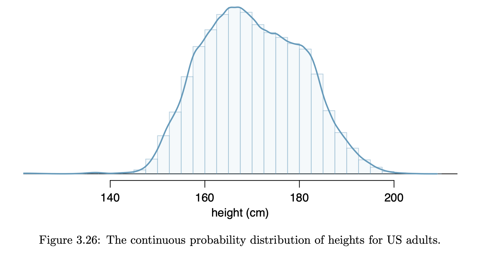
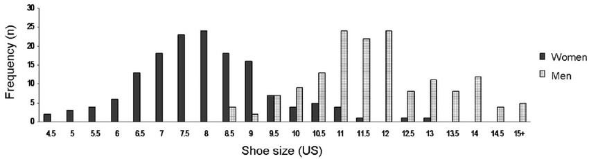

```{r child = "../setup.Rmd"}
```

```{css, echo = FALSE}
.tiny .remark-code { font-size: 70%; }
.small .remark-code { font-size: 80%; }
.tiny { font-size: 60%; }
.small { font-size: 80%; }
```


```{r packages, echo=FALSE, message=FALSE, warning=FALSE}
library(tidyverse)
library(knitr)
```

## Reminders: Midterm 2

- Closed-book. These formulas will be provided: 
  - **Bayes' theorem**: $P(A \mid B) =\frac{P(B \mid A)P(A)}{P(B)}$.
  - **Probability mass functions**:  
      - Binomial: $P(X=x)=\begin{pmatrix} n \\ x \end{pmatrix}p^x(1-p)^{n-x}$  
      - Poisson: $P(X = x) = \frac{\lambda^x e^{-\lambda}}{x!}$, $\lambda > 0$

---
## Recap

--

- Common probability distributions: Binomial  

  - Theoretical properties: probability mass function, parameters, mean and variance, effect of varying parameters
  
  - Sampling and law of large numbers; effect of changing parameters 

  - R functions:
  
      - `d____()`, e.g., `dbinom()`: for densities (more accurately, for discrete random variables these are probability mass functions, $P(X = x)$)
      - `p____()`, e.g., `pbinom()`: for $P(X\leq x)$
      - `r____()`, e.g., `rbinom()`: for random sample

---
## Today
- Common probability distributions

  - Poisson distribution 

  - Normal or Gaussian

---

## Frequency distribution vs. probability distribution 

- Use `rbinom()` to get 5000 draws from the population 

- In R:
.small[
```{r}
set.seed(0) # so results are reproducible 
binomDraws <- rbinom(n = 5000, size = 3, prob = .2)
table(binomDraws)/5000
```
]

- Compare with the theoretical probabilities:
.small[
```{r}
dbinom(x = 0:3, size = 3, prob = .2)
```
]
---

## Frequency distribution of e-cigarette smokers 

```{r}
data.frame(binomDraws) %>%
  ggplot(aes(x = binomDraws)) + 
    geom_bar() +
    labs(x = "Number of Smokers",
         title = "5000 samples from Binomial(3, .2)")
```

---
## Varying the number of Bernoulli trials: 100 trials

.small[
```{r}
set.seed(0) # so results are reproducible 
binomDraws100 <- rbinom(n = 5000, size = 100, prob = .2)
data.frame(binomDraws100) %>%
  ggplot(aes(x = binomDraws100)) + 
    geom_bar() +
    labs(x = "Number of Smokers",
         title = "5000 samples from Binomial(100, .2)")
```
]
---
## Varying the number of Bernoulli trials: 500 trials

.small[
```{r}
set.seed(0) # so results are reproducible 
binomDraws500 <- rbinom(n = 5000, size = 500, prob = .2)
data.frame(binomDraws500) %>%
  ggplot(aes(x = binomDraws500)) + 
    geom_bar() +
    labs(x = "Number of Smokers",
         title = "5000 samples from Binomial(500, .2)")
```
]
---
## Frequency distribution of e-cigarette smokers varying number of Bernoulli trials

.small[
.pull-left[
```{r eval = FALSE}
data.frame(binomDraws) %>%
  bind_cols(size = 3) %>%
  bind_rows(
    data.frame(binomDraws100) %>%
      rename(binomDraws = binomDraws100) %>%
      bind_cols(size = 100)
  ) %>%
  bind_rows(
    data.frame(binomDraws500) %>%
      rename(binomDraws = binomDraws500) %>%
      bind_cols(size = 500)
  ) %>%
  ggplot(aes(x = binomDraws, 
             fill = as.factor(size))) +
    geom_histogram(binwidth = 1, position = "identity", alpha = .7) + 
    labs(
      x = "Number of smokers",
      y = "Frequency",
      title = "5000 samples each from Binomial(3, .2), Binomial(100, .2), Binomial(500, .2)",
      fill = "Size"
    )
```
]
]
.pull-right[
```{r echo = FALSE, out.width = "100%"}
data.frame(binomDraws) %>%
  bind_cols(size = 3) %>%
  bind_rows(
    data.frame(binomDraws100) %>%
      rename(binomDraws = binomDraws100) %>%
      bind_cols(size = 100)
  ) %>%
  bind_rows(
    data.frame(binomDraws500) %>%
      rename(binomDraws = binomDraws500) %>%
      bind_cols(size = 500)
  ) %>%
  ggplot(aes(x = binomDraws, 
                    fill = as.factor(size))) + 
    geom_histogram(binwidth = 1, position = "identity", alpha = .7) + 
    labs(
      x = "Number of smokers",
      y = "Frequency",
      title = "5000 samples each from \n Binomial(3, .2), Binomial(100, .2), Binomial(500, .2)",
      fill = "Size"
    )
```
]

---
## Frequency distribution of e-cigarette smokers varying probability of success

.small[
```{r }
set.seed(0) # so results are reproducible 
binomP.2 <- rbinom(n = 5000, size = 100, prob = .2)
binomP.5 <- rbinom(n = 5000, size = 100, prob = .5)
binomP.7 <- rbinom(n = 5000, size = 100, prob = .7)
```
]
```{r echo = FALSE, out.width = "60%"}
data.frame(binomP.2) %>%
  rename(outcome = binomP.2) %>%
  bind_cols(prob = .2) %>%
  bind_rows(
    data.frame(binomP.5) %>%
      rename(outcome = binomP.5) %>%
      bind_cols(prob = .5)
  ) %>%
  bind_rows(
    data.frame(binomP.7) %>%
      rename(outcome = binomP.7) %>%
      bind_cols(prob = .7)
  ) %>%
  ggplot(aes(x = outcome, 
                    fill = as.factor(prob))) +
    geom_histogram(binwidth = 1, position = "identity", alpha = .7) + 
    labs(
      x = "Number of smokers",
      y = "Frequency",
      title = "5000 samples each from \nBinomial(100, .2), Binomial(100, .5), Binomial(100, .7)",
      fill = "Prob"
    )
```


---
## Poisson distribution

- Useful for estimating the **number of events in a large population over a unit of time**. 

- For example:
  - The number of people having heart attacks in New York City every year
  - The number of accidents occurring at an intersection per hour
  - The number of typos in every 100 pages of a book 
  
- It is named after French mathematician Siméon Denis Poisson

---
## Poisson distribution
- E.g.: Number of people having heart attacks in New York City every year

- **Key ingredients**
  - **Fixed interval** of time or space
  
  - Events happen with a **known average rate**, independently of time since the last event ("memoryless" property)
      - One person having a heart attack does not change the probability of another person having a heart attack, hence the timing of the next heart attack 

- The parameter that defines a Poisson distributed random variable is the **rate** $\lambda$, where $\lambda > 0$

  - Rate = **average number of occurrences per unit of time**

- Often used to model rare events

---
## Probability mass function, mean and variance

- $P(X = x) = \frac{\lambda^x e^{-\lambda}}{x!}$, defined over non-negative integer values of $x$

  - Recall: $n! = n(n - 1)(n - 2)\cdots (1)$. 

- No upper limit, i.e., $x$ can take very large non-negative integer values 

- $E(X) = \lambda$

- $Var(X) = \lambda$

---
## Poisson probabilities  
- $P(X = x) = \frac{\lambda^x e^{-\lambda}}{x!}$ lets us calculate probabilities of taking a certain value

- For $x = 2$ and $\lambda = 3$, we have 

$$
\begin{aligned}
P(X = 2) &= \frac{3^2 e^{-3}}{2!}  = \frac{9(e^{-3})}{2(1)}  = 0.2240418
\end{aligned}
$$
- In R:

```{r}
dpois(x = 2, lambda = 3)
```

- For large values of $x$, the probability is very small because of the large denominator

```{r}
dpois(x = 10, lambda = 3)
```

---
## Probability distribution
- In the same manner, we can derive the entire probability distribution

.tiny[
.pull-left[
```{r}
dpois(x = 0:10, lambda = 3)
```

```{r eval = FALSE}
data.frame(x = 0:10, y = dpois(0:10, lambda = 3)) %>%
  ggplot(aes(x = x, y = y)) + 
    geom_bar(stat = "identity") +
  labs(title = "Probability distribution of Poisson(3)",
       y = "P(X = x)")
```
]
]
.pull-right[
```{r echo = FALSE, out.width = "100%"}
data.frame(x = 0:10, y = dpois(0:10, lambda = 3)) %>%
  ggplot(aes(x = x, y = y)) + 
    geom_bar(stat = "identity") +
  labs(title = "Probability distribution of Poisson(3)",
       y = "P(X = x)")
```
]

---
## Probability distribution varying lambda

.small[
```{r}
data.frame(x = 0:30, y = dpois(0:30, lambda = 3), lambda = 3) %>%
  bind_rows(data.frame(x = 0:30, y = dpois(0:30, lambda = 10), lambda = 10)) %>%
  bind_rows(data.frame(x = 0:30, y = dpois(0:30, lambda = 20), lambda = 20)) %>%
    ggplot(aes(x = x, y = y, fill = as.factor(lambda))) + 
      geom_bar(stat = "identity", 
               position = "identity", 
               alpha = .5) +
    labs(title = "Probability distribution of \nPoisson(3), Poisson(10), Poisson(20)",
         y = "P(X = x)",
         fill = "Lambda")
```
]

---
## Sampling from Poisson distribution in R
- Simulate random draws using the `rpois()` function

- `rpois()` has the arguments 
  - `n`, the number of draws from the distribution 
  - `lambda`, the mean

```{r}
set.seed(0) # so results are reproducible 
inputLambda <- 3
poissonDraws <- rpois(n = 100, lambda = inputLambda)
poissonDraws
```

---
## Frequency distribution varying lambda

.small[
```{r }
set.seed(0) # so results are reproducible 
poissonL3 <- rpois(n = 5000, lambda = 3)
poissonL10 <- rpois(n = 5000, lambda = 10)
poissonL20 <- rpois(n = 5000, lambda = 20)
```
]

.tiny[
.pull-left[
```{r eval = FALSE}
data.frame(poissonL3) %>%
  rename(outcome = poissonL3) %>%
  bind_cols(lambda = 3) %>%
  bind_rows(
    data.frame(poissonL10) %>%
      rename(outcome = poissonL10) %>%
      bind_cols(lambda = 10)
  ) %>%
  bind_rows(
    data.frame(poissonL20) %>%
      rename(outcome = poissonL20) %>%
      bind_cols(lambda = 20)
  ) %>%
  ggplot(aes(x = outcome, 
                    fill = as.factor(lambda))) +
    geom_histogram(binwidth = 1, position = "identity", alpha = .7) + 
    labs(
      x = "Number of occurrences",
      y = "Frequency",
      title = "5000 samples each from \nPoisson(3), Poisson(10), Poisson(20)",
      fill = "Lambda"
    )
```
]
]
.pull-right[
```{r echo = FALSE, out.width = "100%"}
data.frame(poissonL3) %>%
  rename(outcome = poissonL3) %>%
  bind_cols(lambda = 3) %>%
  bind_rows(
    data.frame(poissonL10) %>%
      rename(outcome = poissonL10) %>%
      bind_cols(lambda = 10)
  ) %>%
  bind_rows(
    data.frame(poissonL20) %>%
      rename(outcome = poissonL20) %>%
      bind_cols(lambda = 20)
  ) %>%
  ggplot(aes(x = outcome, 
                    fill = as.factor(lambda))) +
    geom_histogram(binwidth = 1, position = "identity", alpha = .7) + 
    labs(
      x = "Number of occurrences",
      y = "Frequency",
      title = "5000 samples each from \nPoisson(3), Poisson(10), Poisson(20)",
      fill = "Lambda"
    )
```
]


---
## Exercises
An insurance agency determines that 70% of individuals do not exceed their deductible. 

- Suppose the insurance agency is considering a random sample of four individuals they insure. What is the probability that exactly one of them will exceed the deductible?

--

- What is the probability that 3 of 8 randomly selected individuals will have exceeded the insurance deductible, i.e., that 5 of 8 will not exceed the deductible?

---
## Exercises
A very skilled court stenographer makes one typographical error (typo) per hour on average.

- What probability distribution is most appropriate for calculating the probability of a given number of typos this stenographer makes in an hour?

- What are the mean and the standard deviation of the number of typos this stenographer makes?

- Would it be considered unusual if this stenographer made 4 or more typos in a given hour?

- Calculate the probability that this stenographer makes at most 2 typos in a given hour.

---

## Recall: Continuous random variables

```{r echo = FALSE, out.width = "40%"}

```

- Probability distribution for a discrete random variable: **probability mass function**

- Continuous random variable: **probability density functions**

- For a continuous random variable, probability for any exact value is zero

- Instead, we think about probabilities in ranges. 

- $P(a \leq X \leq b)$ is the area under the density function between $a$ and $b$.

---
## Normal Distribution

- The **normal distribution** is an example of a continuous distribution

- It is a very important distribution and one of the primary inferential tools in statistics 

- Many **natural phenomenon** approximate the normal distribution, such as weight, height, blood pressure, annual rainfall

- Commonly called the *Gaussian distribution* after [Carl Friedrich Gauss](https://en.wikipedia.org/wiki/Carl_Friedrich_Gauss)

- Also sometimes called a *bell curve*

---

## Illustration: Shoe sizes 

- Mickle et al (2010 *Footwear Science*) showed the following bimodal distribution of shoe sizes in the US. 

```{r echo=FALSE, out.width="80%"}

```

Note that standard shoe sizes are discrete.

---

## Illustration: Shoe sizes 

- Let $X$ represent the shoe size for wearers of men's shoes

- (Hypothetical) probability distribution of shoe sizes of wearers of men's shoes.

```{r echo=FALSE}
set.seed(0)
x <- rnorm(10000, mean = 11, sd = 1.5)
x2 <- 2*x
xcat <- round(x2, digits = 0)
xdf <- data.frame(cbind(xcat = xcat / 2, x))
ggplot(data = xdf, aes(x = xcat)) + 
  geom_bar(aes(y = (..count..)/sum(..count..))) + 
  scale_x_continuous(n.breaks = 10) +
  labs(x = "Shoe Size",
       y = "Probability",
       title = "US Men's Shoe Sizes")
```

---

## Illustration: Shoe sizes 

What is the probability of a customer wanting  a men's shoe size smaller than 9?


```{r echo=FALSE}
ggplot(data = xdf, aes(x = xcat)) + 
  geom_bar(aes(y = (..count..)/sum(..count..))) + 
  scale_x_continuous(n.breaks = 10) +
  labs(x = "Shoe Size",
       y = "Percent",
       title = "US Men's Shoe Sizes")
```


---

## Smaller Shoes

.pull-left[
```{r janitor,warning=FALSE,message=FALSE,echo=FALSE}
library(janitor)
distx <- xdf %>%
  tabyl(xcat) %>%
  select(-n) %>%
  rename(size = xcat,
         probability = percent)
distx[1:11, ]
```
]
.pull-right[
```{r janitor2,warning=FALSE,message=FALSE,echo=FALSE}
distx[12:22, ]
```
]

The probability of a random men's shoe wearer having a shoe size less than 9 in this population is `r sum(distx$probability[distx$size < 9])`.

What is the probability of shoe size 10-11.5?
---

## Moving to Continuous Distributions

- Now suppose we could get *really* well-fitting shoes, using quarter sizes (9, 9.25, 9.5, 9.75, ...) or even tenth sizes (9, 9.1, 9.2, ...), or shoes specifically made to fit your feet perfectly.

- As the number of sizes increases, the bar widths become narrower -> probability distribution of continuous random variable

.pull-left[
```{r normal, echo=FALSE, message=FALSE, warning=FALSE, out.width="90%"}
ggplot(data = data.frame(x = c(4, 18)), aes(x)) +
  stat_function(fun = dnorm, n = 10000, args = list(mean = 11, sd = 1.5)) + ylab("") +
  scale_y_continuous() +
  labs (x = "Continuous Shoe Size",
        y = "Density")

```
]
.pull-right[
This is a **probability density function**.
]
---
## Moving to Continuous Distributions

- Probability density function can be used to get the probability of any range of continuous shoe sizes 

```{r, echo=FALSE, warning=FALSE, message=FALSE}
ggplot(data.frame(x = c(4, 18)), aes(x = x)) +
  stat_function(fun = dnorm,
                n = 10000,
                args = list(mean = 11, sd = 1.5)) +
  stat_function(
    fun = dnorm,
    args = list(mean = 11, sd = 1.5),
    xlim = c(4, 9),
    geom = "area",
    fill = "#003087",
    alpha = .3
  ) + labs(x = "Continuous Shoe Size")

```

E.g., probability of shoe size being less than 9 (shaded area)

---
## Moving to Continuous Distributions
```{r echo=FALSE, warning=FALSE, message=FALSE, out.width = "40%"}
ggplot(data.frame(x = c(4, 18)), aes(x = x)) +
  stat_function(fun = dnorm,
                n = 10000,
                args = list(mean = 11, sd = 1.5)) +
  stat_function(
    fun = dnorm,
    args = list(mean = 11, sd = 1.5),
    xlim = c(4, 9),
    geom = "area",
    fill = "#003087",
    alpha = .3
  ) + labs(x = "Continuous Shoe Size")

```

- How do we find this area of interest?

- Calculus! $$P(a \leq X \leq b)=\text{area between a and b below the curve}=\int_a^b f(x)dx$$ where $f(x)$ represents the density curve
  - In this course, we will use R

---
## Normal Distribution

- **Symmetric, bell-shaped**

- Characterized by the mean, $\mu$, and the standard deviation, $\sigma$ (or variance, $\sigma^2$)

- For the normal distribution, the **density function** is given by  $$f(x)=\frac{1}{\sqrt{2\pi\sigma^2}}e^{-\frac{1}{2}\frac{(x-\mu)^2}{\sigma^2}}$$

- Notation: $N(\mu,\sigma^2)$

- The normal distribution with mean 0 and standard deviation 1 is called the **standard normal distribution**. It is commonly denoted $Z \sim N(0, 1)$. 

---
## Probability density function for Normal Distribution
- Like `dbinom()` and `dpois()`, `dnorm()` in R gives us the probability density function 

- Here instead of $P(X = x)$, it is the **value of the probability density function**, $f(x)$ on the previous slide, at values that we input

- `dnorm()` has arguments `x`, `mean` and `sd`, where `mean` and `sd` are the mean and standard deviation of the normal distribution that we want

- **Remember that $P(X = x) = 0$ for a continuous random variable**; the value that `dnorm()` gives us is not a probability but the height of the density function

---
## Probability density function for Normal Distribution
```{r}
dnorm(x = -3:3, mean = 0, sd = 1)
```

.small[
```{r}
data.frame(x = c(-3, 3)) %>%
  ggplot(aes(x)) +
  stat_function(fun = dnorm, args = list(mean = 0, sd = 1)) +
  labs(title = "Probability distribution of N(0, 1)",
       y = "f(x)")
```
]

---
## Normal Distribution varying mean 
- Which of the three distributions have means 0, 1, and 4?

```{r echo = FALSE}
myCols <- c("#420A68FF", "#DD513AFF", "#FCA50AFF")
data.frame(x = c(-3, 7)) %>%
  ggplot(aes(x)) +
  stat_function(fun = dnorm, 
                args = list(mean = 0, sd = 1),
                geom = "area", 
                fill = myCols[1],
                alpha = .5) +
  stat_function(fun = dnorm, 
                args = list(mean = 1, sd = 1), 
                geom = "area", 
                fill = myCols[2],
                alpha = .5) +
  stat_function(fun = dnorm, 
                args = list(mean = 4, sd = 1), 
                geom = "area", 
                fill = myCols[3],
                alpha = .5) +
  labs(title = "Probability distribution of N(0, 1), N(1, 1), N(4, 1)",
       y = "f(x)")
```

---
## Normal Distribution varying standard deviation 
- Which has standard deviation 1, 2, and 4? 

```{r echo = FALSE}
data.frame(x = c(-15, 15)) %>%
  ggplot(aes(x)) +
  stat_function(fun = dnorm, 
                n = 10000,
                args = list(mean = 0, sd = 1),
                geom = "area", 
                fill = myCols[1],
                alpha = .5) +
  stat_function(fun = dnorm, 
                args = list(mean = 0, sd = 2), 
                geom = "area", 
                fill = myCols[2],
                alpha = .5) +
  stat_function(fun = dnorm, 
                args = list(mean = 0, sd = 4), 
                geom = "area", 
                fill = myCols[3],
                alpha = .5) +
  labs(title = "Probability distribution of N(0, 1), N(0, 4), N(0, 16)",
       y = "f(x)")
```


---
## Summary

- Common probability distributions: Poisson and Normal

  - Theoretical properties: probability density function, parameters, mean and variance, effect of varying parameters
  
  - R functions, e.g.:
  
      - `dnorm()` for densities 
      - `pnorm()` for $P(X\leq x)$
      - `rnorm()` for random sample
    
  - Standard normal distribution
  
