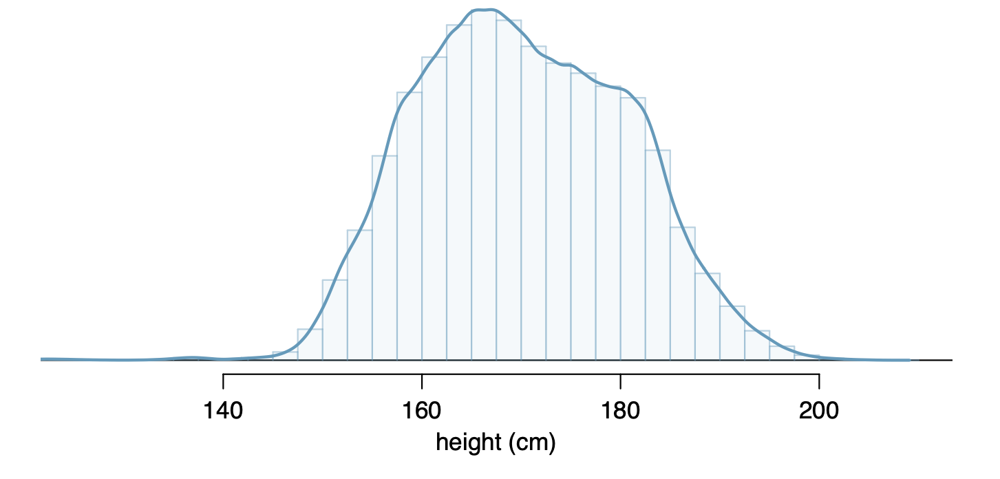

```{r child = "../setup.Rmd"}
```

```{css, echo = FALSE}
.tiny .remark-code { font-size: 70%; }
.small .remark-code { font-size: 80%; }
.tiny { font-size: 60%; }
.small { font-size: 80%; }
```


```{r packages, echo=FALSE, message=FALSE, warning=FALSE}
library(tidyverse)
library(knitr)
```


## Reminders

- Lab 6 due on Monday, 9PM

- HW 5 will be released today

- Participation survey opens after class, closes Monday 9PM 

- Change in schedule for remaining homework:
    - HW 6: released 11/14 (after Veteren's Day), due 11/21 (after midterm 2, which is on 11/18)
    
    - HW 7: released 11/28 (after Thanksgiving), due 12/2 


---
## Recap

--

- Common probability distributions: Binomial and Poisson 

  - Theoretical properties: probability mass function, parameters, mean and variance, effect of varying parameters
  
  - Sampling and law of large numbers; effect of changing parameters 

  - R functions:
  
      - `d____()`, e.g., `dbinom()`: for densities (more accurately, for discrete random variables these are probability mass functions, $P(X = x)$)
      - `p____()`, e.g., `pbinom()`: for $P(X\leq x)$
      - `r____()`, e.g., `rbinom()`: for random sample

---
## Today
- Common probability distributions

  - Poisson distribution 

  - Normal or Gaussian
     
---
## Recall: Poisson distribution

- The Poisson distribution is often useful for estimating the **number of events in a large population over a unit of time**. 

- For example: The number of people having heart attacks in New York City every year

- This distribution involves a few key ingredients
  - There must be a **fixed interval** of time or space
  
  - Events happen with a **known average rate**, independently of time since the last event ("memoryless" property)

- The parameter that defines a Poisson distributed random variable is the **rate**, often denoted by $\lambda$, where $\lambda > 0$

- The rate is the **average number of occurrences per unit of time**

- Often used to model rare events

---
## Recall: Probability mass function, mean and variance

- The probability mass function for a Poisson distributed random variable is $P(X = x) = \frac{\lambda^x e^{-\lambda}}{x!}$, defined over non-negative integer values of $x$

- For a Poisson random variable, the mean, $E(X) = \lambda$, and the variance, $Var(X) = \lambda$

- We can calculate probabilities in R using `dpois()`, e.g.:

```{r}
dpois(x = 2, lambda = 3)
```

---
## Probability distribution
- In the same manner, we can derive the entire probability distribution

.tiny[
.pull-left[
```{r}
dpois(x = 0:10, lambda = 3)
```

```{r eval = FALSE}
data.frame(x = 0:10, y = dpois(0:10, lambda = 3)) %>%
  ggplot(aes(x = x, y = y)) + 
    geom_bar(stat = "identity") +
  labs(title = "Probability distribution of Poisson(3)",
       y = "P(X = x)")
```
]
]
.pull-right[
```{r echo = FALSE, out.width = "100%"}
data.frame(x = 0:10, y = dpois(0:10, lambda = 3)) %>%
  ggplot(aes(x = x, y = y)) + 
    geom_bar(stat = "identity") +
  labs(title = "Probability distribution of Poisson(3)",
       y = "P(X = x)")
```
]

---
## Probability distribution varying lambda

.small[
```{r}
data.frame(x = 0:30, y = dpois(0:30, lambda = 3), lambda = 3) %>%
  bind_rows(data.frame(x = 0:30, y = dpois(0:30, lambda = 10), lambda = 10)) %>%
  bind_rows(data.frame(x = 0:30, y = dpois(0:30, lambda = 20), lambda = 20)) %>%
    ggplot(aes(x = x, y = y, fill = as.factor(lambda))) + 
      geom_bar(stat = "identity", 
               position = "identity", 
               alpha = .5) +
    labs(title = "Probability distribution of \nPoisson(3), Poisson(10), Poisson(20)",
         y = "P(X = x)",
         fill = "Lambda")
```
]

---
## Sampling from Poisson distribution in R
- For any non-negative value of $\lambda$, we can simulate random draws using the `rpois()` function

- `rpois()` has the arguments `n, lambda`, where `n` is the number of draws from the distribution, and `lambda` is the mean.

```{r}
set.seed(0) # so results are reproducible 
inputLambda <- 3
poissonDraws <- rpois(n = 100, lambda = inputLambda)
poissonDraws
```

---
## Frequency distribution varying lambda

.small[
```{r }
set.seed(0) # so results are reproducible 
poissonL3 <- rpois(n = 5000, lambda = 3)
poissonL10 <- rpois(n = 5000, lambda = 10)
poissonL20 <- rpois(n = 5000, lambda = 20)
```
]

.tiny[
.pull-left[
```{r eval = FALSE}
data.frame(poissonL3) %>%
  rename(outcome = poissonL3) %>%
  bind_cols(lambda = 3) %>%
  bind_rows(
    data.frame(poissonL10) %>%
      rename(outcome = poissonL10) %>%
      bind_cols(lambda = 10)
  ) %>%
  bind_rows(
    data.frame(poissonL20) %>%
      rename(outcome = poissonL20) %>%
      bind_cols(lambda = 20)
  ) %>%
  ggplot(aes(x = outcome, 
                    fill = as.factor(lambda))) +
    geom_histogram(binwidth = 1, position = "identity", alpha = .7) + 
    labs(
      x = "Number of occurrences",
      y = "Frequency",
      title = "5000 samples each from \nPoisson(3), Poisson(10), Poisson(20)",
      fill = "Lambda"
    )
```
]
]
.pull-right[
```{r echo = FALSE, out.width = "100%"}
data.frame(poissonL3) %>%
  rename(outcome = poissonL3) %>%
  bind_cols(lambda = 3) %>%
  bind_rows(
    data.frame(poissonL10) %>%
      rename(outcome = poissonL10) %>%
      bind_cols(lambda = 10)
  ) %>%
  bind_rows(
    data.frame(poissonL20) %>%
      rename(outcome = poissonL20) %>%
      bind_cols(lambda = 20)
  ) %>%
  ggplot(aes(x = outcome, 
                    fill = as.factor(lambda))) +
    geom_histogram(binwidth = 1, position = "identity", alpha = .7) + 
    labs(
      x = "Number of occurrences",
      y = "Frequency",
      title = "5000 samples each from \nPoisson(3), Poisson(10), Poisson(20)",
      fill = "Lambda"
    )
```
]


---
## Recall: Continuous random variables

- We saw continuous random variables earlier and how they differ from discrete random variables

```{r echo = FALSE, out.width = "40%"}

```

- A probability distribution for a discrete random variable is called a **probability mass function**; for a continuous random variable it is a **probability density functions**

- For a continuous random variable, the probability that the random variable takes on any exact value is zero. Instead, we think about probabilities in ranges. 

- $P(a \leq X \leq b)$ is the area under the density function between $a$ and $b$.

---
## Normal Distribution

- The **normal distribution** is an example of a continuous distribution

- It is a very important distribution and one of the primary inferential tools in statistics 

- Many natural phenomenon approximate the normal distribution, such as weight, height, blood pressure, annual rainfall

- The normal distribution is commonly called the *Gaussian distribution* after [Carl Friedrich Gauss](https://en.wikipedia.org/wiki/Carl_Friedrich_Gauss), who wrote down the equations governing it in the early 1800's. 

- It is also sometimes referred to as a *bell curve*, although there are other distributions that are symmetric and shaped like a bell

---

## Illustration: Shoe sizes 

- Thinking about shoe sizes is a nice formulation for the Gaussian distribution

- Mickle et al (2010 *Footwear Science*) showed the following bimodal distribution of shoe sizes in the US. 

```{r echo=FALSE, out.width="80%"}
knitr::include_graphics("img/bimodalshoes.png")
```

Note that standard shoe sizes are discrete.

---

## Illustration: Shoe sizes 

- Let $X$ represent shoe size for wearers of men's shoes

- Here is a (hypothetical) probability distribution of shoe sizes of wearers of men's shoes.

```{r echo=FALSE}
set.seed(0)
x <- rnorm(10000, mean = 11, sd = 1.5)
x2 <- 2*x
xcat <- round(x2, digits = 0)
xdf <- data.frame(cbind(xcat = xcat / 2, x))
ggplot(data = xdf, aes(x = xcat)) + 
  geom_bar(aes(y = (..count..)/sum(..count..))) + 
  scale_x_continuous(n.breaks = 10) +
  labs(x = "Shoe Size",
       y = "Percent",
       title = "US Men's Shoe Sizes")
```

---

## Illustration: Shoe sizes 

If we want to know the probability that a customer coming into a store wants a men's shoe size smaller than 9, we just add up the heights of the bars for shoe sizes 8.5 and smaller. We can do this for shoe sizes in any range and tabulate the full discrete distribution of shoe sizes.


```{r echo=FALSE}
ggplot(data = xdf, aes(x = xcat)) + 
  geom_bar(aes(y = (..count..)/sum(..count..))) + 
  scale_x_continuous(n.breaks = 10) +
  labs(x = "Shoe Size",
       y = "Percent",
       title = "US Men's Shoe Sizes")
```


---

## Smaller Shoes

.pull-left[
```{r janitor,warning=FALSE,message=FALSE,echo=FALSE}
library(janitor)
distx <- xdf %>%
  tabyl(xcat) %>%
  select(-n) %>%
  rename(size = xcat,
         probability = percent)
distx[1:11, ]
```
]
.pull-right[
```{r janitor2,warning=FALSE,message=FALSE,echo=FALSE}
distx[12:22, ]
```
]

The probability of a random men's shoe wearer having a shoe size less than 9 in this population is `r sum(distx$probability[distx$size < 9])`.

What is the probability of shoe size 10-11.5?
---

## Moving to Continuous Distributions

- Now suppose we could get *really* well-fitting shoes, using quarter sizes (9, 9.25, 9.5, 9.75, ...) or even tenth sizes (9, 9.1, 9.2, ...), or shoes specifically made to fit your feet perfectly.

- As the number of sizes increases, the bar width becomes more narrow, and the graph approaches a smooth curve.

- We will use these smooth curves to describe the probability distributions of continuous random variables (e.g. a shoe size could be 9.50032)

.pull-left[
```{r normal, echo=FALSE, message=FALSE, warning=FALSE, out.width="90%"}
ggplot(data = data.frame(x = c(4, 18)), aes(x)) +
  stat_function(fun = dnorm, n = 10000, args = list(mean = 11, sd = 1.5)) + ylab("") +
  scale_y_continuous() +
  labs (x = "Continuous Shoe Size",
        y = "Density")

```
]
.pull-right[
This is a *probability density function*.
]
---
## Moving to Continuous Distributions

- The probability density function can be used to get the probability of any range of continuous shoe sizes we would like to investigate.

```{r, echo=FALSE, warning=FALSE, message=FALSE}
ggplot(data.frame(x = c(4, 18)), aes(x = x)) +
  stat_function(fun = dnorm,
                n = 10000,
                args = list(mean = 11, sd = 1.5)) +
  stat_function(
    fun = dnorm,
    args = list(mean = 11, sd = 1.5),
    xlim = c(4, 9),
    geom = "area",
    fill = "#003087",
    alpha = .3
  ) + labs(x = "Continuous Shoe Size")

```

For example, we can calculate the probability a continuous shoe size is less than 9 (the shaded area).

---
## Moving to Continuous Distributions
```{r echo=FALSE, warning=FALSE, message=FALSE, out.width = "40%"}
ggplot(data.frame(x = c(4, 18)), aes(x = x)) +
  stat_function(fun = dnorm,
                n = 10000,
                args = list(mean = 11, sd = 1.5)) +
  stat_function(
    fun = dnorm,
    args = list(mean = 11, sd = 1.5),
    xlim = c(4, 9),
    geom = "area",
    fill = "#003087",
    alpha = .3
  ) + labs(x = "Continuous Shoe Size")

```

- How do we find this area of interest?

- Calculus! $$P(a \leq X \leq b)=\text{area between a and b below the curve}=\int_a^b f(x)dx$$ where $f(x)$ represents the density curve
  - In this course, we will use R

---
## Normal Distribution

- The normal distribution is a **symmetric, bell-shaped** distribution

- It is characterized by the mean, $\mu$, and the standard deviation, $\sigma$ (or variance, $\sigma^2$)

- For the normal distribution, the **density function** is given by  $$f(x)=\frac{1}{\sqrt{2\pi\sigma^2}}e^{-\frac{1}{2}\frac{(x-\mu)^2}{\sigma^2}}$$

- The notation $N(\mu,\sigma^2)$ is often used.

- The normal distribution with mean 0 and standard deviation 1 is called the **standard normal distribution**. It is commonly denoted $Z \sim N(0, 1)$. 

---
## Probability density function for Normal Distribution
- Like `dbinom()` and `dpois()`, `dnorm()` in R gives us the probability distribution 

- Here instead of $P(X = x)$, it is the **value of the probability density function**, $f(x)$ on the previous slide, at values that we input

- `dnorm()` has arguments `x`, `mean` and `sd`, where `mean` and `sd` are the mean and standard deviation of the normal distribution that we want

- **Remember that $P(X = x) = 0$ for a continuous random variable**; the value that `dnorm()` gives us is not a probability but the height of the density function

---
## Probability density function for Normal Distribution
```{r}
dnorm(x = -3:3, mean = 0, sd = 1)
```

.small[
```{r}
data.frame(x = c(-3, 3)) %>%
  ggplot(aes(x)) +
  stat_function(fun = dnorm, args = list(mean = 0, sd = 1)) +
  labs(title = "Probability distribution of N(0, 1)",
       y = "f(x)")
```
]

---
## Normal Distribution varying mean 
- Which of the three distributions have means 0, 1, and 4?

```{r echo = FALSE}
myCols <- c("#420A68FF", "#DD513AFF", "#FCA50AFF")
data.frame(x = c(-3, 7)) %>%
  ggplot(aes(x)) +
  stat_function(fun = dnorm, 
                args = list(mean = 0, sd = 1),
                geom = "area", 
                fill = myCols[1],
                alpha = .5) +
  stat_function(fun = dnorm, 
                args = list(mean = 1, sd = 1), 
                geom = "area", 
                fill = myCols[2],
                alpha = .5) +
  stat_function(fun = dnorm, 
                args = list(mean = 4, sd = 1), 
                geom = "area", 
                fill = myCols[3],
                alpha = .5) +
  labs(title = "Probability distribution of N(0, 1), N(1, 1), N(4, 1)",
       y = "f(x)")
```

---
## Normal Distribution varying standard deviation 
- Which has standard deviation 1, 2, and 4? 

```{r echo = FALSE}
data.frame(x = c(-15, 15)) %>%
  ggplot(aes(x)) +
  stat_function(fun = dnorm, 
                n = 10000,
                args = list(mean = 0, sd = 1),
                geom = "area", 
                fill = myCols[1],
                alpha = .5) +
  stat_function(fun = dnorm, 
                args = list(mean = 0, sd = 2), 
                geom = "area", 
                fill = myCols[2],
                alpha = .5) +
  stat_function(fun = dnorm, 
                args = list(mean = 0, sd = 4), 
                geom = "area", 
                fill = myCols[3],
                alpha = .5) +
  labs(title = "Probability distribution of N(0, 1), N(0, 4), N(0, 16)",
       y = "f(x)")
```

---
## Calculating probabilities for the normal distribution

- We saw `pbinom()`, which gave us $P(X \leq x)$ for the binomial distribution

- Similarly, `pnorm()` gives us $P(X \leq x)$ for the normal distribution. The arguments are 
  - `q`, the vector of quantiles ( $x$ in $P(X \leq x)$ ); note that you can input multiple values at once, hence "vector"
  - `mean`, the mean $\mu$ (default value 0)
  - `sd`, the standard deviation $\sigma$ (default value 1)

```{r}
pnorm(0)
```

---
## Calculating probabilities for our shoes example

Going back to our shoe size example, assume that men's shoe sizes follow a normal distribution with mean 11 and standard deviation 1.5, i.e., $N(\mu = 11,\sigma^2 = 1.5^2)$

What is the probability of shoe sizes less than 9? 

```{r}
pnorm(9, mean = 11, sd = 1.5)
```

What is the probability of shoe sizes greater than 9? 

```{r}
1 - pnorm(9, mean = 11, sd = 1.5)
```


---
## Calculating probabilities for our shoes example
What is the probability of shoe sizes less than 13? 

```{r}
pnorm(13, mean = 11, sd = 1.5)
```

What is the probability of shoe size 10-11.5?
--
```{r}
pnorm(11.5, mean = 11, sd = 1.5) - pnorm(10, mean = 11, sd = 1.5)
```

---
## Probabilities between two values

```{r echo=FALSE}
knitr::include_graphics("img/stdnorm6.png")
```

To get the probability that a random wearer of men's shoes would wear a size between 10 and 11.5, we take `pnorm(11.5, mean = 11, sd = 1.5) - pnorm(10, mean = 11, sd = 1.5)` to get the value `r pnorm(11.5, mean = 11, sd = 1.5) - pnorm(10, mean = 11, sd = 1.5)`.

---
## Sampling from Normal distribution in R
- Just like with the Bernoulli, binomial and Poisson distributions, we can simulate random draws from the normal distribution using the `rnorm()` function

- `rnorm()` has the arguments `n, mean, sd`, where `n` is the number of draws from the distribution, `mean` is the mean and `sd` is the standard deviation.

```{r}
set.seed(0) # so results are reproducible 
normalDraws <- rnorm(n = 100, mean = 0, sd = 1)
head(normalDraws, 20)
```

---
## Frequency distribution varying mean and sd

.small[
```{r }
set.seed(0) # so results are reproducible 
normal1 <- rnorm(n = 5000, mean = 3, sd = 2)
normal2 <- rnorm(n = 5000, mean = 3, sd = 10)
normal3 <- rnorm(n = 5000, mean = 11, sd = 1.5) # shoe size distribution 
```
]

```{r echo = FALSE, out.width = "60%"}
data.frame(normal1) %>%
  rename(outcome = normal1) %>%
  bind_cols(mean = 3, sd = 2) %>%
  bind_rows(
    data.frame(normal2) %>%
      rename(outcome = normal2) %>%
      bind_cols(mean = 3, sd = 10)
  ) %>%
  bind_rows(
    data.frame(normal3) %>%
      rename(outcome = normal3) %>%
      bind_cols(mean = 11, sd = 1.5)
  ) %>%
  ggplot(aes(x = outcome, 
                    fill = as.factor(paste0(mean, ", ", sd)))) +
    geom_histogram(binwidth = 1, position = "identity", alpha = .7) + 
    labs(
      x = "x",
      y = "Frequency",
      title = "5000 samples each from N(3, 2^2), N(3, 10^2), N(11, 1.5^2)",
      fill = "Mean, sd"
    ) +
  scale_fill_viridis_d() +
  guides(fill = "none")
```

---
## Frequency distribution varying mean and sd

.small[
```{r }
set.seed(0) # so results are reproducible 
normal1 <- rnorm(n = 5000, mean = 3, sd = 2)
normal2 <- rnorm(n = 5000, mean = 3, sd = 10)
normal3 <- rnorm(n = 5000, mean = 11, sd = 1.5)
```
]

```{r echo = FALSE, out.width = "60%"}
data.frame(normal1) %>%
  rename(outcome = normal1) %>%
  bind_cols(mean = 3, sd = 2) %>%
  bind_rows(
    data.frame(normal2) %>%
      rename(outcome = normal2) %>%
      bind_cols(mean = 3, sd = 10)
  ) %>%
  bind_rows(
    data.frame(normal3) %>%
      rename(outcome = normal3) %>%
      bind_cols(mean = 11, sd = 1.5)
  ) %>%
  ggplot(aes(x = outcome, 
                    fill = as.factor(paste0(mean, ", ", sd)))) +
    geom_histogram(binwidth = 1, position = "identity", alpha = .7) + 
    labs(
      x = "Number of occurrences",
      y = "Frequency",
      title = "5000 samples each from N(3, 2^2), N(3, 10^2), N(11, 1.5^2)",
      fill = "Mean, sd"
    ) +
  scale_fill_viridis_d() 
```

---
## More about the standard normal distribution

- Recall: standard normal distribution $Z \sim N(0, 1)$

- A normally distributed random variable can be expressed as a standard normal by **subtracting the mean and dividing by the standard deviation**; this process is called **standardization**

- $Y \sim N(\mu, \sigma^2)$

- $Z = \frac{Y - \mu}{\sigma}$

- $E\left(\frac{Y - \mu}{\sigma}\right) = \frac{1}{\sigma}[E(Y) - \mu] = 0$

- $Var\left(\frac{Y - \mu}{\sigma}\right) = \frac{1}{\sigma^2}[Var(Y)] = \frac{1}{\sigma^2}[\sigma^2] = 1$

- What we are essentially doing is **moving the location** (mean moves to 0) and **changing the scale** (standard deviation becomes 1)

---
## More about the standard normal distribution

- Earlier, we were interested in the probability of shoe sizes smaller than 13, and we calculated it using

.small[
```{r}
pnorm(13, mean = 11, sd = 1.5)
```
]

- Let $Y$ be the random variable denoting men's shoe sizes. Then $Y \sim N(11, 1.5^2)$.

.tiny[
$$
\begin{aligned}
P(Y \leq 13) &= P\left(\frac{Y - \mu_y}{\sigma_y} \leq \frac{13 - \mu_y}{\sigma_y} \right) \\
&=P\left( Z \leq \frac{13-11}{1.5} \right) \\
&=P(Z \leq \frac{2}{1.5})
\end{aligned}
$$
]
.small[
```{r}
pnorm(2/1.5, mean = 0, sd = 1)
```
]

---
## z-score
.tiny[
$$
\begin{aligned}
P(Y \leq 13) &= P\left(\frac{Y - \mu_y}{\sigma_y} \leq \frac{13 - \mu_y}{\sigma_y} \right) \\
&=P\left( Z \leq \frac{13-11}{1.5} \right) \\
&=P(Z \leq \frac{2}{1.5})
\end{aligned}
$$
]

- The standardized value on the right-hand side, $\frac{13-11}{1.5}$, is known more generally as a z-score, where $z = \frac{x - \mu}{\sigma} = \frac{\text{value - mean}}{\text{standard deviation}}$

- The z-score is the **number of standard deviations above (positive z-scores) or below the mean (negative z-scores)**. To see this:

  - $x - \mu$ is the number relative to the mean, e.g., shoe size 13 is 2 above the mean
  
  - Dividing the above by $\sigma$ gives us the number of standard deviations above the mean, e.g., with our shoe size distribution having a standard deviation of 1.5, shoe size 13 is $\frac{2}{1.5} = 1.33$ standard deviations above the mean

---
## z-score

.tiny[
$$
\begin{aligned}
P(Y \leq 13) &= P\left(\frac{Y - \mu_y}{\sigma_y} \leq \frac{13 - \mu_y}{\sigma_y} \right) \\
&=P\left( Z \leq \frac{13-11}{1.5} \right) \\
&=P(Z \leq \frac{2}{1.5})
\end{aligned}
$$
]

- The *relative* positions of values in the original and standardized distributions stay the same, i.e., $P(Y \leq 13) = P(Z \leq \frac{2}{1.5})$ 
  - Our size 13 (or value $\frac{2}{1.5}$ standard deviations above the mean) remains the same relative to the rest of the distribution.

---
## Standardizing in R

Consider the samples we drew earlier from $N \sim (11, 1.5^2)$

.small[
```{r }
set.seed(0) # so results are reproducible 
normal3 <- rnorm(n = 5000, mean = 11, sd = 1.5) # shoe size distribution 
standardizedNormal3 <- (normal3 - 11)/1.5
```
]

```{r echo = FALSE, out.width = "60%"}
data.frame(normal3) %>%
  rename(outcome = normal3) %>%
  bind_cols(dist = "original") %>%
  bind_rows(
    data.frame(standardizedNormal3) %>%
      rename(outcome = standardizedNormal3) %>%
      bind_cols(dist = "standardized")
  ) %>%
  ggplot(aes(x = outcome, 
                    fill = as.factor(dist))) +
    geom_histogram(binwidth = .1, position = "identity", alpha = .7) + 
    labs(
      x = "x",
      y = "Frequency",
      title = "Original N(11, 1.5^2) and standardized",
      fill = "Distribution"
    ) +
  scale_fill_viridis_d() 
```

---
## Standardizing in R
```{r echo = FALSE, out.width = "60%"}
data.frame(normal3) %>%
  rename(outcome = normal3) %>%
  bind_cols(dist = "original") %>%
  bind_rows(
    data.frame(standardizedNormal3) %>%
      rename(outcome = standardizedNormal3) %>%
      bind_cols(dist = "standardized")
  ) %>%
  ggplot(aes(x = outcome, 
                    fill = as.factor(dist))) +
    geom_histogram(binwidth = .1, position = "identity", alpha = .7) + 
    labs(
      x = "x",
      y = "Frequency",
      title = "Original N(11, 1.5^2) and standardized",
      fill = "Distribution"
    ) +
  scale_fill_viridis_d() +
  geom_vline(xintercept = 13, linetype = "dashed") +
  geom_vline(xintercept = 2/1.5, linetype = "dashed")
```

.small[
```{r }
sum(normal3 <= 13)/length(normal3)
sum(standardizedNormal3 <= 2/1.5)/length(standardizedNormal3)
```
]

---
## Summary

- Common probability distributions: Normal

  - Theoretical properties: probability density function, parameters, mean and variance, effect of varying parameters
  
  - R functions:
  
      - `dnorm()` for densities 
      - `pnorm()` for $P(X\leq x)$
      - `rnorm()` for random sample
    
  - Standard normal distribution
  
