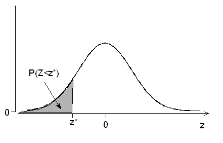

```{r child = "../setup.Rmd"}
```

```{css, echo = FALSE}
.tiny .remark-code { font-size: 70%; }
.small .remark-code { font-size: 80%; }
.tiny { font-size: 60%; }
.small { font-size: 80%; }
```


```{r packages, echo=FALSE, message=FALSE, warning=FALSE}
library(tidyverse)
library(knitr)
```

## Reminders/announcements 

- Veterans Day this Friday, no class! 

- No homework assigned this Friday; HW 6 will be released 11/14 (after Veterans Day), due 11/21 

- Next week's schedule: 

  - Monday lecture, HW 6 assigned
  - Wednesday review (Jed Harwood)
  - Thursday OH (XHT, 12:10-2pm MSB 4242)
  - Friday midterm 2

---
## Midterm 2 on 11/18

- Will cover material from 10/24 (Lecture 13), until next Monday's lecture (Lecture 21)

- Closed-book. These formulas will be provided: 
  - **Bayes' theorem**: $P(A \mid B) =\frac{P(B \mid A)P(A)}{P(B)}$.
  - **Probability mass functions**:  
      - Binomial: $P(X=x)=\begin{pmatrix} n \\ x \end{pmatrix}p^x(1-p)^{n-x}$  
      - Poisson: $P(X = x) = \frac{\lambda^x e^{-\lambda}}{x!}$, $\lambda > 0$
  - **Probability density function for normal distribution**:
  $f(x)=\frac{1}{\sqrt{2\pi\sigma^2}}e^{-\frac{1}{2}\frac{(x-\mu)^2}{\sigma^2}}$

- You don't need your computers or calculators 

- There will be no make-up exams

- Drop policy for exams: 1 midterm may be dropped or used with 50% penalty on the final

---
## Recap

- Common probability distributions: Normal

  - Theoretical properties: probability density function, parameters, mean and variance, effect of varying parameters
  
  - R functions:
  
      - `dnorm()` for densities 
      - `pnorm()` for $P(X\leq x)$
      - `rnorm()` for random sample
    
  - Standard normal distribution


---
## Today

- Common probability distributions: Normal

  - More about the standard normal distribution

  - R functions:
      - `qnorm()`
    
  - Sum of independent normal distributions 
  
- Sampling distributions
  
---
## More about the standard normal distribution 

- We saw earlier that $P(Z \leq 0) = .5$. This is because the standard normal distribution is symmetric with mean 0.

```{r}
pnorm(0) # default value of mean = 0 and sd = 1
```

- Tail probabilities of the standard normal distribution 

  - The symmetry of the normal distribution allows us to calculate the probability of values falling in the tails
  
  - For any $z$-score, $P(Z \leq -z) = P(Z \geq z)$

```{r echo=FALSE, out.width = "20%"}
knitr::include_graphics("img/stdnorm5.png")
```

---
## Quantiles for the normal distribution 

- Quantiles are cut points dividing the range of a probability distribution into continuous intervals

- Recall: quartiles (four groups) and percentiles (100 groups)

- $P(X \leq q) = p$, where $q$ is the quantile (think of value on the horizontal axis), e.g., $P(Z \leq 0) = .5$

- Recall: `pnorm(q, mean, sd)` for $P(X\leq x)$, or $P(Z \leq z)$ for standard normal. `pnorm()` returns the probability, `p`

```{r}
pnorm(q = 0, mean = 0, sd = 1)
```

- `qnorm(p, mean, sd)` for the quantile, e.g., $P(X \leq \ ?) = p$. `qnorm()` returns the quantile, `q`
  
```{r}
qnorm(p = .5, mean = 0, sd = 1)
```

---
## Important reference points for the normal distribution 

- For the standard normal, z-scores (quantiles in R) corresponding to particular probabilities (critical values) are often written as $z_p$, where $p$ denotes the probability in the **right tail**, e.g., $z_{.5} = 0$

- The z-scores corresponding to probabilities of 0.025 (2.5%) in the left and right tails are important reference points. Specifically, $z_{.025} \approx 1.96$

- In R, `qnorm(.025, lower.tail = FALSE)` returns the z-score corresponding to a probability of .025 in the right tail, $z_{.025}$, i.e., 2.5% probability in the right tail, so we should get 1.96. By symmetry, `qnorm(.975)` will return 1.96.

.pull-left[
```{r}
qnorm(.025, lower.tail = FALSE)
qnorm(.975)
```
]

.pull-right[
```{r echo=FALSE, out.width = "70%"}
knitr::include_graphics("img/stdnorm5.png")
```
]
---
## Important reference points for the normal distribution 


.pull-left[
```{r}
pnorm(1.96)
pnorm(1.96, lower.tail = FALSE)
```

```{r echo=FALSE, out.width = "78%"}
knitr::include_graphics("img/stdnorm1.png")
```
]
.pull-right[
```{r}
pnorm(-1.96)
pnorm(-1.96, lower.tail = FALSE)
```

```{r echo=FALSE, out.width = "70%"}
knitr::include_graphics("img/stdnorm2.png")
```
]

---
## Standard normal table

- A **standard normal table** allows us to calculate values based on the standard normal distribution.

- It tells us how much area is under the normal curve to the *left* of the specified value (lower tail area). Sometimes the table shows the complement of this probability (upper or *right* tail area).

```{r echo=FALSE, out.width = "50%"}

```

- With modern computing, we don't need to rely on these tables to get the desired probabilities, but you often find them in the back of statistics textbooks.

---
## Standard normal table

```{r echo=FALSE}
knitr::include_graphics("img/normaltable.png")
```

---
## Standard normal table

.pull-left[
What is the probability of a shoe size bigger than 13 (z-score 1.33)?

```{r echo=FALSE, out.width="100%"}
knitr::include_graphics("img/normalcurveupper.png")
```
]
--
.pull-right[
.small[
```{r}
pnorm(13, mean = 11, sd = 1.5, lower.tail = FALSE)
pnorm(2/1.5, lower.tail = FALSE)
1 - pnorm(2/1.5)
```
]
]

---
## Sum of independent normal random variables 

- Important property: Any linear combination of normal random variables is a normal random variable with expectation and variance given by the formulas for expected value and variance of linear combinations (Lecture 15)

- Recall: A linear combination of two random variables, $X$ and $Y$, is of the form $aX+bY$, where $a$
and $b$ are constants

- Recall: 
  - $E(aX + bY) = aE(X) + bE(Y)$
  - For a linear combination of **independent** random variables $Var(aX + bY) = a^2 Var(X) + b^2 Var(Y)$

- Hence if $X \sim N(\mu_x, \sigma_x^2)$ and $Y \sim N(\mu_y, \sigma_y^2)$ are independent, $W = X + Y \sim N(\mu_x + \mu_y, \sigma_x^2 + \sigma_y^2)$

- Extends to more than two random variables in the linear combination. Note also that $b$ can be negative, e.g., $E(X - Y) = E(X) - E(Y)$ and $Var(X - Y) = Var(X) + Var(Y)$.

---
## Summary: Distributions in R

- For each distribution, R has a family of commands, starting with the letters `d`, `p`, `q` and `r`
  - `d` for density
  - `p` for cumulative density up to input value $P(X \leq x)$. Think of $P(X \leq q) = p$
  - `q` for the quantile, e.g., $P(X \leq \ ?) = p$
  - `r` for a random sample from the distribution

---
## Course content 

1. Fundamentals of R
  - Overview of data types and structures
  - Data manipulation and data visualization tools  

2. Descriptive statistics for numerical and categorical data

3. Probability
  - Rules of probability computation; conditional probability
  - Basic probability models: Binomial, Normal and Poisson 

4. **Statistical inference**
  - **Sampling distributions of sample mean and sample proportion**
  - Hypothesis testing and confidence intervals for population mean and population proportion

---

## Recall: What is statistical inference?
- **Descriptive statistics** are numbers that are used to summarize and describe data. Descriptive statistics do not necessarily generalize beyond the data, because of sampling variability

- **Inferential statistics** or **statistical inference** gives us an idea about how sample means (for example) from different samples are likely to vary from each other and from the population mean 

- **Statistical inference** allows us to draw conclusions about the larger population. It is the process of using sample data to make conclusions about the underlying population the sample came from.

- If the sample is **representative**, then we can use the tools of probability and statistical inference to make generalizable conclusions to the broader population of interest.

.pull-left[
```{r echo=FALSE, out.width="50%"}
knitr::include_graphics("img/soup.png")
```
]

.pull-right[
Similar to tasting a spoonful of soup while cooking to make an inference about the entire pot.
]

---
## Recall: Example of statistical inference in action 

When a sample statistic is used to estimate a population parameter, it will be accompanied by a margin of error

```{r echo = FALSE, out.width = "85%"}
knitr::include_graphics("img/approval.png")
```

.tiny[
Source: https://www.rasmussenreports.com/public_content/politics/biden_administration/prez_track_sep23
]

---
## Recall: Many Topics in Statistical Inference

- Fundamentals: probability, distributions, random variables, ...

- **Sampling**

- Hypothesis testing

- Point estimates and confidence intervals

- Modeling: Linear regression, analysis of variance, nonparametric models, machine learning, ... 

---
## Sampling Distribution of the Sample Mean 

Recall our shoe size example, where wearers of men's shoe sizes follow a $N(11, 1.5^2)$ distribution.

Say we are interested in the sample mean of shoe sizes. We have a sample of 1000 observations.

```{r}
set.seed(0)
sampled1000_1 <- rnorm(1000, 11, 1.5)
head(sampled1000_1, 20)
mean(sampled1000_1) 
```

---
## Sampling Distribution of the Sample Mean 
Now we repeat the experiment, i.e., get a different sample of 1000 observations. 

```{r}
set.seed(10)
sampled1000_2 <- rnorm(1000, 11, 1.5)
head(sampled1000_2, 20)
mean(sampled1000_2) 
all.equal(mean(sampled1000_1), mean(sampled1000_2))
```
---
## Sampling Distribution of the Sample Mean 

If we repeat the experiment an infinite number of times, what distribution of sample means would we get? This is known as the **sampling distribution**.

1. Take a sample of size $n$ and calculate its mean $\overline{x}_1$
2. Take a second sample of the same size and calculate its mean $\overline{x}_2$
3. Repeat this many times to get a dataset of sample means $\overline{x}_1, \overline{x}_2, \ldots$

What is the distribution of the *statistics* $\overline{x}_1, \overline{x}_2, \overline{x}_3, \ldots$?

The sample mean $\overline{X}$, is defined as $\overline{X} = \frac{\sum_{i = 1}^n X_i}{n}$. Each realization above is a draw from $\overline{X}$, denoted with a small letter $\overline{x}$.

Here we consider $X_1, ..., X_n$ that are **independent and identically distributed**. (E.g., $X_1, ... X_n \sim N(11, 1.5^2)$ for the shoe size distribution.)

---
## Sampling Distribution of the Sample Mean 

1. Take a sample of size $n$ and calculate its mean $\overline{x}_1$
2. Take a second sample of the same size and calculate its mean $\overline{x}_2$
3. Repeat this many times to get a dataset of sample means $\overline{x}_1, \overline{x}_2, \ldots$

We cannot repeat an infinite number of times, but we do this 10,000 times in R.

.small[
```{r}
set.seed(0)
repeat10000 <- t(replicate(n = 10000, rnorm(1000, 11, 1.5)))
str(repeat10000)
head(rowMeans(repeat10000), 20)
means10000 <- rowMeans(repeat10000)
```
]

---
## Sampling Distribution of the Sample Mean 


```{r}
data.frame(shoesMean = means10000) %>%
  ggplot(aes(x = shoesMean)) +
  geom_density() +
  labs(x = "Mean of sample of size 1000",
       y = "Density",
       title = "Sampling distribution from N(11, 1.5^2)")
```

---
## Sampling Distribution of the Sample Mean 

.pull-left[
```{r echo = FALSE, out.width = "100%"}
data.frame(shoesMean = means10000) %>%
  ggplot(aes(x = shoesMean)) +
  geom_density() +
  labs(x = "Mean shoe size of sample of size 1000",
       y = "Density",
       title = "Sampling distribution from N(11, 1.5^2)")
```
]
.pull-right[
How would we describe this distribution?

- Center

- Spread

- Shape
]
---
## Sampling Distribution of the Sample Mean 

.pull-left[
```{r echo = FALSE, out.width = "100%"}
data.frame(shoesMean = means10000) %>%
  ggplot(aes(x = shoesMean)) +
  geom_density() +
  labs(x = "Mean shoe size of sample of size 1000",
       y = "Density",
       title = "Sampling distribution from N(11, 1.5^2)")
```
]
.small[
.pull-right[
How would we describe this distribution?

- Center
  - The distribution is centered at 11, which is the same as the population parameter

- Spread
  - The variability looks to be much smaller than the original distribution (the original distribution has standard deviation 1.5)

- Shape
  - The distribution is symmetric and bell-shaped, and it resembles a normal distribution.
]
]

---
## Effect of changing sample size

- Earlier we used a sample size of 1000. What if we used a sample size of 50? 

```{r}
set.seed(0)
repeat10000_n50 <- t(replicate(n = 10000, rnorm(50, 11, 1.5)))
str(repeat10000_n50)
head(rowMeans(repeat10000_n50), 20)
means10000_n50 <- rowMeans(repeat10000_n50)
```

---
## Effect of changing sample size

.tiny[
.pull-left[
```{r eval = FALSE}
data.frame(shoesMean = means10000, sampleSize = 1000) %>%
  bind_rows(
    data.frame(means10000_n50, sampleSize = 50) %>%
      rename(shoesMean = means10000_n50)
  )  %>%
  ggplot(aes(x = shoesMean,
             fill = as.factor(sampleSize))) +
  geom_density() +
  labs(x = "Mean shoe size",
       y = "Density",
       title = "Sampling distribution from N(11, 1.5^2)",
       fill = "Sample size")  +
  scale_fill_viridis_d()
 # guides(fill = "none")
```
]
]

.pull-right[
```{r echo = FALSE, out.width = "100%"}
data.frame(shoesMean = means10000, sampleSize = 1000) %>%
  bind_rows(
    data.frame(means10000_n50, sampleSize = 50) %>%
      rename(shoesMean = means10000_n50)
  )  %>%
  ggplot(aes(x = shoesMean,
             fill = as.factor(sampleSize))) +
  geom_density(alpha = .5) +
  labs(x = "Mean shoe size",
       y = "Density",
       title = "Sampling distribution from N(11, 1.5^2)",
       fill = "Sample size")  +
  scale_fill_viridis_d()
 # guides(fill = "none")
```
]

- What do you notice about the spread? 

--
  - A larger sample size produces more precise estimates 
  - We will formalize this intuition using the Central Limit Theorem 
  
---
## Note on sampling distributions

- From Open Intro Statistics: "Sampling distributions are never observed, but we keep them in mind."

- In real-world applications, we never actually observe the sampling distribution

- Even in simulations, we cannot run experiments an infinite number of times to generate the sampling distribution 

- Yet it is useful to think of a sample statistic as coming from such a hypothetical distribution

- Understanding the sampling distribution will help us characterize and make sense of the sample statistics that we do observe.


---
## Sampling distributions, confidence intervals and hypothesis testing

Knowing the sampling distribution can help us

- Estimate a population parameter as point estimate $\pm$ margin of error, where the margin of error is comprised of a measure of how confident we want to be and the sample statistic's variability. (Coming soon: confidence intervals)

- Test whether a population parameter is equal to some value, by evaluating how likely it is that we have obtained the observed sample statistic, if the population parameter is indeed that value. (Coming soon: hypothesis testing)

---
## Summary

- Common probability distributions: Normal

  - More about the standard normal distribution

  - R functions:
      - `qnorm()` for the value corresponding to an input probability, e.g., $P(X \leq \ ?) = p$
    
  - Sum of independent normal distributions: any linear combination of normal random variables is a normal random variable
  
- Sampling distributions

