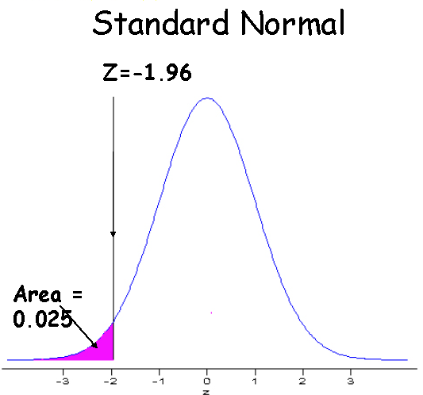

```{r child = "../setup.Rmd"}
```

```{css, echo = FALSE}
.tiny .remark-code { font-size: 70%; }
.small .remark-code { font-size: 80%; }
.tiny { font-size: 60%; }
.small { font-size: 80%; }
```


```{r packages, echo=FALSE, message=FALSE, warning=FALSE}
library(tidyverse)
library(knitr)
```

## Reminders

- No class the rest of the week, Happy Thanksgiving! 

- Homework 6 and 7 will be assigned on Monday (11/27 and 12/4) and due Sunday 9pm

---
## Recap

- Common probability distributions: Normal

  - Theoretical properties: probability density function, parameters, mean and variance, effect of varying parameters
  
  - R functions:
  
      - `dnorm()` for densities 
      - `pnorm()` for $P(X\leq x)$
      - `rnorm()` for random sample
    
  - Standard normal distribution


---
## Today

- Common probability distributions: Normal

  - More about the standard normal distribution

  - R functions:
      - `qnorm()`
    
  - Sum of independent normal distributions 
  
- Sampling distributions
  

---
## Calculating probabilities for the normal distribution

- Recall `pbinom()`: $P(X \leq x)$ for  binomial 

- `pnorm()` for $P(X \leq x)$ for the normal distribution

- Arguments: 
  - `q`, "vector of quantiles" ( $x$ in $P(X \leq x)$ )
  - `mean`, $\mu$ (default value 0)
  - `sd`, standard deviation $\sigma$ (default value 1)

```{r}
pnorm(0)
```
---
## Back to shoes example

Men's shoe sizes follow a normal distribution with mean 11 and standard deviation 1.5, i.e., $N(\mu = 11,\sigma^2 = 1.5^2)$

```{r, echo=FALSE, warning=FALSE, message=FALSE}
ggplot(data.frame(x = c(4, 18)), aes(x = x)) +
  stat_function(fun = dnorm,
                n = 10000,
                args = list(mean = 11, sd = 1.5)) +
  stat_function(
    fun = dnorm,
    args = list(mean = 11, sd = 1.5),
    xlim = c(4, 9),
    geom = "area",
    fill = "#003087",
    alpha = .3
  ) + labs(x = "Continuous Shoe Size")

```

E.g., probability of shoe size being less than 9 (shaded area)

---
## Calculating probabilities for our shoes example

Given $N(\mu = 11,\sigma^2 = 1.5^2)$, what is the probability of shoe sizes less than 9? 

--

```{r}
pnorm(9, mean = 11, sd = 1.5)
```

What is the probability of shoe sizes greater than 9? 

--

```{r}
1 - pnorm(9, mean = 11, sd = 1.5)
```


---
## Calculating probabilities for our shoes example
What is the probability of shoe sizes less than 13? 
--

```{r}
pnorm(13, mean = 11, sd = 1.5)
```

--
What is the probability of shoe size 10-11.5?
--

```{r}
pnorm(11.5, mean = 11, sd = 1.5) - pnorm(10, mean = 11, sd = 1.5)
```

---
## Probabilities between two values

```{r echo=FALSE}

```

What is the probability of shoe size 10-11.5?

```{r}
pnorm(11.5, mean = 11, sd = 1.5) - pnorm(10, mean = 11, sd = 1.5)
```

---
## Sampling from Normal distribution in R
- `rnorm()` 

- Arguments `n, mean, sd` 

```{r}
set.seed(0) # so results are reproducible 
normalDraws <- rnorm(n = 100, mean = 0, sd = 1)
head(normalDraws, 20)
```

---
## Frequency distribution varying mean and sd

.small[
```{r }
set.seed(0) # so results are reproducible 
normal1 <- rnorm(n = 5000, mean = 3, sd = 2)
normal2 <- rnorm(n = 5000, mean = 3, sd = 10)
normal3 <- rnorm(n = 5000, mean = 11, sd = 1.5) # shoe size distribution 
```
]

```{r echo = FALSE, out.width = "60%"}
data.frame(normal1) %>%
  rename(outcome = normal1) %>%
  bind_cols(mean = 3, sd = 2) %>%
  bind_rows(
    data.frame(normal2) %>%
      rename(outcome = normal2) %>%
      bind_cols(mean = 3, sd = 10)
  ) %>%
  bind_rows(
    data.frame(normal3) %>%
      rename(outcome = normal3) %>%
      bind_cols(mean = 11, sd = 1.5)
  ) %>%
  ggplot(aes(x = outcome, 
                    fill = as.factor(paste0(mean, ", ", sd)))) +
    geom_histogram(binwidth = 1, position = "identity", alpha = .7) + 
    labs(
      x = "x",
      y = "Frequency",
      title = "5000 samples each from N(3, 2^2), N(3, 10^2), N(11, 1.5^2)",
      fill = "Mean, sd"
    ) +
  scale_fill_viridis_d() +
  guides(fill = "none")
```

---
## Frequency distribution varying mean and sd

.small[
```{r }
set.seed(0) # so results are reproducible 
normal1 <- rnorm(n = 5000, mean = 3, sd = 2)
normal2 <- rnorm(n = 5000, mean = 3, sd = 10)
normal3 <- rnorm(n = 5000, mean = 11, sd = 1.5)
```
]

```{r echo = FALSE, out.width = "60%"}
data.frame(normal1) %>%
  rename(outcome = normal1) %>%
  bind_cols(mean = 3, sd = 2) %>%
  bind_rows(
    data.frame(normal2) %>%
      rename(outcome = normal2) %>%
      bind_cols(mean = 3, sd = 10)
  ) %>%
  bind_rows(
    data.frame(normal3) %>%
      rename(outcome = normal3) %>%
      bind_cols(mean = 11, sd = 1.5)
  ) %>%
  ggplot(aes(x = outcome, 
                    fill = as.factor(paste0(mean, ", ", sd)))) +
    geom_histogram(binwidth = 1, position = "identity", alpha = .7) + 
    labs(
      x = "Number of occurrences",
      y = "Frequency",
      title = "5000 samples each from N(3, 2^2), N(3, 10^2), N(11, 1.5^2)",
      fill = "Mean, sd"
    ) +
  scale_fill_viridis_d() 
```

---
## Standard normal distribution

- Recall: $Z \sim N(0, 1)$

- Any normally distributed random variable can be expressed as a standard normal by **subtracting the mean and dividing by the standard deviation**

- This process is called **standardization**

- $Y \sim N(\mu, \sigma^2)$

- $Z = \frac{Y - \mu}{\sigma}$

- $E\left(\frac{Y - \mu}{\sigma}\right) = \frac{1}{\sigma}[E(Y) - \mu] = 0$

- $Var\left(\frac{Y - \mu}{\sigma}\right) = \frac{1}{\sigma^2}[Var(Y)] = \frac{1}{\sigma^2}[\sigma^2] = 1$

- **Moving the location** (mean moves to 0) and **changing the scale** (standard deviation becomes 1)

---
## More about the standard normal distribution

- Probability of shoe sizes smaller than 13:

.small[
```{r}
pnorm(13, mean = 11, sd = 1.5)
```
]

- Let $Y$ be the random variable denoting men's shoe sizes. Then $Y \sim N(11, 1.5^2)$.

.tiny[
$$
\begin{aligned}
P(Y \leq 13) &= P\left(\frac{Y - \mu_y}{\sigma_y} \leq \frac{13 - \mu_y}{\sigma_y} \right) \\
&=P\left( Z \leq \frac{13-11}{1.5} \right) \\
&=P(Z \leq \frac{2}{1.5})
\end{aligned}
$$
]
.small[
```{r}
pnorm(2/1.5, mean = 0, sd = 1)
```
]

---
## z-score
.tiny[
$$
\begin{aligned}
P(Y \leq 13) &= P\left(\frac{Y - \mu_y}{\sigma_y} \leq \frac{13 - \mu_y}{\sigma_y} \right) \\
&=P\left( Z \leq \frac{13-11}{1.5} \right) \\
&=P(Z \leq \frac{2}{1.5})
\end{aligned}
$$
]

- Standardized value $\frac{13-11}{1.5}$ is a z-score

- $z = \frac{x - \mu}{\sigma} = \frac{\text{value - mean}}{\text{standard deviation}}$

- **Number of standard deviations above (positive z-scores) or below the mean (negative z-scores)**


---
## z-score

.tiny[
$$
\begin{aligned}
P(Y \leq 13) &= P\left(\frac{Y - \mu_y}{\sigma_y} \leq \frac{13 - \mu_y}{\sigma_y} \right) \\
&=P\left( Z \leq \frac{13-11}{1.5} \right) \\
&=P(Z \leq \frac{2}{1.5})
\end{aligned}
$$
]

- $x - \mu$ is the number relative to the mean, e.g., shoe size 13 is 2 above the mean

- Dividing by $\sigma$: gives number of standard deviations above the mean

- e.g., shoe size distribution has sd = 1.5, so shoe size 13 is $\frac{2}{1.5} = 1.33$ standard deviations above the mean

- **Relative** positions stay the same, i.e., $P(Y \leq 13) = P(Z \leq \frac{2}{1.5})$ 

---
## Recall: Variance and standard deviation

- **Rules of thumb** for symmetric, bell-shaped distributions: 68%, 95%, and 99.7% of the values lie within one, two, and three standard deviations of the mean, respectively

```{r echo=FALSE, out.width="60%"}
knitr::include_graphics("img/sdRules.png")
```

```{r}
pnorm(2)
```

---
## Standardizing in R

Consider the samples we drew earlier from $N \sim (11, 1.5^2)$

.small[
```{r }
set.seed(0) # so results are reproducible 
normal3 <- rnorm(n = 5000, mean = 11, sd = 1.5) # shoe size distribution 
standardizedNormal3 <- (normal3 - 11)/1.5
```
]

```{r echo = FALSE, out.width = "60%"}
data.frame(normal3) %>%
  rename(outcome = normal3) %>%
  bind_cols(dist = "original") %>%
  bind_rows(
    data.frame(standardizedNormal3) %>%
      rename(outcome = standardizedNormal3) %>%
      bind_cols(dist = "standardized")
  ) %>%
  ggplot(aes(x = outcome, 
                    fill = as.factor(dist))) +
    geom_histogram(binwidth = .1, position = "identity", alpha = .7) + 
    labs(
      x = "x",
      y = "Frequency",
      title = "Original N(11, 1.5^2) and standardized",
      fill = "Distribution"
    ) +
  scale_fill_viridis_d() 
```

---
## Standardizing in R
```{r echo = FALSE, out.width = "60%"}
data.frame(normal3) %>%
  rename(outcome = normal3) %>%
  bind_cols(dist = "original") %>%
  bind_rows(
    data.frame(standardizedNormal3) %>%
      rename(outcome = standardizedNormal3) %>%
      bind_cols(dist = "standardized")
  ) %>%
  ggplot(aes(x = outcome, 
                    fill = as.factor(dist))) +
    geom_histogram(binwidth = .1, position = "identity", alpha = .7) + 
    labs(
      x = "x",
      y = "Frequency",
      title = "Original N(11, 1.5^2) and standardized",
      fill = "Distribution"
    ) +
  scale_fill_viridis_d() +
  geom_vline(xintercept = 13, linetype = "dashed") +
  geom_vline(xintercept = 2/1.5, linetype = "dashed")
```

.small[
```{r }
sum(normal3 <= 13)/length(normal3)
sum(standardizedNormal3 <= 2/1.5)/length(standardizedNormal3)
```
]

---
## Exercise

Assume that player ratings in chess tournaments follow a symmetric, bell-shaped distribution with mean 1600 and standard deviation 350. 

What common probability distribution do player ratings follow, and what are the parameters? 

--

A player with a rating of 2650 enters the tournament. What is the probability of a rating higher than this player? 

--

What is the probability of ratings between 1200 and 1800? 


---
## More about the standard normal distribution 

- We saw earlier that $P(Z \leq 0) = .5$. This is because the standard normal distribution is symmetric with mean 0.

```{r}
pnorm(0) # default value of mean = 0 and sd = 1
```

- Tail probabilities of the standard normal distribution 

  - The symmetry of the normal distribution allows us to calculate the probability of values falling in the tails
  
  - For any $z$-score, $P(Z \leq -z) = P(Z \geq z)$

```{r echo=FALSE, out.width = "20%"}
knitr::include_graphics("img/stdnorm5.png")
```

---
## Quantiles for the normal distribution 

- Quantiles are cut points dividing the range of a probability distribution into continuous intervals

- Recall: quartiles (four groups) and percentiles (100 groups)

- $P(X \leq q) = p$, where $q$ is the quantile (think of value on the horizontal axis), e.g., $P(Z \leq 0) = .5$

- Recall: `pnorm(q, mean, sd)` for $P(X\leq x)$, or $P(Z \leq z)$ for standard normal. `pnorm()` returns the probability, `p`

```{r}
pnorm(q = 0, mean = 0, sd = 1)
```

- `qnorm(p, mean, sd)` for the quantile, e.g., $P(X \leq \ ?) = p$. `qnorm()` returns the quantile, `q`
  
```{r}
qnorm(p = .5, mean = 0, sd = 1)
```

---
## Important reference points for the normal distribution 

- z-scores (quantiles) corresponding to particular probabilities are often written as $z_p$
  - $p$ denotes the probability in the **right tail**, e.g., $z_{.025} \approx 1.96$

- Important reference points: 2.5% in the left and right tails 

- In R:

.pull-left[
```{r}
qnorm(.025, lower.tail = FALSE)
qnorm(.975)
```
]

.pull-right[
```{r echo=FALSE, out.width = "70%"}
knitr::include_graphics("img/stdnorm5.png")
```
]
---
## Important reference points for the normal distribution 


.pull-left[
```{r}
pnorm(1.96)
pnorm(1.96, lower.tail = FALSE)
```

```{r echo=FALSE, out.width = "78%"}
knitr::include_graphics("img/stdnorm1.png")
```
]
.pull-right[
```{r}
pnorm(-1.96)
pnorm(-1.96, lower.tail = FALSE)
```

```{r echo=FALSE, out.width = "70%"}

```
]

---
## Standard normal table

```{r echo=FALSE}
knitr::include_graphics("img/normaltable.png")
```

---
## Standard normal table

.pull-left[
What is the probability of a shoe size bigger than 13 (z-score 1.33)?

```{r echo=FALSE, out.width="100%"}
knitr::include_graphics("img/normalcurveupper.png")
```
]
--
.pull-right[
.small[
```{r}
pnorm(13, mean = 11, sd = 1.5, lower.tail = FALSE)
pnorm(2/1.5, lower.tail = FALSE)
1 - pnorm(2/1.5)
```
]
]

---
## Sum of independent normal random variables 

- Important property: **Any linear combination of normal random variables is a normal random variable** 
--

- A linear combination of two random variables, $X$ and $Y$, is of the form $aX+bY$, where $a$
and $b$ are constants

- Recall: 
  - $E(aX + bY) = aE(X) + bE(Y)$
  - For a linear combination of **independent** random variables $Var(aX + bY) = a^2 Var(X) + b^2 Var(Y)$

- $X \sim N(\mu_x, \sigma_x^2)$ and $Y \sim N(\mu_y, \sigma_y^2)$ are independent, $W = X + Y \sim N(\mu_x + \mu_y, \sigma_x^2 + \sigma_y^2)$

---
## Sum of independent normal random variables 

- Extends to more than two random variables in the linear combination

- $E(aX + bY) = aE(X) + bE(Y)$
  - $b$ can be negative, e.g., $E(X - Y) = E(X) - E(Y)$ and $Var(X - Y) = Var(X) + Var(Y)$.

---
## Summary: Distributions in R

- For each distribution, R has a family of commands, starting with the letters `d`, `p`, `q` and `r`
  - `d` for density
  - `p` for cumulative density up to input value $P(X \leq x)$. Think of $P(X \leq q) = p$
  - `q` for the quantile, e.g., $P(X \leq \ ?) = p$
  - `r` for a random sample from the distribution

---
## Summary

- Common probability distributions: Normal

  - More about the standard normal distribution

  - R functions:
      - `qnorm()` for the value corresponding to an input probability, e.g., $P(X \leq \ ?) = p$
    
  - Sum of independent normal distributions: any linear combination of normal random variables is a normal random variable
  

