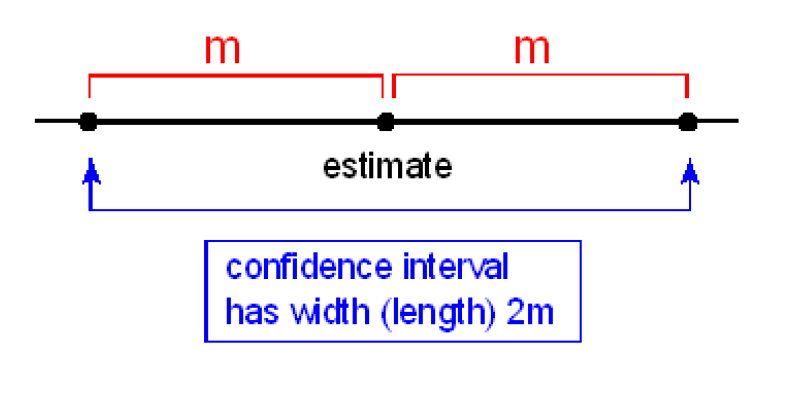
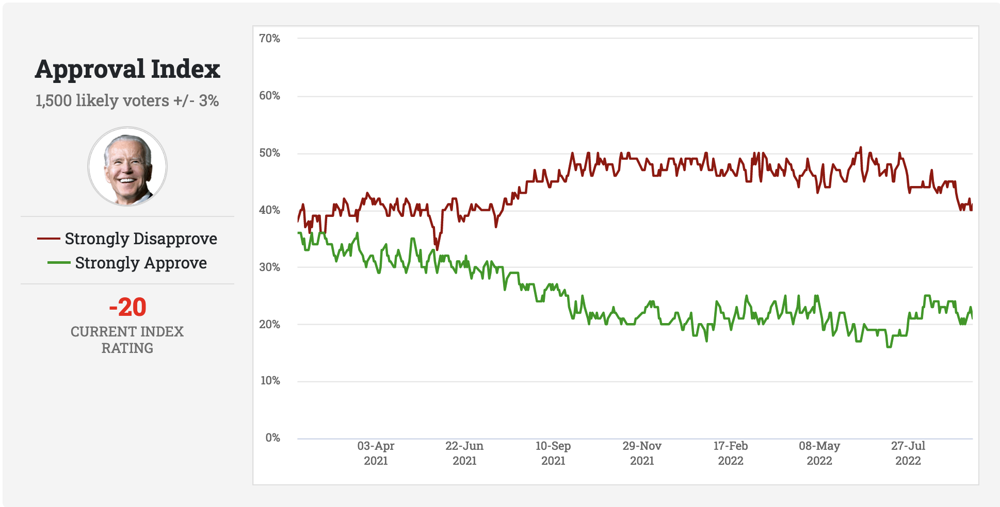
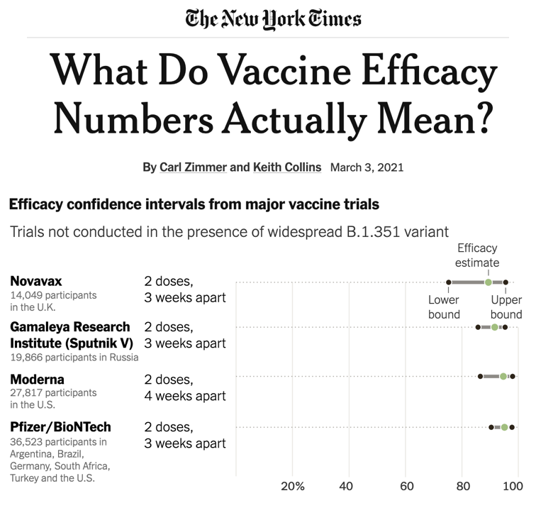

```{r child = "../setup.Rmd"}
```


```{css, echo = FALSE}
.tiny .remark-code { font-size: 70%; }
.small .remark-code { font-size: 80%; }
.tiny { font-size: 60%; }
.small { font-size: 80%; }
```

```{r packages, echo=FALSE, message=FALSE, warning=FALSE}
library(dplyr)
```

## Reminders/announcements 

- Homework assigned this afternoon, due 11/21 

- Participation survey for last week and this week opens after midterm, closes Monday 11/21 9PM

- This week's schedule: 
  - Tuesday 10-11am and Thursday 10:30-11:30am OH (JH, MSB 1117): please check Piazza beforehand 
  - Wednesday review (JH)
  - Thursday OH (XHT, 12:10-2pm MSB 4242; no lab)
  - Friday midterm 2

- Next week: Thanksgiving! Only one lecture on Monday 11/21

---
## Midterm 2
- Will cover material from 10/24 (Lecture 13), until today's lecture (Lecture 21)

- Closed-book with some formulas provided (see Lecture 19)

- You don't need your computers or calculators 

- There will be no make-up exams

- Drop policy for exams: 1 midterm may be dropped or used with 50% penalty on the final

---
## Recap
  
- Central Limit Theorem: $\overline{X} \approx N(\mu, \frac{\sigma^2}{n})$ 

- Sampling distribution of the sample mean

- Sampling distribution of the sample proportion: $\overline{X} = \hat{P} \approx N(p, \frac{p(1-p)}{n})$ 

---
## Today
- Normal approximation to binomial

- Confidence intervals: 

  - Introduction and interpretation 
  
  - Construction using Central Limit Theorem 

---
## Normal approximation to the Binomial distribution
- We saw in an earlier lecture that as the number of trials increased, the binomial distribution becomes symmetric and bell-shaped. 

- A commonly used rule of thumb is that for $Y \sim$ Binomial(n, p), when $np > 5$ and $n(1-p) > 5$, $Y \approx N(np, np(1-p))$. This approximation comes from the Central Limit Theorem.

- By the Central Limit Theorem, $\overline{X} = \hat{P} = \frac{\sum_{i = 1}^n{X_i}}{n} \approx N(p, \frac{p(1-p)}{n})$ where $X_i \sim$ Bernoulli(p).

- Now, $Y = \sum_{i = 1}^n{X_i} = n \overline{X}$

- By the rules for expectation and variance, $E(n\overline{X}) = nE(\overline{X}) = np$ and $Var(n\overline{X}) = n^2 Var(\overline{X}) = np(1-p)$

---
## Example: cats
We ask a random sample of 435 people if they like cats. Assume that the probability that a randomly selected person likes cats is 75%. Find the probability that at least 325 people like cats. 

Let $Y$ be the number of people, out of 435, that like cats. Then $Y \sim$ Binomial(435, .75). We want $P(Y \geq 325)$. In R:

```{r}
sum(dbinom(325:435, 435, .75))
1 - pbinom(324, 435, .75) # pbinom alternative
```

---
## Example: cats
We ask a random sample of 435 people if they like cats. Assume that the probability that a randomly selected person likes cats is 75%. Using a normal approximation, find the probability that at least 325 people like cats. 

Using the Central Limit Theorem, we have $\overline{X} = \hat{P} = \frac{\sum_{i = 1}^n{X_i}}{n} \approx N(p, \frac{p(1-p)}{n})$, so $Y = \sum_{i = 1}^n{X_i} = n \overline{X} \approx N(np, np(1-p))$. 

In this case, $Y \approx N(435*.75, 435*.75*.25)$. We want $P(Y \geq 325)$, so in R: 

```{r}
1 - pnorm(324, 435*.75, sd = sqrt(435*.75*.25))
```

Note that this is only an approximation!

---

## Recall: Sampling distributions

Knowing the sampling distribution can help us

- **Estimate a population parameter as point estimate $\pm$ margin of error, where the margin of error is comprised of a measure of how confident we want to be and the sample statistic's variability. (Coming soon: confidence intervals)**

- Test whether a population parameter is equal to some value, by evaluating how likely it is that we have obtained the observed sample statistic, if the population parameter is indeed that value. (Coming soon: hypothesis testing)

---
## Course content 

1. Fundamentals of R
  - Overview of data types and structures
  - Data manipulation and data visualization tools  

2. Descriptive statistics for numerical and categorical data

3. Probability
  - Rules of probability computation; conditional probability
  - Basic probability models: Binomial, Normal and Poisson 

4. Statistical inference
  - Sampling distributions of sample mean and sample proportion
  - **Hypothesis testing and confidence intervals for population mean and population proportion**


---
## Estimation and testing

- **Estimation**: using the sample to estimate a single value or plausible range of values for the unknown parameter

  - Point estimate: A **point estimate** is a single value computed from the sample data to serve as the "best guess", or estimate, for the population parameter. 
    - "Based on a survey of 300 UC Davis students, we estimate that 50% of students ride bikes on campus."
  
  - **Interval estimate**: "Based on a survey of 300 UC Davis students, we are 95% confident that the mean proportion of students riding bikes on campus is (.45, .55)."

- **Testing**: evaluating whether our observed sample provides evidence against some claim about the population

  - "We reject the hypothesis that 10% of UC Davis students ride bikes on campus"

- We will first talk about estimation


---

## Point estimates vs. confidence intervals

- A **point estimate** is a single value computed from the sample data to serve as the "best guess", or estimate, for the population parameter. 

  - For example, the sample mean $\overline{X}$ is often used as an estimator for the population mean $\mu$

  - In R, we can simply use `mean()` to calculate the estimate from a given sample 

- Point estimates vs. confidence intervals: If you want to catch a fish, do you prefer a spear or a net?

.pull-left[
```{r echo=FALSE, out.width="70%", fig.align="center"}

```
]
.pull-right[
```{r echo=FALSE, out.width="70%", fig.align="center"}
knitr::include_graphics("img/net.png")
```
]

---

## Point estimates vs. confidence intervals

If you want to estimate a population parameter, do you prefer to report a range of values or a single value?

.pull-left[
```{r echo=FALSE, out.width=400, fig.align="center"}

```
]
.pull-right[
```{r echo=FALSE, out.width=400, fig.align="center"}
knitr::include_graphics("img/net.png")
```
]

---

## Point estimates vs. confidence intervals

If you want to estimate a population parameter, do you prefer to report a range of values, or a single value?

- If we report a point estimate, we probably won’t hit the exact population parameter.

- If we report a range of plausible values we have a better chance of capturing the parameter.

---
## What is a Confidence Interval?
When a sample statistic is used to estimate a population parameter, it will be accompanied by some measure of uncertainty, e.g., a margin of error or confidence interval 

A **confidence interval** provides a range of reasonable values that are intended to contain the parameter of interest with a certain **degree of confidence**. It often takes the form (point estimate $\pm$ margin of error)

It is written as (point estimate - margin of error, point estimate + margin of error).

```{r echo=FALSE,out.width="40%"}

```

It is accompanied by a **level of confidence**, often 95%, and said in words as "We are 95% **confident** that the true population parameter falls within the interval (point estimate - margin of error, point estimate + margin of error)."

---
## Example: Approval ratings

```{r echo = FALSE, out.width = "70%"}

```

.tiny[
Source: https://www.rasmussenreports.com/public_content/politics/biden_administration/prez_track_sep23
]

What is the population parameter of interest? What is the sample statistic?

--

**Population parameter**: Proportion of likely voters that strongly approve of President Biden 

**Sample statistic**: Proportion based on 1500 likely voters (on a given day)

**95% confidence interval**: (37%, 43%)
---
## Example: Vaccine efficacy

```{r echo = FALSE, out.width = "45%"}

```

"The uncertainty around a point estimate can be small or large. Scientists represent this uncertainty by calculating a range of possibilities, which they call a confidence interval."

---
## Elements and interpretation 

.pull-left[
```{r echo = FALSE, out.width = "75%"}

```

"We are 95% **confident** that the true population parameter falls within the interval (.85, .95)."
]

.pull-right[
**Elements**:
- Confidence level
- Point estimate
- Lower bound
- Upper bound
]

**Interpretation**: If we were to **repeat this procedure** a large number of times, sampling and constructing confidence intervals in the same way, **95% of constructed intervals would contain the true population parameter**.

---
## Interpretation 
"We are 95% **confident** that the true population parameter falls within the interval (.85, .95)."

**Interpretation**: If we were to **repeat this procedure** a large number of times, sampling and constructing confidence intervals in the same way, **95% of constructed intervals would contain the true population parameter**.

- If we repeat the experiment 10,000 times, i.e., draw samples and construct 10,000 confidence intervals, we would expect 9,500 of these to contain the true population parameter 

- **Incorrect interpretation**: *Observed interval* has a 95% *probability* of containing the population parameter

- Do not confuse **confidence** with **probability**

- Once we **observe an interval** (collected a sample), there is no more variability. The observed interval either contains the population parameter, or it does not. 

---
## Confidence Level: Procedure, not Specific Realization 

- The **confidence level** reflects the measure of confidence in the **procedure** that led to the confidence interval

- In our fishing example, it is a statement about the properties of the net (e.g., size, quality) and your fishing technique. Once you've made an attempt (cast net into water), you either caught fish or did not. 

- Another analogy: a game of horseshoes

.pull-left[

**Correct**: Based on your throwing technique, 95% of the horseshoes you throw will encircle the stake

**Incorrect**: After you throw a horseshoe, it has a 95% *probability* of encircling the stake. It does not! It either encircles the stake or does not
]

.pull-right[
```{r echo=FALSE, out.width = "100%"}

```

.tiny[
Source: https://www.istockphoto.com/photo/pitching-horseshoes-gm140471913-3413882
]
]
---

## Constructing confidence intervals 

- In order to construct a confidence interval we need to quantify the **variability of our sample statistic**

- Suppose we are interested in the population mean height of students

  - We sample 50 students, ask each student their height, and calculate the sample mean height 
  
  - Then, we sample repeat the procedure, sampling 50 students and calculating the mean height. Would we expect these two means to be exactly equal, close but not equal, or wildly different?

- We need to quantify the variability of the sample mean from sample to sample

- One way to do this is to **use the sampling distribution of the sample mean**, which we derived using the **Central Limit Theorem**

- In the following results, assume independent samples and $n$ large enough, so that the Central Limit Theorem holds

---

## Confidence intervals using CLT 

- What we want: "If we were to **repeat this procedure** a large number of times, sampling and constructing confidence intervals in the same way, **95% of constructed intervals would contain the true population parameter**." This translates to P(CI contains true parameter) = .95.

- Recall: z-scores corresponding to particular probabilities (critical values) are often written as $z_p$, where $p$ denotes the probability in the right tail, e.g., $z_{.025} \approx 1.96$

- **Set up**: $X_i$ are independent and identically distributed with population mean $\mu$ and variance, $\sigma^2$. We are interested in a confidence interval for the unknown population parameter $\mu$. We use the sample mean, $\overline{X}$, constructed from a sample of size $n$, as an estimator for the population mean. Assume $n$ is large.


---
## Confidence intervals using CLT 

- **Set up**: $X_i$ are independent and identically distributed with population mean $\mu$ and variance, $\sigma^2$. We are interested in a confidence interval for the unknown population parameter $\mu$. We use the sample mean, $\overline{X}$, constructed from a sample of size $n$, as an estimator for the population mean. Assume $n$ is large.

- The final ingredient we will need is $\alpha$, which is the **significance level** of the confidence interval

  - **Confidence level** = $100(1 - \alpha)$%, i.e., a **95% confidence interval** will need $\alpha = .05$
  
  - The previous statement on the interpretation of CIs is more generally P(CI contains true parameter) = $1 - \alpha$ (more accurately, we need P(CI contains true parameter) $\geq 1 - \alpha$)

- $z_{\frac{\alpha}{2}}$ is the z-score corresponding to a probability of $\frac{\alpha}{2}$ in the right tail. We saw earlier that for $\alpha = .05$, $z_{\frac{\alpha}{2}}$ is 1.96, i.e., $P(Z > 1.96) \approx .025$.

---
## Confidence intervals using CLT 

- Consider the following interval

$$\left(\overline{X}-z_{\frac{\alpha}{2}}\frac{\sigma}{\sqrt{n}}, \overline{X}+z_{\frac{\alpha}{2}}\frac{\sigma}{\sqrt{n}} \right)$$

- We will prove that P(CI contains true parameter) = $1 - \alpha$, i.e., $P(\overline{X}-z_{\frac{\alpha}{2}}\frac{\sigma}{\sqrt{n}} \leq \mu \leq \overline{X}+z_{\frac{\alpha}{2}}\frac{\sigma}{\sqrt{n}}) = 1 - \alpha$

- For simplicity, we will use $\alpha = .05$, and replace $z_{\frac{\alpha}{2}}$ by 1.96 in the proof, but note that this will work for any $\alpha$ between 0 and 1.


---
## Proof 

$$
\begin{aligned}
& P\left(\overline{X}-1.96\frac{\sigma}{\sqrt{n}} \leq  \mu \leq \overline{X} + 1.96\frac{\sigma}{\sqrt{n}}\right) \\
&= P\left(\overline{X}-1.96\frac{\sigma}{\sqrt{n}} \leq  \mu \text{ and } \mu \leq \overline{X} + 1.96\frac{\sigma}{\sqrt{n}} \right) \\
&= P\left(\overline{X}-\mu \leq   1.96\frac{\sigma}{\sqrt{n}} \text{ and } \overline{X} - \mu \geq  -1.96\frac{\sigma}{\sqrt{n}} \right) \\
&= P\left( \frac{\overline{X}-\mu}{\frac{\sigma}{\sqrt{n}}} \leq   1.96 \text{ and } \frac{\overline{X} - \mu}{\frac{\sigma}{\sqrt{n}}} \geq  -1.96 \right) \\
&= P\left( -1.96  \leq \frac{\overline{X}-\mu}{\frac{\sigma}{\sqrt{n}}} \leq   1.96\right) \\
&\approx P\left( -1.96  \leq Z \leq   1.96\right)  \text{ by the Central Limit Theorem} \\
&= .95
\end{aligned}
$$

---
## Confidence Interval for Population Mean
Hence after collecting a sample and computing the sample mean, $\bar{x}$, an $\alpha$-level confidence interval for $\mu$ is

$$\left(\overline{x}-z_{\frac{\alpha}{2}}\frac{\sigma}{\sqrt{n}}, \overline{x}+z_{\frac{\alpha}{2}}\frac{\sigma}{\sqrt{n}} \right)$$

Notice that the random variable $\overline{X}$ has been replaced by the sample statistic $\overline{x}$

---
## Example
Let $X_1, X_2, ..., X_{200}$ be independent $N(\mu, 4)$ random variables. We collect the sample of size 200, and the resulting sample mean, $\overline{x}$, is $\overline{x} = 24$. What is a 95% confidence interval for $\mu$?

Since $n = 200$ is large, by CLT, a 95% confidence interval for $\mu$ is given by 
$$\left(\overline{x}-z_{\frac{\alpha}{2}}\frac{\sigma}{\sqrt{n}}, \overline{x}+z_{\frac{\alpha}{2}}\frac{\sigma}{\sqrt{n}} \right)$$

Substitute $\overline{x} = 24$, $z_{\frac{\alpha}{2}} = 1.96$, $\sigma = 2$, $n = 200$, giving $\left(24-1.96*2/ \sqrt{200}, 24 + 1.96*2/ \sqrt{200} \right)$ or (23.72, 24.28)

We are 95% confident that $\mu$ falls within the interval (23.72, 24.28).

---

## Confidence Interval Width: changing n

$$\left(\overline{x}-z_{\frac{\alpha}{2}}\frac{\sigma}{\sqrt{n}}, \overline{x}+z_{\frac{\alpha}{2}}\frac{\sigma}{\sqrt{n}} \right)$$

For a given $z_{\frac{\alpha}{2}}$, confidence intervals that are narrower indicate greater certainty in estimated values. We can get narrower intervals by increasing $n$, the sample size.

---

## Earlier example
We had $n = 200$, $\overline{x} = 24$, $\sigma = 2$, and our 95% confidence interval for $\mu$ was (23.72, 24.28).

What about when $n = 2000$?

$$\left(\overline{x}-z_{\frac{\alpha}{2}}\frac{\sigma}{\sqrt{n}}, \overline{x}+z_{\frac{\alpha}{2}}\frac{\sigma}{\sqrt{n}} \right)$$

Substitute $\overline{x} = 24$, $z_{\frac{\alpha}{2}} = 1.96$, $\sigma = 2$, $n = 2000$, giving $\left(24-1.96*2/ \sqrt{2000}, 24 + 1.96*2/ \sqrt{2000} \right)$ or (23.91, 24.09)

---

## Confidence Interval Width: changing alpha

While 95% confidence intervals are the most common, it is simple to generate other intervals, for example 99% intervals, by replacing the z-score. E.g., for a 99% interval, we need the z-score that cuts off the upper 0.005 of the distribution, which is 2.58.

```{r}
qnorm(.995)
```

In our earlier example, we had $n = 200$, $\overline{x} = 24$, $\sigma = 2$, and our 95% confidence interval for $\mu$ was (23.72, 24.28). When $\alpha = .01$, a 99% confidence interval is $\left(24-2.58*2/ \sqrt{200}, 24 + 2.58*2/ \sqrt{200} \right)$ or (23.64, 24.36).

---
## Confidence Interval Width: changing alpha

In a recent study of 50 randomly selected statistics students, they
were asked the number of hours per week they spend studying for
their statistics classes. The results were used to estimate the mean
time for all statistics students with 90%, 95% and 99% confidence
intervals. These were (not necessarily in the same order):
$$(7.5, 8.5) ~~~ (7.6, 8.4) ~~~(7.7, 8.3).$$

Which interval is which?

---
## Summary
- Normal approximation to binomial: For $Y \sim$ Binomial(n, p), when $np > 5$ and $n(1-p) > 5$, $Y \approx N(np, np(1-p))$

- Confidence intervals: 

  - Introduction and interpretation 
  
  - Construction using Central Limit Theorem: $\left(\overline{x}-z_{\frac{\alpha}{2}}\frac{\sigma}{\sqrt{n}}, \overline{x}+z_{\frac{\alpha}{2}}\frac{\sigma}{\sqrt{n}} \right)$

