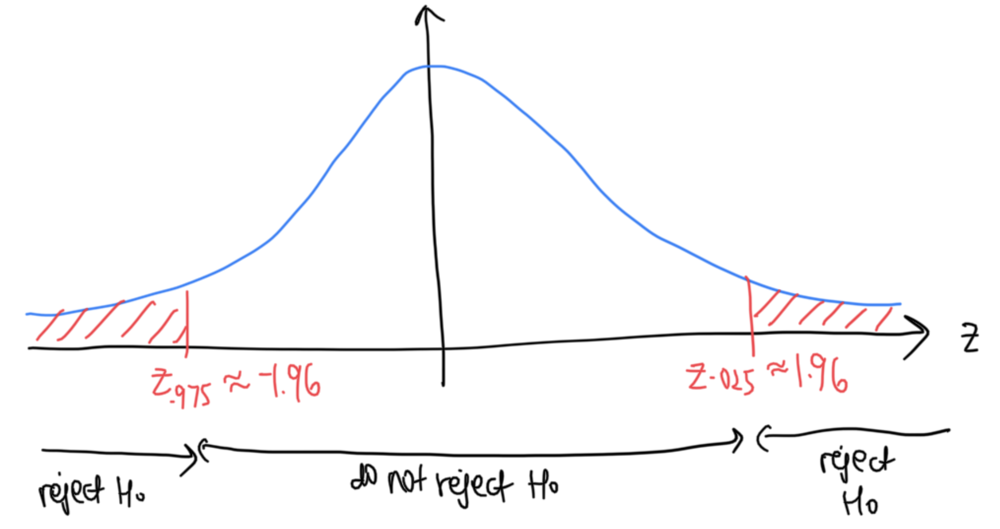

```{r child = "../setup.Rmd"}
```


```{css, echo = FALSE}
.tiny .remark-code { font-size: 70%; }
.small .remark-code { font-size: 80%; }
.tiny { font-size: 60%; }
.small { font-size: 80%; }
```

```{r packages, echo=FALSE, message=FALSE, warning=FALSE}
library(dplyr)
library(ggplot2)
```


## Today

- Hypothesis tests for population mean and proportion 

  - p-value approach 

  - Critical value approach

---

## More about p-values

```{r echo=FALSE, out.width="50%"}

```

- Note that all computations are done assuming that $H_0$ is true, i.e., to be precise, the decision rule is reject $H_0$ if the p-value $P(|Z| \geq |z| \mid H_0) = P(Z \geq |z|$ or $Z \leq -|z| \mid H_0) < \alpha$

- The blue distribution is the distribution under the null hypothesis

- $P(|Z| \geq |z|) = P(Z \geq |z|) + P(Z \leq -|z|)$ (shaded area)

---
## More about p-values

```{r echo=FALSE, out.width="50%"}

```

- The value of the **test statistic** is $z$ (value on horizontal axis)

- **p-value** = $P(|Z| \geq |z|)$ under $H_0$ (for a two-sided test; more details coming). It is the probability of getting a result as extreme as what we got, if $H_0$ were true. 

- Recall the decision rule: reject $H_0$ if $P(|Z| \geq |z|) = P(Z \geq |z|$ or $Z \leq -|z|) < \alpha$. Alternatively, the p-value can be interpreted as the smallest significance level that we would reject $H_0$.


---

## More about p-values

- Probability of getting data like ours or more extreme data if $H_0$ were true

- Common misinterpretation: "p-value is the probability that $H_0$ is true". The p-value is calculated *assuming* that $H_0$ is true. It cannot be used to tell us how likely it is that assumption is correct.

- **Decision rule**: reject $H_0$ if p-value $< \alpha$
  - We will demonstrate that this produces the required property that P(reject $H_0$ | $H_0$ true) $= \alpha$

---

## More about p-values: simulation example 
Setup: $X_i \sim N(\mu,4^2)$ 

$H_0$: $\mu = \mu_0 = 20$  
$H_A$: $\mu \neq 20$

Under $H_0$, $Z = \frac{\overline{X} - \mu_0}{\sigma / \sqrt{n}} \sim N(0, 1)$ 

Value of test statistic: $z = \frac{\overline{x} - \mu_0}{\sigma / \sqrt{n}}$

Decision rule: reject $H_0$ if $P(|Z| \geq |z|) = P(Z \geq |z|$ or $Z \leq -|z|) < \alpha$

---

## More about p-values: simulation example 
1. Get 1000 draws from $N(20, 4^2)$. This is the distribution when $H_0$ is true.
2. Calculate the sample mean, $\bar{x}$, and the test statistic, $z = \frac{\overline{x} - 20}{4 / \sqrt{1000}}$
3. Calculate the p-value, $P(|Z| \geq |z|)$ 
4. Repeat steps (1)-(3) 10,000 times

```{r}
set.seed(0)
myDraws <- t(replicate(10000, rnorm(1000, 20, 4)))
sampleMeans <- rowMeans(myDraws)
testStat <- (sampleMeans - 20)/(4/sqrt(1000))
pValues <- 2*pnorm(abs(testStat), lower.tail = FALSE)
```

---

## More about p-values: simulation example 
- **Decision rule**: reject if p-value $< \alpha$

- What proportion out of the 10,000 experiments should we expect to reject $H_0$?

--

- Given by significance level $\alpha$

- When $\alpha = .05$, reject 5% of the time to produce the required property that P(reject $H_0$ | $H_0$ true) $= \alpha$

```{r}
sum(pValues < .05)
mean(pValues < .05)
```

---

## More about p-values: simulation example 

```{r}
ggplot(data.frame(pValues), aes(x = pValues)) +
  geom_histogram(binwidth = .05, boundary = 0) + 
  labs(title = "10,000 p-values",
       x = "p-value",
       y = "Count")
```

- Note: the p-value is actually a random variable and it follows a uniform distribution (out of scope for this class)

---
## Critical value approach

```{r echo=FALSE, out.width="50%"}

```

- The **rejection region** is $|z| > z_{\alpha/2}$ or $|z| > 1.96$ when $\alpha = .05$. This is a **portion of the x-axis**. 

- The boundaries of the rejection region are called **critical values**.

- **Significance level** is the probability over the rejection region, the red area: $P(|Z| > z_{\frac{\alpha}{2}}) = \alpha$

---
## Hypothesis Testing for the Population Mean ( $\sigma$ known)
Say $X_i$ has mean $\mu$ and standard deviation $\sigma$. The test statistic we will use is $Z = \frac{\overline{X} - \mu}{\sigma / \sqrt{n}}$. By CLT, $Z \approx N(0, 1)$ when $n$ large.

$H_0$: $\mu = \mu_0$  
$H_A$: $\mu \neq \mu_0$

Under $H_0$, $Z = \frac{\overline{X} - \mu_0}{\sigma / \sqrt{n}} \approx N(0, 1)$

Value of test statistic: $z = \frac{\overline{x} - \mu_0}{\sigma / \sqrt{n}}$

Decision rule: 
- p-value approach: reject $H_0$ if $P(|Z| \geq z) = P(Z \geq |z|$ or $Z \leq -|z|) < \alpha$
- Critical value approach: reject if $|z| > z_{\alpha/2}$ or $|z| > 1.96$ when $\alpha = .05$

---
## Hypothesis Testing for the Population Mean ( $\sigma$ unknown)
Say $X_i$ has mean $\mu$ and standard deviation $\sigma$. The test statistic we will use is $Z = \frac{\overline{X} - \mu}{S / \sqrt{n}}$. $Z \approx N(0, 1)$ when $n$ large. (Here notice that $\sigma$ has been replaced by $S$)

$H_0$: $\mu = \mu_0$  
$H_A$: $\mu \neq \mu_0$

Under $H_0$, $Z = \frac{\overline{X} - \mu_0}{S / \sqrt{n}} \approx N(0, 1)$ (Here notice that $\sigma$ has been replaced by $S$)

Value of test statistic: $z = \frac{\overline{x} - \mu_0}{s / \sqrt{n}}$ (replace $\sigma$ by $s$)

Decision rule: 
- p-value approach: reject $H_0$ if $P(|Z| \geq z) = P(Z \geq |z|$ or $Z \leq -|z|) < \alpha$
- Critical value approach: reject if $|z| > z_{\alpha/2}$ or $|z| > 1.96$ when $\alpha = .05$

---
## Hypothesis Testing for the Population Proportion (alternative 1, using $\hat{p}$)
Say $X_i \sim$ Bernoulli(p). The test statistic we will use is $Z = \frac{\hat{P} - p}{\sqrt{\hat{P}(1-\hat{P})} / \sqrt{n}}$. $Z \approx N(0, 1)$ when $n$ large. 

$H_0$: $p = p_0$  
$H_A$: $p \neq p_0$

Under $H_0$, $Z = \frac{\hat{P} - p_0}{\sqrt{\hat{P}(1-\hat{P})} / \sqrt{n}} \approx N(0, 1)$

Value of test statistic: $z = \frac{\hat{p} - p_0}{\sqrt{\hat{p}(1-\hat{p})} / \sqrt{n}}$

Decision rule: 
- p-value approach: reject $H_0$ if $P(|Z| \geq z) = P(Z \geq |z|$ or $Z \leq -|z|) < \alpha$
- Critical value approach: reject if $|z| > z_{\alpha/2}$ or $|z| > 1.96$ when $\alpha = .05$

---
## Hypothesis Testing for the Population Proportion (alternative 2, using $p_0$)
Say $X_i \sim$ Bernoulli(p). The test statistic we will use is $Z = \frac{\hat{P} - p}{\sqrt{p(1-p)} / \sqrt{n}}$. By CLT, $Z \approx N(0, 1)$ when $n$ large. 

$H_0$: $p = p_0$  
$H_A$: $p \neq p_0$

Under $H_0$, $Z = \frac{\hat{P} - p_0}{\sqrt{p_0(1-p_0)} / \sqrt{n}} \approx N(0, 1)$ (Here notice that $p$ is replaced by $p_0$)

Value of test statistic: $z = \frac{\hat{p} - p_0}{\sqrt{p_0(1-p_0)} / \sqrt{n}}$

Decision rule: 
- p-value approach: reject $H_0$ if $P(|Z| \geq z) = P(Z \geq |z|$ or $Z \leq -|z|) < \alpha$
- Critical value approach: reject if $|z| > z_{\alpha/2}$ or $|z| > 1.96$ when $\alpha = .05$

---
## Example 1: test for population mean, $\sigma$ known
Assume that the heights of redwood trees in California follow a distribution with standard deviation 25 feet. Let the random variable $X_i$ denote the height of the $i$th redwood tree. 

We guess that the unknown population mean is 230, and would like to test this hypothesis against the alternative that $\mu \neq 230$. We collect data on the heights of 300 randomly sampled redwood trees. Assume the samples are indepedent. We get a sample mean of 220. Construct a hypothesis test at a 5% significance level. 

---
## Example 1: test for population mean, $\sigma$ known (critical value approach)

$H_0$: $\mu = 230$  
$H_A$: $\mu \neq 230$

Test statistic: $Z = \frac{\overline{X} - \mu}{\sigma / \sqrt{n}}$. By CLT, $Z \approx N(0, 1)$ when $n$ large.

Under $H_0$, $Z = \frac{\overline{X} - 230}{25 / \sqrt{300}} \approx N(0, 1)$ 

Value of test statistic: $z = \frac{220 - 230}{25 / \sqrt{300}} = -6.928203$ 

The rejection region is $|z| > 1.96$ when $\alpha = .05$

$|z|  = 6.928203 > 1.96$. The test statistic is in the rejection region, so we reject $H_0$ that $\mu = 230$. There is sufficient evidence at a 5% level to reject the null hypothesis that the mean height of a Californian redwood tree is 230 feet. 

---
## Example 1: test for population mean, $\sigma$ known (p-value approach)

(Same set up as last slide)

Value of test statistic: $z = \frac{220 - 230}{25 / \sqrt{300}} = -6.928203$ 

The p-value is $P(|Z| \geq |z|)$, in this case $P(|Z| \geq 6.928203) = P(Z \geq 6.928203 \text{ or } Z \leq -6.928203)$

```{r}
2*pnorm(-6.928203)
```

The p-value is less than .05, so we reject $H_0$ that $\mu = 230$. There is sufficient evidence at a 5% level to reject the null hypothesis that the mean height of a Californian redwood tree is 230 feet. 

---
## Example 2: test for population mean, $\sigma$ unknown
Assume that the heights of redwood trees in California follow a distribution with unknown mean and standard deviation. Let the random variable $X_i$ denote the height of the $i$th redwood tree. 

We guess that the unknown population mean is 230, and would like to test this hypothesis against the alternative that $\mu \neq 230$. We collect data on the heights of 300 randomly sampled redwood trees. Assume the samples are indepedent. We get a sample mean of 220 and sample standard deviation of 24. Construct a hypothesis test at a 5% significance level. 

---
## Example 3: test for population proportion
We are interested in the population proportion of likely voters that approve of President Biden. We guess that this is .4 and would like to test this hypothesis against the alternative that it is different from .4. We conduct a random sample of 1500 likely voters, and the proportion among them that approve of President Biden is .3. Construct a hypothesis test at a 5% significance level to determine if our hypothesis is plausible. 

---
## Example 3: test for population proportion


Let $X_i$ be a binary random variable denoting whether or not the $i$th sampled voter approves of President Biden. Now, $X_i \sim$ Bernoulli(p), and by CLT, $Z = \frac{\hat{P} - p}{\sqrt{p(1-p)} / \sqrt{n}} \approx N(0, 1)$ when $n$ large. 

$H_0$: $p = .4$  
$H_A$: $p \neq .4$

Under $H_0$, $Z = \frac{\hat{P} - .4}{\sqrt{.4(1-.4)} / \sqrt{1500}} \approx N(0, 1)$

Value of test statistic: $z = \frac{.3 - .4}{\sqrt{.4(1-.4)} / \sqrt{1500}} = -7.91$

The rejection region is $|z| > 1.96$ when $\alpha = .05$

$|z|  = 7.91 > 1.96$. The test statistic is in the rejection region, so we reject $H_0$ that $p = .4$. There is sufficient evidence at a 5% level to reject the null hypothesis that the population proportion of likely voters that approve of President Biden is .4. 

---
## Different critical values

Recall: The boundaries of the rejection region are called critical values

```{r echo=FALSE, out.width="60%"}

```

.small[
```{r}
qnorm(.95) # alpha = .1 (5% in each tail)
qnorm(.975) # alpha = .05 (2.5% in each tail)
qnorm(.995) # alpha = .01 (.5% in each tail)
```
]

---
## Rejection regions

Decision rule: Reject $H_0$ if $|z| > z_{\alpha/2}$

```{r echo=FALSE, out.width="60%"}

```

- $|z| > 2.58$ for $\alpha = .01$
- $|z| > 1.96$ for $\alpha = .05$
- $|z| > 1.64$ for $\alpha = .1$

---
## Summary of rejection rules 

For two-sided z-tests:

| $\alpha$ | Critical value approach | p-value approach
|:------|:------:|:---------:|:----------------:|:---------------:|
| .01 | $\lvert z \rvert > z_{\alpha/2} \approx 2.58$ | $P(\lvert Z\rvert \geq \lvert z\rvert \mid H_0) < .01$|
| .05 | $\lvert z \rvert > 1.96$ | $P(\lvert Z\rvert \geq \lvert z\rvert \mid H_0) < .05$|
| .1 | $\lvert z \rvert > 1.64$| $P(\lvert Z\rvert \geq \lvert z\rvert \mid H_0) < .1$|


---
## Summary

- Hypothesis tests for population mean and proportion 

  - p-value approach: reject $H_0$ if $P(|Z| \geq |z| \mid H_0) = P(Z \geq |z|$ or $Z \leq -|z| \mid H_0) < \alpha$

  - Critical value approach: reject if $|z| > z_{\alpha/2}$ 

- Test statistics (all approximately standard normal):

  - Population mean when $\sigma$ known: $Z = \frac{\overline{X} - \mu}{\sigma / \sqrt{n}}$
  - Population mean when $\sigma$ unknown: $Z = \frac{\overline{X} - \mu}{S / \sqrt{n}}$
  - Population proportion (option 1): $Z = \frac{\hat{P} - p}{\sqrt{\hat{P}(1-\hat{P})} / \sqrt{n}}$
  - Population proportion (option 2): $Z = \frac{\hat{P} - p}{\sqrt{p(1-p)} / \sqrt{n}}$
  