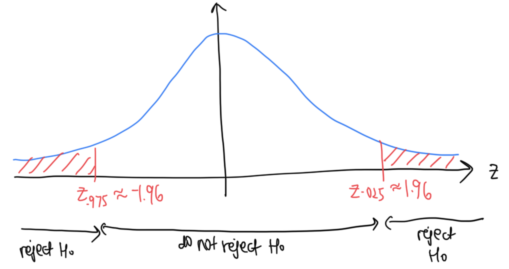
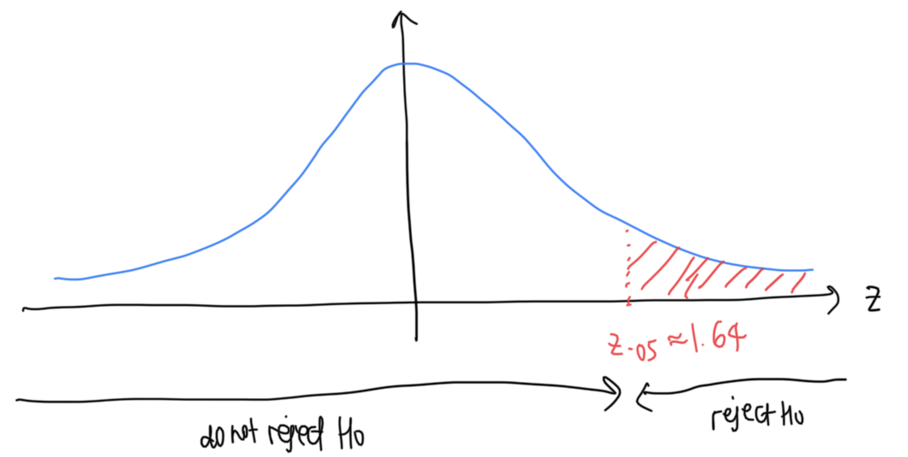
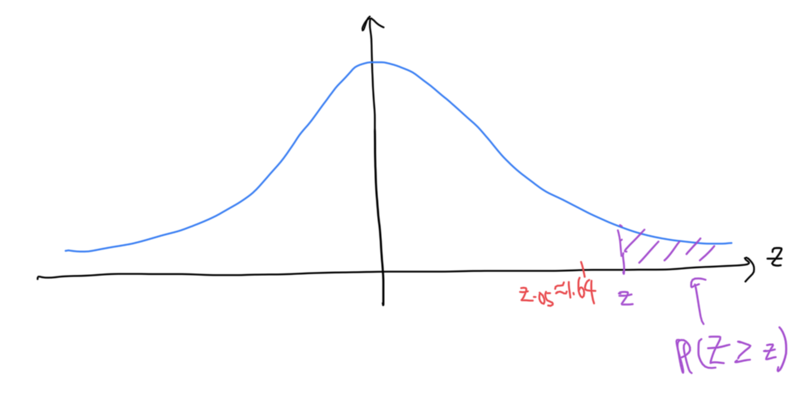
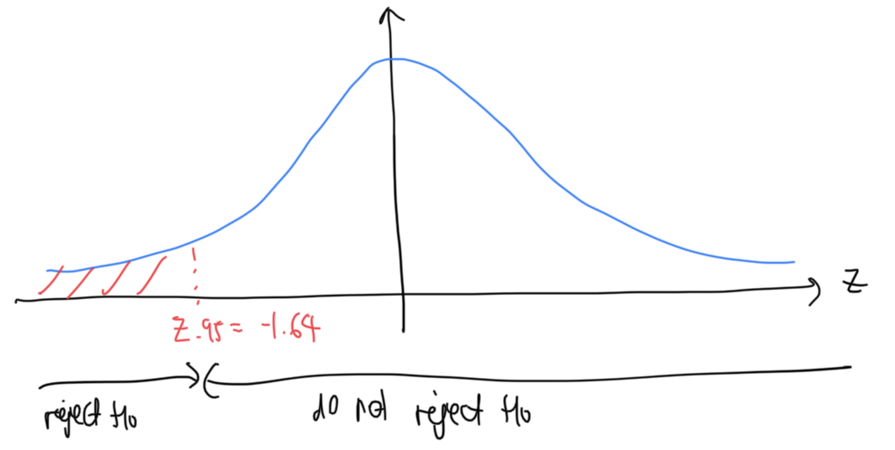
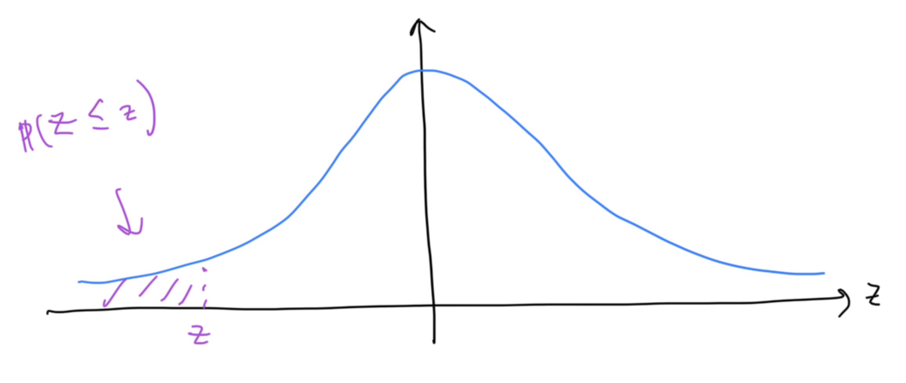

```{r child = "../setup.Rmd"}
```


```{css, echo = FALSE}
.tiny .remark-code { font-size: 70%; }
.small .remark-code { font-size: 80%; }
.tiny { font-size: 60%; }
.small { font-size: 80%; }
```

```{r packages, echo=FALSE, message=FALSE, warning=FALSE}
library(dplyr)
library(ggplot2)
```

## Reminders

- Office hours next week:
  - XHT: Monday 9:30-10:30 at MSB 4242
  - JH: Tuesday 9:30-10:30 at MSB 1117 (note change in time)

- Final: Wednesday 12/7 3:30-5:30 at Hunt 100

- Course evals: https://eval.ucdavis.edu, open 11/25 to 12/2 at 11PM

- Feedback on Canvas (optional)

- Homework 7 due today at 9PM

---
## Recap

- Hypothesis tests for population mean and proportion 

  - p-value approach: reject $H_0$ if $P(|Z| \geq |z| \mid H_0) = P(Z \geq |z|$ or $Z \leq -|z| \mid H_0) < \alpha$

  - Critical value approach: reject if $|z| > z_{\alpha/2}$ 


---
## Today

- Correspondence between confidence intervals and hypothesis tests 

- One-sided vs. two-sided tests 


---
## Recall: Significance level

- We defined the significance level, $\alpha$, when discussing confidence intervals: 
  - Confidence level = $100(1 - \alpha)$%, i.e., a 95% confidence interval will need $\alpha = .05$
  - P(CI contains true parameter) = $1 - \alpha$.
  
- The significance level is also an important ingredient in a hypothesis test

- It defines the tolerable **Type I error**: the probability of rejecting $H_0$ **when $H_0$ is actually true**. $\alpha=0.05$ is often used.

- There is a direct correspondence between hypothesis tests and confidence intervals

---
## Correspondence between Hypothesis Tests and Confidence Intervals

Consider the following proposal: 

- Given a hypothesis about $\mu$ that we wish to test, $\mu = \mu_0$, we simply check if the value $\mu_0$ falls within the constructed confidence interval. If it does, do not reject our hypothesis. If it doesn't, reject. 

- Example: suppose we are testing $H_0: \mu=0.02$ versus $H_A: \mu \neq 0.02$ using a significance level of $\alpha=0.05$. We construct a 95% confidence interval for $\mu$ and use the following decision rule.

  - If $0.02$ falls outside the confidence interval, reject $H_0$
  - If $0.02$ falls inside the confidence interval, do not reject $H_0$

---
## Correspondence between Hypothesis Tests and Confidence Intervals

- Consider the confidence interval $\left(\overline{X}-z_{\frac{\alpha}{2}}\frac{\sigma}{\sqrt{n}}, \overline{X}+z_{\frac{\alpha}{2}}\frac{\sigma}{\sqrt{n}} \right)$
  - We proved that P(CI contains true parameter) = $1 - \alpha$, i.e., $P(\overline{X}-z_{\frac{\alpha}{2}}\frac{\sigma}{\sqrt{n}} \leq \mu \leq \overline{X}+z_{\frac{\alpha}{2}}\frac{\sigma}{\sqrt{n}}) = 1 - \alpha$

- Consider a hypothesis test with $H_0: \mu = \mu_0$. We want a test with level $\alpha$. This means we need P(reject $H_0$ when $H_0$ true) $= \alpha$. 

- Proposal: reject $H_0$ if $\mu_0 \notin \left(\overline{X}-z_{\frac{\alpha}{2}}\frac{\sigma}{\sqrt{n}}, \overline{X}+z_{\frac{\alpha}{2}}\frac{\sigma}{\sqrt{n}} \right)$

- For this to be a valid hypothesis test (controls type I error), we need to show that P(reject $H_0$ when $H_0$ true) = $.05$ using our proposed rejection rule 
---

## Proof

We have $P(\overline{X}-z_{\frac{\alpha}{2}}\frac{\sigma}{\sqrt{n}} \leq \mu \leq \overline{X}+z_{\frac{\alpha}{2}}\frac{\sigma}{\sqrt{n}}) = 1 - \alpha$

- Proposal: reject $H_0$ if $\mu_0 \notin \left(\overline{X}-z_{\frac{\alpha}{2}}\frac{\sigma}{\sqrt{n}}, \overline{X}+z_{\frac{\alpha}{2}}\frac{\sigma}{\sqrt{n}} \right)$

- Want to show: P(reject $H_0$ when $H_0$ true) $= \alpha$ 

- When $H_0$ is true, $\mu = \mu_0$, so our first line becomes $P(\overline{X}-z_{\frac{\alpha}{2}}\frac{\sigma}{\sqrt{n}} \leq \mu_0 \leq \overline{X}+z_{\frac{\alpha}{2}}\frac{\sigma}{\sqrt{n}}) = 1 - \alpha$, i.e., $P(\mu_0 \in \left(\overline{X}-z_{\frac{\alpha}{2}}\frac{\sigma}{\sqrt{n}}, \overline{X}+z_{\frac{\alpha}{2}}\frac{\sigma}{\sqrt{n}} \right)) = 1 - \alpha$

Hence, 
$$
\begin{aligned}
P\text{(reject }H_0\text{ when }H_0\text{ true}) &= P(\mu_0 \notin \left(\overline{X}-z_{\frac{\alpha}{2}}\frac{\sigma}{\sqrt{n}}, \overline{X}+z_{\frac{\alpha}{2}}\frac{\sigma}{\sqrt{n}} \right)) \\
& = 1 - (1 - \alpha) \\
& = \alpha
\end{aligned}
$$

---

## Correspondence between Hypothesis Tests and Confidence Intervals

Hence our decision rule for an $\alpha$-level test for $H_0: \mu = \mu_0$ is reject $H_0$ if $\mu_0 \notin \left(\overline{X}-z_{\frac{\alpha}{2}}\frac{\sigma}{\sqrt{n}}, \overline{X}+z_{\frac{\alpha}{2}}\frac{\sigma}{\sqrt{n}} \right)$

In other words, given a sample, we construct a $100(1-\alpha)$% confidence interval for $\mu$. 

Given a hypothesis about $\mu$ that we wish to test, $\mu = \mu_0$, we simply check if $\mu_0$ falls within the constructed confidence interval. If it does, do not reject our hypothesis. If it doesn't, reject. Some intuition: 

- For a hypothesis test, we assume $\mu = \mu_0$. $100(1-\alpha)\%$ of CIs will contain $\mu = \mu_0$, so if we reject if $\mu_0$ is not in the CI, P(reject) = $\alpha$. 
- Confidence intervals can be thought of as representing the range of population means that are "compatible with the data". Looking at a confidence interval can hence help us decide if a proposed value for the population mean is reasonable.

---
## Previous Example (Lecture 21, Slide 27)
Let $X_1, X_2, ..., X_{200}$ be independent $N(\mu, 4)$ random variables. We collect the sample of size 200, and the resulting sample mean, $\overline{x}$, is $\overline{x} = 24$. What is a 95% confidence interval for $\mu$?

We are 95% confident that $\mu$ falls within the interval (23.72, 24.28).

--

Consider the hypothesis that $\mu = 24$. Do we have sufficient evidence to reject this hypothesis at a 5% level? 

How about $\mu = 25$? 


---

## "Sidedness" of tests

- Typically, hypothesis tests are **two-sided**, meaning that we are looking for any difference from a hypothesized value, whether smaller or larger. 

- All the examples that we have seen so far are two-sided tests 

- Sometimes, it is appropriate to conduct a **one-sided** test. For example, in the low-dose contraception example, we might only be interested in whether the dose is less than the required level, which would cause breakthrough pregnancies. 

---

## Null and Alternative Hypotheses 

Consider all the possibilities for tests for $\mu$:

|  | $H_0$  | $H_A$|
|:------|:------:|:---------:|
| Two-sided | $\mu=\mu_0$ | $\mu \neq \mu_0$ |
| One-sided | $\mu \leq \mu_0$ | $\mu > \mu_0$ |
| One-sided | $\mu \geq \mu_0$ | $\mu < \mu_0$ |

Similarly for $p$:

|  | $H_0$  | $H_A$|
|:------|:------:|:---------:|
| Two-sided | $p=p_0$ | $p \neq p_0$ |
| One-sided | $p \leq p_0$ | $p > p_0$ |
| One-sided | $p \geq p_0$ | $p < p_0$ |

---
## Recall: rejection regions for two-sided tests 

Decision rule: Reject $H_0$ if $|z| > z_{\alpha/2}$

```{r echo=FALSE, out.width="60%"}

```

- $|z| > 2.58$ for $\alpha = .01$
- $|z| > 1.96$ for $\alpha = .05$
- $|z| > 1.64$ for $\alpha = .1$

For one-sided tests, we only reject $H_0$ if the test statistic is either larger than expected (e.g., for a test where $H_A: \mu > \mu_0$), or smaller than expected

---
## One-sided tests: critical value approach

Consider $H_A: \mu > \mu_0$

Decision rule: Reject $H_0$ if $z > z_{\alpha}$ or $z > 1.64$ for $\alpha = .05$. The probability over the rejection region is still the significance level $\alpha$, but all of the probability is now in the right tail. 

```{r echo=FALSE, out.width="60%"}

```

How do we get the critical value in R?
```{r}
qnorm(.95) # alpha = .05
```

---
## One-sided tests: p-value approach

Consider $H_A: \mu > \mu_0$

Decision rule: Reject $H_0$ if $P(Z \geq z) < \alpha$

```{r echo=FALSE, out.width="60%"}

```

How do we get the p-value in R? `1 - pnorm(z)`, where `z` is the value of the test statistic

---
## One-sided tests: critical value approach

Consider $H_A: \mu < \mu_0$

Decision rule: Reject $H_0$ if $z < z_{1-\alpha}$ or $z < -1.64$ for $\alpha = .05$

```{r echo=FALSE, out.width="60%"}

```

How do we get the critical value in R?
```{r}
qnorm(.05) # alpha = .05
```

---
## One-sided tests: p-value approach

Consider $H_A: \mu < \mu_0$

Decision rule: Reject $H_0$ if $P(Z \leq z) < \alpha$

```{r echo=FALSE, out.width="60%"}

```

How do we get the p-value in R? `pnorm(z)`, where `z` is the value of the test statistic

---
## Rejection regions and p-values

|  | $H_0$  | $H_A$| Critical value approach | p-value approach
|:------|:------:|:---------:|:----------------:|:---------------:|
| Two-sided | $\mu=\mu_0$ | $\mu \neq \mu_0$ | $\lvert z \rvert > z_{\alpha/2}$ | $P(\lvert Z\rvert \geq \lvert z\rvert \mid H_0) < \alpha$|
| One-sided | $\mu \leq \mu_0$ | $\mu > \mu_0$ | $z > z_{\alpha}$| $P(Z \geq z \mid H_0) < \alpha$|
| One-sided | $\mu \geq \mu_0$ | $\mu < \mu_0$ | $z < z_{1 - \alpha}$ | $P(Z \leq z \mid H_0) < \alpha$|

---
## Example 1: test for population mean, $\sigma$ known
Assume that the heights of redwood trees in California follow a distribution with standard deviation 25 feet. Let the random variable $X_i$ denote the height of the $i$th redwood tree. 

Now, we are only interested in tall trees, so we would like to do a test with the alternative that $\mu > 230$. We collect data on the heights of 300 randomly sampled redwood trees. Assume the samples are indepedent. We get a sample mean of 240. Conduct a hypothesis test at a 5% significance level. 

---
## Example 1: one-sided z-test for population mean, $\sigma$ known (critical value approach)

$H_0$: $\mu \leq 230$  
$H_A$: $\mu > 230$

Test statistic: $Z = \frac{\overline{X} - \mu}{\sigma / \sqrt{n}}$. By CLT, $Z \approx N(0, 1)$ when $n$ large.

Under $H_0$, $Z = \frac{\overline{X} - 230}{25 / \sqrt{300}} \approx N(0, 1)$ 

Value of test statistic: $z = \frac{240 - 230}{25 / \sqrt{300}} = 6.928203$ 

The rejection region is $z > 1.64$ when $\alpha = .05$

$z  = 6.928203 > 1.64$. The test statistic is in the rejection region, so we reject $H_0$ that $\mu \leq 230$. There is sufficient evidence at a 5% level to reject the null hypothesis that the mean height of a Californian redwood tree is less than or equal to 230 feet. 

---
## Example 1: one-sided z-test for population mean, $\sigma$ known (p-value approach)

(Same set up as last slide)

Value of test statistic: $z = \frac{240 - 230}{25 / \sqrt{300}} = 6.928203$ 

The p-value is $P(Z \geq z)$, in this case $P(Z \geq 6.928203)$

```{r}
1 - pnorm(6.928203)
```

The p-value is less than .05, so we reject $H_0$ that $\mu \leq 230$. There is sufficient evidence at a 5% level to reject the null hypothesis that the mean height of a Californian redwood tree is less than or equal to 230 feet. 

---
## Example 2: one-sided z-test for population mean, $\sigma$ unknown
Assume that the heights of redwood trees in California follow a distribution with unknown mean and standard deviation. Let the random variable $X_i$ denote the height of the $i$th redwood tree. 

Now, we are only interested in tall trees, so we would like to do a test with the alternative that $\mu > 230$. We collect data on the heights of 300 randomly sampled redwood trees. Assume the samples are indepedent. We get a sample mean of 240 and sample standard deviation of 24. Conduct a hypothesis test at a 5% significance level. 

---
## Example 2: one-sided z-test for population mean, $\sigma$ unknown

$H_0$: $\mu \leq 230$  
$H_A$: $\mu > 230$

Test statistic: $Z = \frac{\overline{X} - \mu}{S / \sqrt{n}}$. $Z \approx N(0, 1)$ when $n$ large.

Under $H_0$, $Z = \frac{\overline{X} - 230}{S / \sqrt{300}} \approx N(0, 1)$ 

Value of test statistic: $z = \frac{240 - 230}{24 / \sqrt{300}} = 7.216878$ 

The rejection region is $z > 1.64$ when $\alpha = .05$

$z  = 7.216878 > 1.64$. The test statistic is in the rejection region, so we reject $H_0$ that $\mu \leq 230$. There is sufficient evidence at a 5% level to reject the null hypothesis that the mean height of a Californian redwood tree is less than or equal to 230 feet. 

---
## Example 3: test for population proportion
We are interested in the population proportion of likely voters that approve of President Biden. We only care about low approval ratings, so our alternative hypothesis is $p < .4$. We conduct a random sample of 1500 likely voters, and the proportion among them that approve of President Biden is .3. Conduct a hypothesis test at a 10% significance level. 

---
## Example 3: test for population proportion

Let $X_i$ be a binary random variable denoting whether or not the $i$th sampled voter approves of President Biden. Now, $X_i \sim$ Bernoulli(p), and by CLT, $Z = \frac{\hat{P} - p}{\sqrt{p(1-p)} / \sqrt{n}} \approx N(0, 1)$ when $n$ large. 

$H_0$: $p \geq .4$  
$H_A$: $p < .4$

Under $H_0$, $Z = \frac{\hat{P} - .4}{\sqrt{.4(1-.4)} / \sqrt{1500}} \approx N(0, 1)$

Value of test statistic: $z = \frac{.3 - .4}{\sqrt{.4(1-.4)} / \sqrt{1500}} = -7.91$

The rejection region is $z < -1.281552$ when $\alpha = .1$ (we get this using `qnorm(.1)`)

$z  = -7.91 < -1.281552$. The test statistic is in the rejection region, so we reject $H_0$ that $p \geq .4$. There is sufficient evidence at a 10% level to reject the null hypothesis that the population proportion of likely voters that approve of President Biden is greater than or equal to .4. 

---

## Summary
- Hypothesis tests for population mean and proportion 

  - p-value approach: reject $H_0$ if $P(|Z| \geq |z| \mid H_0) = P(Z \geq |z|$ or $Z \leq -|z| \mid H_0) < \alpha$

  - Critical value approach: reject if $|z| > z_{\alpha/2}$ 

  - Using a confidence interval: reject $H_0$ if $\mu_0 \notin \left(\overline{X}-z_{\frac{\alpha}{2}}\frac{\sigma}{\sqrt{n}}, \overline{X}+z_{\frac{\alpha}{2}}\frac{\sigma}{\sqrt{n}} \right)$

- One-sided vs. two-sided tests 

  - Decision rules using critical values and p-values 

---
## Course content 

1. Fundamentals of R
  - Overview of data types and structures
  - Data manipulation and data visualization tools  

2. Descriptive statistics for numerical and categorical data

3. Probability
  - Rules of probability computation; conditional probability
  - Basic probability models: Binomial, Normal and Poisson 

4. Statistical inference
  - Sampling distributions of sample mean and sample proportion
  - Hypothesis testing and confidence intervals for population mean and population proportion

