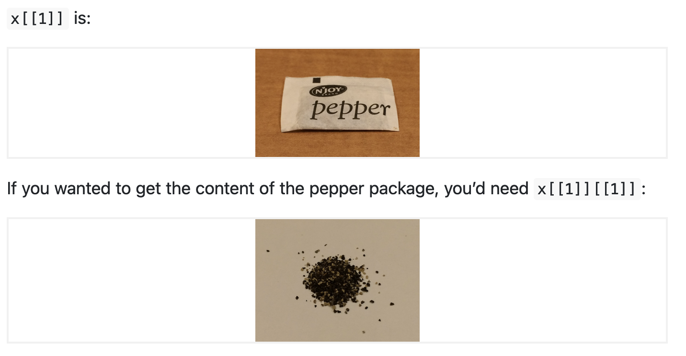

```{r child = "../setup.Rmd"}
```

```{css, echo = FALSE}
.small .remark-code { font-size: 80%; }
.tiny .remark-code { font-size: 50%; }
```

```{r packages, echo=FALSE, message=FALSE, warning=FALSE}
library(dplyr)
library(ggplot2)
# library(dsbox)
```


## Announcements

- First homework will be posted this afternoon on course website

- Due next Thursday at 9pm


---
## Today 

- Lists 

- Data frames, or more generally "data sets"

---
## Lists
- Lists are a generic container
- Sequence of values, _not_ necessarily all of the same type

```{r}
my.distribution <- list("exponential", 7, FALSE)
my.distribution
```

- Most of what you can do with vectors you can also do with lists
- This is an unnamed list
---
## Lists
- Elements can be vectors of any type, or other data structures like matrices
- This is a named list

```{r}
l <- list(
  x = 1:4,
  y = c("hi", "hello", "jello"),
  z = matrix(c(TRUE, FALSE, FALSE, FALSE), nrow = 2)
)
l
```


---
## Lists
Make an empty list to fill in later
```{r}
myList <- vector(mode = "list", length = 4)
myList
```
---
## Accessing pieces of lists
Can use `[ ]` as with vectors  
or use `[[ ]]`, but only with a single index  
`[[ ]]` drops names and structures, `[ ]` does not

```{r}
l[1]
l[[1]]
```
<small>Does `l[[1:2]]` work?</small>


---
## Accessing pieces of lists
Helpful illustration from R for Data Science (first edition, Chapter 20.5.3):

.pull-left[
```{r echo=FALSE, out.width="110%"}
knitr::include_graphics("img/pepperShaker1.png")
```
]

.pull-right[
```{r echo=FALSE, out.width="110%"}

```
]
---
## Working with lists 
.pull-left[
```{r}
my.distribution
```
]

.pull-right[
```{r}
is.character(my.distribution)
is.character(my.distribution[[1]])
my.distribution[[2]]^2
```
]

<small>What happens if you try `my.distribution[2]^2`?</small>
<small>What happens if you try `[[ ]]` on a vector?</small>

---
## Filling in lists 
```{r}
myList[[1]] <- 1:10
myList
```
<small>What happens if you try `myList[1] <- 1:10`?</small>

---
## Expanding and contracting lists
Add to lists with `c()` (also works with vectors):
```{r}
my.distribution <- c(my.distribution, 7)
my.distribution
```

---

## Naming list elements
- We saw how to name elements of a list while constructing them

- We can also add names later on:

```{r}
my.distribution <- list("exponential", 7, FALSE)
names(my.distribution) <- c("family", "mean", "is.symmetric")
my.distribution
```
---

Lists have a special short-cut way of using names, `$` (which removes names and structures):
```{r}
my.distribution[["family"]]
my.distribution$family
my.distribution[1]
```

---
## Names in lists 

Creating a list with names:
```{r}
another.distribution <- list(family="gaussian", mean = 7, 
                             sd = 1, is.symmetric = TRUE)
```

Adding named elements:
```{r}
my.distribution$was.estimated <- FALSE
my.distribution[["last.updated"]] <- "2011-08-30"
```

Removing a named list element, by assigning it the value `NULL`:
```{r}
my.distribution$was.estimated <- NULL
```
---
## Structure of lists
- We saw the output of `str()` with arrays earlier on

- `str()` is particularly useful for lists, since it allows us to easily get an idea of what is in the list. 
```{r}
str(my.distribution)
```

---
## `lapply()`
When each list element has the same structure, a particularly useful function is `lapply()`
```{r}
myList <- replicate(8, rnorm(n = 10), simplify = FALSE)
str(myList)
```
---
```{r}
lapply(myList, mean)
```
---
## `lapply()`
Another useful function is `unlist()`, which removes the list structure

```{r}
unlist(lapply(myList, mean), use.names = FALSE)
```
---
## Concept of key-value pairs

- Lists give us a way to **store and look up data** by _name_, rather than by _position_

- This is a **useful programming concept** with many names: 
  - Key-value pairs
  - Dictionaries
  - Associative arrays
  - Hashes

- E.g., if all our distributions have components named `family`, we can look that up by name, without worrying about where it is in the list

---
## Data frames
- A **data frame** is a special **list** containing vectors of equal length

- Data frame = the classic data table, $n$ rows for observations, $p$ columns for variables

- Lots of the statistical parts of R presume data frames

- Not just a matrix because **columns can have different types**

- Many **matrix functions** also work for data frames (`rowSums()`, `summary()`, `apply()`)

<small>but no matrix multiplying data frames, even if all columns are numeric</small>

---
## Creating data frames 

Here we start with a matrix and turn it into a data frame:

```{r}
a.matrix <- matrix(c(35, 8, 10, 4), nrow = 2)
colnames(a.matrix) <- c("v1", "v2")
a.matrix
a.matrix[, "v1"]  
```
<small>Does `a.matrix$v1` work?</small>

---

```{r}
(a.data.frame <- data.frame(a.matrix))
a.data.frame$v1 # now this works 
a.data.frame[, "v1"]
a.data.frame[1, ]
colMeans(a.data.frame)
```

---
## Adding rows and columns
We can add columns during construction of the data frame:
```{r}
(a.data.frame <- data.frame(a.matrix, logicals = c(TRUE, FALSE)))
```

We can also add columns by name
```{r}
a.data.frame$newCol <- 1:2
a.data.frame
```

Now remove `newCol`
```{r}
a.data.frame <- a.data.frame[, -4]
```
---
## Adding rows and columns
We can also add rows or columns to an array or data-frame with `rbind()` and `cbind()`, but be careful about forced type conversions
```{r}
rbind(a.data.frame, list(v1 = -3, v2 = -5, logicals = TRUE))
rbind(a.data.frame, c(3, 4, 6))
```
<small>What happened here?</small>

---

## Data frames, data sets  

- We've seen data frames. This is a commonly used data structure that we get after reading in a data set into R. 

- In a data set in general, 
  - Each row is an **observation**, $n$
  - Each column is a **variable**, $p$

- Often, the **first things we want to do** when given a data set are to figure out
  1. What is in it (what dimensions, what variables)
  2. What the main characteristics of the variables are. 

- We've seen a few tools and functions for working with data frames in "base R," next we will look at some tools from `dplyr`

---
```{r echo=FALSE, out.width="100%"}
knitr::include_graphics("img/tidyverse.png")
```
https://www.tidyverse.org/
- What we've seen so far: "base R"
- `ggplot2` for plotting, `dplyr` for data manipulation


---
## Summary
--

- Lists (continued)
  - Names in lists
  - `lapply()`

- Data frames, or more generally "data sets"
  - Creating data frames
  - `tidyverse` and `dplyr`
  
  
