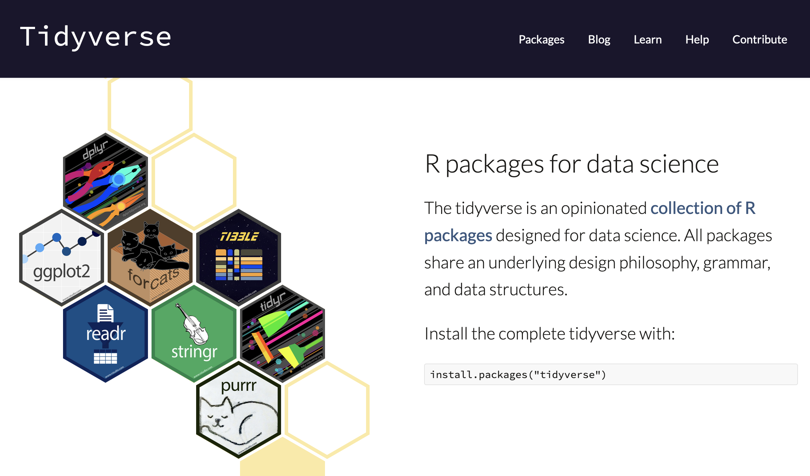

```{r child = "../setup.Rmd"}
```

```{css, echo = FALSE}
.small .remark-code { font-size: 80%; }
.tiny .remark-code { font-size: 50%; }
```

```{r packages, echo=FALSE, message=FALSE, warning=FALSE}
library(dplyr)
library(ggplot2)
# library(dsbox)
```


## Recap
--

- More on arrays
  - Accessing array values
  - Operating on arrays
  - Array functions 

- Matrices
  - Matrix multiplication
  - Other matrix operators 

- Introduction to lists 
  - Accessing pieces of lists 
  - Working with lists 

---
## Questions from last time

- `rowSums()` actually works on arrays
  - `dims` argument (from help page), default = 1: "For row*, the sum or mean is over dimensions dims+1, ..."
  
  - Meaning that if you give it a three-dimensional array, it will sum on dimensions 2 and 3
 
.tiny[
```{r}
myArr <- array(1:24, dim = c(4, 3, 2))
myArr
rowSums(myArr)
```
]

---
## Questions from last time

- Variable names

  - `.` (`my.var`), `_` (`my_var`) and camel case (`myVar`) are commonly used
  
  - Style guide recommends underscore (snake case)
  
- Do not re-use names of common functions and variables

```{r, eval = FALSE}
T <- FALSE
c <- 10
mean <- function(x) sum(x)
```

---
## Reminders

- First homework will be posted this afternoon on course website

- Due next Thursday at 9pm

- Guidelines are the same as for labs:

  - PDF files only
  - Submission through Gradescope (accessible through Canvas)
  - If you collaborate with others, write their names in your submission

- Participation survey on Canvas: open 12pm until Monday 9pm


---
## Today
- Lists (continued)

- Data frames, or more generally "data sets"

- Exploratory data analysis

---
## Course content 

1. Fundamentals of R
  - **Overview of data types and structures**
  - **Data manipulation and data visualization tools** 

2. Descriptive statistics for numerical and categorical data 

3. Probability
  - Rules of probability computation; conditional probability
  - Basic probability models: Binomial, Normal and Poisson 

4. Statistical inference
  - Sampling distributions of sample mean and sample proportion 
  - Hypothesis testing and confidence intervals for population mean and population proportion

---
## Naming list elements
- We saw how to name elements of a list while constructing them

- We can also add names later on:

```{r}
my.distribution <- list("exponential", 7, FALSE)
names(my.distribution) <- c("family", "mean", "is.symmetric")
my.distribution
```
---

Lists have a special short-cut way of using names, `$` (which removes names and structures):
```{r}
my.distribution[["family"]]
my.distribution$family
my.distribution[1]
```

---
## Names in lists 

Creating a list with names:
```{r}
another.distribution <- list(family="gaussian", mean = 7, 
                             sd = 1, is.symmetric = TRUE)
```

Adding named elements:
```{r}
my.distribution$was.estimated <- FALSE
my.distribution[["last.updated"]] <- "2011-08-30"
```

Removing a named list element, by assigning it the value `NULL`:
```{r}
my.distribution$was.estimated <- NULL
```
---
## Structure of lists
- We saw the output of `str()` with arrays earlier on

- `str()` is particularly useful for lists, since it allows us to easily get an idea of what is in the list. 
```{r}
str(my.distribution)
```

---
## `lapply()`
When each list element has the same structure, a particularly useful function is `lapply()`
```{r}
myList <- replicate(8, rnorm(n = 10), simplify = FALSE)
str(myList)
```
---
```{r}
lapply(myList, mean)
```
---
## `lapply()`
Another useful function is `unlist()`, which removes the list structure

```{r}
unlist(lapply(myList, mean), use.names = FALSE)
```
---
## Concept of key-value pairs

- Lists give us a way to store and look up data by _name_, rather than by _position_

- This is a useful programming concept with many names: 
  - Key-value pairs
  - Dictionaries
  - Associative arrays
  - Hashes

- If all our distributions have components named `family`, we can look that up by name, without worrying about where it is in the list

---
## Data frames
- A data frame is a special **list** containing vectors of equal length

- Data frame = the classic data table, $n$ rows for observations, $p$ columns for variables

- Lots of the statistical parts of R presume data frames

- Not just a matrix because *columns can have different types*

- Many matrix functions also work for data frames (`rowSums()`, `summary()`, `apply()`)

<small>but no matrix multiplying data frames, even if all columns are numeric</small>

---
## Creating data frames 

Here we start with a matrix and turn it into a data frame:

```{r}
a.matrix <- matrix(c(35, 8, 10, 4), nrow = 2)
colnames(a.matrix) <- c("v1", "v2")
a.matrix
a.matrix[, "v1"]  
```
<small>Does `a.matrix$v1` work?</small>

---

```{r}
(a.data.frame <- data.frame(a.matrix))
a.data.frame$v1 # now this works 
a.data.frame[, "v1"]
a.data.frame[1, ]
colMeans(a.data.frame)
```

---
## Adding rows and columns
We can add columns during construction of the data frame:
```{r}
(a.data.frame <- data.frame(a.matrix, logicals = c(TRUE, FALSE)))
```

We can also add columns by name
```{r}
a.data.frame$newCol <- 1:2
a.data.frame
```

Now remove `newCol`
```{r}
a.data.frame <- a.data.frame[, -4]
```
---
## Adding rows and columns
We can also add rows or columns to an array or data-frame with `rbind()` and `cbind()`, but be careful about forced type conversions
```{r}
rbind(a.data.frame, list(v1 = -3, v2 = -5, logicals = TRUE))
rbind(a.data.frame, c(3, 4, 6))
```
<small>What happened here?</small>


---
## More complicated data structures: structures of structures
- Internally, a data frame is basically a list of vectors  
- List elements can even be other lists, 
  - which may contain other data structures, including other lists,  
  - which may contain other data structures...

- This **recursion** lets us build arbitrarily complicated data structures from the basic ones

---
## More complicated data structures: structures of structures

Most complicated objects are (usually) lists of data structures

```{r}
a <- list(a = 1:3, b = "a string", c = pi, d = list(-1, -5))
str(a)
```

---

## Data frames, data sets  

- We've seen data frames. This is a commonly used data structure that we get after reading in a data set into R. 

- In a data set in general, 
  - Each row is an **observation**, $n$
  - Each column is a **variable**, $p$

- Often, the first things we want to do when given a data set are to figure out
  1. What is in it (what dimensions, what variables)
  2. What the main characteristics of the variables are. 

- We've seen a few tools and functions for working with data frames in "base R," now we will look at some tools from `dplyr`

---
```{r echo=FALSE, out.width="100%"}

```
https://www.tidyverse.org/
- What we've seen so far: "base R"
- `ggplot2` for plotting, `dplyr` for data manipulation


---
## First question: What's in a data set?

### Example: Star Wars data 

- `starwars` data set in the `dplyr` package 
```{r message=FALSE}
dplyr::starwars
```

(A `tibble` is the `tidyverse` version of the data frame.)

---


We've seen `str()`. `dplyr::glimpse()` produces cleaner output in this case:

```{r}
dplyr::glimpse(starwars)
```

---

How many rows and columns does this data set have? What does each row represent? What does each column represent?

```{r eval = FALSE}
?starwars
```

```{r echo=FALSE, out.width="100%"}
knitr::include_graphics("img/starwars-help.png")
```

---

How many rows and columns does this data set have?

```{r}
nrow(starwars) # number of rows
ncol(starwars) # number of columns
dim(starwars)  # dimensions (row column)
```

As we've seen, columns (variables) in data frames can be accessed with `$`:

```{r eval=FALSE}
dataframe$var_name
```


---

## Second question: what are the main characteristics of the data? 

Exploratory data analysis (EDA) is an approach to summarizing the main characteristics of a data set

```{r echo=FALSE}
knitr::include_graphics("img/elephant.jpg")
```

---

##  Exploratory data analysis 

- Often, this is visual 

- We might also calculate summary statistics, e.g., mean, median

- We might also manipulate or transform the data before visualizing or calculating summary statistics
  - e.g., filter certain values, group continuous variables into buckets, take log-transformation 

- We will first introduce visual summaries and tools for data manipulation, then talk about numerical summaries.

- We saw a visualization example in the first lecture. Here are a few more. 

---

## Visualization example 1: Mass vs. height in Star Wars data 

How would you describe the relationship between mass and height of Starwars characters?
What other variables would help us understand data points that don't follow the overall trend?
Who is the not so tall but much heavier character?

```{r fig.width = 8, warning = FALSE, echo=FALSE, out.width = "50%"}
ggplot(data = starwars, mapping = aes(x = height, y = mass)) +
  geom_point() +
  labs(title = "Mass vs. height of Starwars characters",
       x = "Height (cm)", y = "Weight (kg)") +
  geom_point(data = starwars %>% filter(name == "Jabba Desilijic Tiure"), size = 5, pch = 1, color = "pink", stroke = 3)
```

---

## Jabba!

```{r echo = FALSE, warning = FALSE, cache = TRUE, out.width = "80%", message = FALSE}
jabba <- magick::image_read("img/jabba.png")

fig <- magick::image_graph(width = 1600, height = 900, res = 200)
ggplot(data = starwars, mapping = aes(x = height, y = mass)) +
  geom_point() +
  labs(title = "Mass vs. height of Starwars characters",
       x = "Height (cm)", y = "Weight (kg)") +
  geom_point(data = starwars %>% filter(name == "Jabba Desilijic Tiure"), size = 5, pch = 1, color = "pink", stroke = 3)

fig %>% magick::image_composite(jabba, offset = "+1000+30")
```

---

## Visualization Example 2: Anscombe's quartet

.small[
.pull-left[
```{r quartet-view1, echo = FALSE}
Tmisc::quartet[1:22,]
```
] 
.pull-right[
```{r quartet-view2, echo = FALSE}
Tmisc::quartet[23:44,]
```
]
]
---

## Summary statistics are identical


```{r quartet-summary}
Tmisc::quartet %>%
  group_by(set) %>%
  summarize(
    mean_x = mean(x), 
    mean_y = mean(y),
    sd_x = sd(x),
    sd_y = sd(y),
    r = cor(x, y)
  )
```

(Don't worry if you don't know what a standard deviation or correlation is; we will come back to this)  

---

## Visualizing Anscombe's quartet

```{r quartet-plot, echo = FALSE, out.width = "80%", fig.asp = 0.4}
ggplot(Tmisc::quartet, aes(x = x, y = y)) +
  geom_point() +
  facet_wrap(~ set, ncol = 4)
```

---

## Visualization Example 3: Facebook visits
.question[ 
How are people reporting lower vs. higher values of FB visits?
]

```{r echo = FALSE, warning = FALSE}
load("./data/student_survey.rda")
ggplot(student_survey, aes(x = fb_visits_per_day)) +
  geom_histogram(binwidth = 1) +
  labs(
    title = "How many times do you go on Facebook per day?", 
    x = "Number of times", y = NULL
    )
```

---
## Summary
--

- Lists (continued)
  - Names in lists
  - `lapply()`

- Data frames, or more generally "data sets"
  - Creating data frames
  - `tidyverse` and `dplyr`

- Exploratory data analysis
  - Some visualization examples

