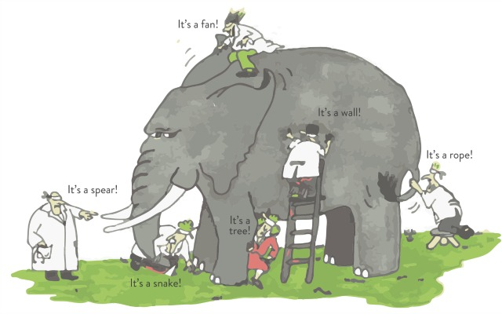

```{r child = "../setup.Rmd"}
```


```{css, echo = FALSE}
.small .remark-code { font-size: 80%; }
.tiny .remark-code { font-size: 50%; }
```


```{r packages, echo=FALSE, message=FALSE, warning=FALSE}
library(dplyr)
library(ggplot2)
# library(dsbox)
```


## Today
- Exploratory data analysis
  - Visualization examples 
  
- Data manipulation tools 

---

## Data frames, data sets  

- We've seen data frames. This is a commonly used data structure that we get after reading in a data set into R. 

- In a data set in general, 
  - Each row is an **observation**, $n$
  - Each column is a **variable**, $p$

- Often, the **first things we want to do** when given a data set are to figure out
  1. What is in it (what dimensions, what variables)
  2. What the main characteristics of the variables are. 

- We've seen a few tools and functions for working with data frames in "base R," next we will look at some tools from `dplyr`

---
```{r echo=FALSE, out.width="100%"}
knitr::include_graphics("img/tidyverse.png")
```
https://www.tidyverse.org/
- What we've seen so far: "base R"
- `ggplot2` for plotting, `dplyr` for data manipulation


---
## First question: What's in a data set?

### Example: Star Wars data 

- `starwars` data set in the `dplyr` package 
```{r message=FALSE}
dplyr::starwars
```

(A `tibble` is the `tidyverse` version of the data frame.)

---


We've seen `str()`. `dplyr::glimpse()` produces cleaner output in this case:

```{r}
dplyr::glimpse(starwars)
```

---

How many rows and columns does this data set have? What does each row represent? What does each column represent?

```{r eval = FALSE}
?starwars
```

```{r echo=FALSE, out.width="100%"}
knitr::include_graphics("img/starwars-help.png")
```

---

How many rows and columns does this data set have?

```{r}
nrow(starwars) # number of rows
ncol(starwars) # number of columns
dim(starwars)  # dimensions (row column)
```

As we've seen, columns (variables) in data frames can be accessed with `$`:

```{r eval=FALSE}
dataframe$var_name
```


---

## Second question: what are the main characteristics of the data? 

**Exploratory data analysis** (EDA) is an approach to summarizing the **main characteristics** of a data set

```{r echo=FALSE}

```

---

##  Exploratory data analysis 

- Often, this is **visual** 

- We might also calculate **summary statistics**, e.g., mean, median

- We might also **manipulate or transform** the data before visualizing or calculating summary statistics
  - e.g., filter certain values, group continuous variables into buckets, take log-transformation 

- We will first introduce **visual summaries** and tools for data manipulation, then talk about **numerical summaries**.

- We saw a visualization example in the first lecture. Here are a few more. 

---

## Visualization example 1: Mass vs. height in Star Wars data 

How would you describe the **relationship** between mass and height of Starwars characters?
What other variables would help us understand data points that don't follow the **overall trend**?
Who is the not so tall but much heavier character?

```{r fig.width = 8, warning = FALSE, echo=FALSE, out.width = "50%"}
ggplot(data = starwars, mapping = aes(x = height, y = mass)) +
  geom_point() +
  labs(title = "Mass vs. height of Starwars characters",
       x = "Height (cm)", y = "Weight (kg)") +
  geom_point(data = starwars %>% filter(name == "Jabba Desilijic Tiure"), size = 5, pch = 1, color = "pink", stroke = 3)
```

---

## Jabba!

```{r echo = FALSE, warning = FALSE, cache = TRUE, out.width = "80%", message = FALSE}
jabba <- magick::image_read("img/jabba.png")

fig <- magick::image_graph(width = 1600, height = 900, res = 200)
ggplot(data = starwars, mapping = aes(x = height, y = mass)) +
  geom_point() +
  labs(title = "Mass vs. height of Starwars characters",
       x = "Height (cm)", y = "Weight (kg)") +
  geom_point(data = starwars %>% filter(name == "Jabba Desilijic Tiure"), size = 5, pch = 1, color = "pink", stroke = 3)

fig %>% magick::image_composite(jabba, offset = "+1000+30")
```

---

## Visualization Example 2: Anscombe's quartet

.small[
.pull-left[
```{r quartet-view1, echo = FALSE}
Tmisc::quartet[1:22,]
```
] 
.pull-right[
```{r quartet-view2, echo = FALSE}
Tmisc::quartet[23:44,]
```
]
]
---

## Summary statistics are identical


```{r quartet-summary}
Tmisc::quartet %>%
  group_by(set) %>%
  summarize(
    mean_x = mean(x), 
    mean_y = mean(y),
    sd_x = sd(x),
    sd_y = sd(y),
    r = cor(x, y)
  )
```

(Don't worry if you don't know what a standard deviation or correlation is; we will come back to this)  

---

## Visualizing Anscombe's quartet

```{r quartet-plot, echo = FALSE, out.width = "80%", fig.asp = 0.4}
ggplot(Tmisc::quartet, aes(x = x, y = y)) +
  geom_point() +
  facet_wrap(~ set, ncol = 4)
```

---

## Visualization Example 3: Facebook visits
.question[ 
How are people reporting lower vs. higher values of FB visits?
]

```{r echo = FALSE, warning = FALSE}
load("./data/student_survey.rda")
ggplot(student_survey, aes(x = fb_visits_per_day)) +
  geom_histogram(binwidth = 1) +
  labs(
    title = "How many times do you go on Facebook per day?", 
    x = "Number of times", y = NULL
    )
```

---
## Data manipulation using `dplyr`

.pull-left[
```{r dplyr-part-of-tidyverse, echo=FALSE, out.width="70%", caption = "dplyr is part of the tidyverse"}
knitr::include_graphics("img/dplyr-part-of-tidyverse.png")
```
]
.pull-right[
.midi[
- `select`: pick columns by name
- `arrange`: reorder rows
- `slice`: pick rows using index(es)
- `filter`: pick rows matching criteria
- `distinct`: filter for unique rows
- `mutate`: add new variables
- `summarize`: reduce variables to values
- `group_by`: for grouped operations
- ... (many more)
]
]

As we go over the examples, think about how you would do these in base R

---

## Rules of `dplyr` functions

- **First argument** is always a data frame

- Subsequent arguments say **what to do** with that data frame

- Always **return a data frame**

- **Don't modify in place**
  - Meaning that you need an assignment operation if you want an "updated" version of the data frame 

---

## Data: Hotel bookings

- Data from two hotels: one resort and one city hotel

- **Observations**: Each **row** represents a hotel booking

- **Goal** for original data collection: Development of prediction models to classify a hotel booking's likelihood to be cancelled ([Antonia et al., 2019](https://www.sciencedirect.com/science/article/pii/S2352340918315191#bib5))

```{r message=FALSE}
hotels <- readr::read_csv("data/hotels.csv")
```

.footnote[
Source: [TidyTuesday](https://github.com/rfordatascience/tidytuesday/blob/master/data/2020/2020-02-11/readme.md)
]

---

## First question: What is in the data set?

.tiny[
```{r output.lines=18}
dplyr::glimpse(hotels)
```
]
---

## `select()`: Select a single column

View only `lead_time` (number of days between booking and arrival date):

```{r}
select(hotels, lead_time)
```

- **First argument**: data frame we're working with , `hotels`
- **Second argument**: variable we want to select, `lead_time`
- **Result**: data frame with `r nrow(hotels)` rows and 1 column
- This is an alternative to `hotels$lead_time`
---

## Select multiple columns

View only the `hotel` type and `lead_time` columns:


```{r}
select(hotels, hotel, lead_time)
```

---
## `select()` to exclude variables

- We saw earlier that `select()` keeps variables
- `select()` can also exclude variables, using the `-` sign

.small[
```{r output.lines=18}
hotels %>%
  select(-agent) 
```
]

---

## `select()` a range of variables

- Instead of writing out all the variable names, `select()` also accepts a **range of variables** 

- This follows the order they are listed in the data frame

```{r}
hotels %>%
  select(hotel:arrival_date_month) 
```

---

## `select()` variables with certain characteristics

```{r}
hotels %>%
  select(starts_with("arrival"))
```

---

## `select()` variables with certain characteristics

```{r}
hotels %>%
  select(ends_with("type")) 
```

---

## Select helpers

- `starts_with()`: Starts with a prefix
- `ends_with()`: Ends with a suffix
- `contains()`: Contains a literal string
- `num_range()`: Matches a numerical range like x01, x02, x03
- `one_of()`: Matches variable names in a character vector
- `everything()`: Matches all variables
- `last_col()`: Select last variable, possibly with an offset
- `matches()`: Matches a regular expression (a sequence of symbols/characters expressing a string/pattern to be searched for within text)

.footnote[
See help for any of these functions for more info, e.g. `?everything`.
]

---

## `select()`, then `arrange()`

What if we wanted to select these columns, and then arrange the data in order of lead time?

```{r}
hotels %>%
  select(hotel, lead_time) %>%
  arrange(lead_time)
```

---

## Pipes

In programming, a pipe is a technique for **passing information from one process to another**. In R, the symbol is `%>%`. Also: `|>`.

.pull-left[
- Start with the data frame `hotels`, and pass it to the `select()` function,
]
.pull-right[
.small[
```{r}
hotels %>% 
  select(hotel, lead_time) %>%
  arrange(lead_time)
```
]
]

---

## Pipes

In programming, a pipe is a technique for **passing information from one process to another**. In R, the symbol is `%>%`. Also: `|>`.

.pull-left[
- Start with the data frame `hotels`, and pass it to the `select()` function,
- then we select the variables `hotel` and `lead_time`,
]
.pull-right[
.small[
```{r}
hotels %>%
  select(hotel, lead_time) %>% #<<
  arrange(lead_time)
```
]
]

---

## Pipes

In programming, a pipe is a technique for **passing information from one process to another**. In R, the symbol is `%>%`. Also: `|>`.

.pull-left[
- Start with the data frame `hotels`, and pass it to the `select()` function,
- then we select the variables `hotel` and `lead_time`,
- and then we arrange the data frame by `lead_time`.
]
.pull-right[
.small[
```{r}
hotels %>%
  select(hotel, lead_time) %>% 
  arrange(lead_time) #<<
```
]
]

Note that the pipe operator is implemented in the package `magrittr`, but is automatically loaded when we use `library(dplyr)` or `library(tidyverse)`.

---

## How does a pipe work?

- You can think about the following **sequence of actions** - find keys, start car, drive to work, park.

- Expressed as a set of **nested functions** in R pseudocode this would look like:
```{r eval=FALSE}
park(drive(start_car(find("keys")), to = "work"))
```

- Writing it out using pipes give it a more natural (and easier to read) 
structure:
```{r eval=FALSE}
find("keys") %>%
  start_car() %>%
  drive(to = "work") %>%
  park()
```

---
## Simple example
- We can write `exp(1)` with pipes as `1 %>% exp`, and `log(exp(1))` as `1 %>% exp %>% log`

```{r}
exp(1)
1 %>% exp
1 %>% exp %>% log
```

- Tidyverse functions are at their best when composed together using the pipe operator

---
## `arrange()` in ascending or descending order

- We saw earlier that `arrange()` defaults to ascending order

- For descending order, use `desc()`

.pull-left[
```{r}
hotels %>%
  select(hotel, lead_time) %>% 
  arrange(lead_time)
```
]
.pull-right[
```{r}
hotels %>%
  select(hotel, lead_time) %>% 
  arrange(desc(lead_time))
```
]

---

## `slice()` for certain row numbers

This is an alternative indexing option for `hotels[1:5, ]`

```{r output.lines=17}
hotels %>%
  slice(1:5) 
```


---

## Reminder: comments in R

- Any text following `#` will be printed as is, and won't be run as code

- This is useful for leaving comments and for temporarily disabling 
certain lines of code (for debugging, trying out different things)

.tiny[
```{r output.lines=5}
hotels %>%
  # slice the first five rows  # this line is a comment
  #select(hotel) %>%           # this one doesn't run
  slice(1:5)                   # this line runs
```
]

---

## `filter()` to select a subset of rows

.small[
```{r output.lines=17}
# bookings in City Hotels
hotels %>%
  filter(hotel == "City Hotel") 
```
]

<small>What was the base R alternative that we saw?</small>

---

## `filter()` for many conditions at once

```{r}
hotels %>%
  filter( 
    adults == 0,     
    children >= 1    
    ) %>% 
  select(adults, babies, children)
```

---

## `filter()` for more complex conditions

```{r}
# bookings with no adults and some children or babies in the room
hotels %>%
  filter( 
    adults == 0,     
    children >= 1 | babies >= 1   
    ) %>%
  select(adults, babies, children)
```

---

## Reminder: Logical operators in R

<br>

operator    | definition                   || operator     | definition
------------|------------------------------||--------------|----------------
`<`         | less than                    ||`x`&nbsp;&#124;&nbsp;`y`     | `x` OR `y` 
`<=`        |	less than or equal to        ||`is.na(x)`    | test if `x` is `NA`
`>`         | greater than                 ||`!is.na(x)`   | test if `x` is not `NA`
`>=`        |	greater than or equal to     ||`x %in% y`    | test if `x` is in `y`
`==`        |	exactly equal to             ||`!(x %in% y)` | test if `x` is not in `y`
`!=`        |	not equal to                 ||`!x`          | not `x`
`x & y`     | `x` AND `y`                  ||              |


---
## Summary
--

- Data manipulation tools 

  - `select()`: selects columns by name
  
  - `arrange()`: reorders rows
  
  - `slice()`: selects rows using index(es)
  
  - `filter()`: selects rows matching criteria

